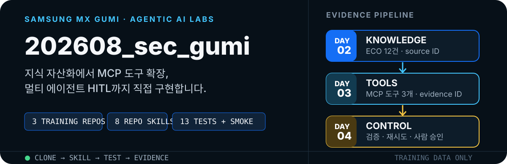
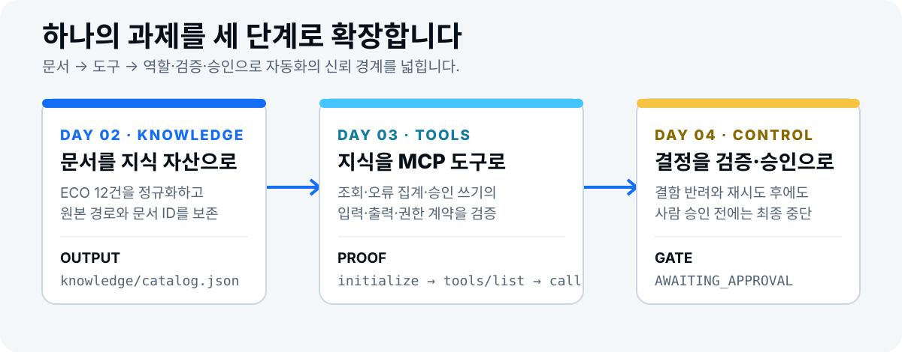

<p align="center">
  
</p>

<p align="center">
  <a href="#빠른-시작">빠른 시작</a> ·
  <a href="#day-2--지식-자산화와-하네스">Day 2</a> ·
  <a href="#day-3--mcp-연동과-도구-확장">Day 3</a> ·
  <a href="#day-4--멀티-에이전트와-hitl">Day 4</a> ·
  <a href="#검증된-완료-기준">검증 결과</a> ·
  <a href="#참고-자료">참고 자료</a>
</p>

## 수업에서 바로 실행하는 3일 실습 패키지

삼성 MX 구미 에이전틱 AI 실습 모노레포입니다. 개념 설명에서 끝나지 않고, 저장소를 복제한 뒤 Claude Code 또는 Codex에서 repo skill을 호출하고, 테스트와 근거 파일로 완료를 확인합니다.

| 실습 | 하는 일 | 이 저장소가 고정하는 개념 |
|---|---|---|
| **Day 2 · Knowledge** | 합성 ECO 12건을 추적 가능한 지식 자산으로 변환 | Harness Engineering, Eval Check, Graph(Advanced) |
| **Day 3 · Tools** | 외부 계정 없이 로컬 MCP 도구 3개를 연결하고 계약 검증 | Loop Engineering, E2E, MCP |
| **Day 4 · Control** | 계획자·실행자·검증자와 사람 승인 게이트를 상태 머신으로 실행 | Agent Orchestration, HITL / HOTL, A2A(Advanced) |

레이아웃은 Codex 기준입니다. `AGENTS.md`와 `.agents/skills/`가 계약을 들고, 각 일자 폴더의 `CLAUDE.md`가 같은 지침을 Claude Code에 넘깁니다. 스킬 본문은 [Agent Skills](https://agentskills.io/specification) `SKILL.md`입니다.

모든 데이터는 교육용 합성 데이터입니다. 실제 사업장 정보, 개인정보, API 키 또는 자격증명을 포함하지 않습니다.

<p align="center">
  
</p>

## 빠른 시작

```bash
git clone https://github.com/saewookkangboy/202608_sec_gumi.git
cd 202608_sec_gumi
```

원하는 일자의 저장소로 이동해 첫 검증을 실행합니다.

```bash
# 저장소 루트에서 일자별로 독립 실행
(cd mx-agentic-ai-day2-knowledge-harness && python3 -m unittest discover -s tests -v)
(cd mx-agentic-ai-day3-mcp-tools && npm test && npm run smoke)
(cd mx-agentic-ai-day4-multi-agent-hitl && npm test && npm run demo)
```

> Day 2에는 Python 3, Day 3·4에는 Node.js가 필요합니다. 실제 시스템 연동 없이 모든 기본 실습을 재현할 수 있습니다.

## Day 2 · 지식 자산화와 하네스

**목표:** 원본을 보호하면서 ECO 문서를 검색 가능한 지식 자산으로 만들고, 답변마다 근거 문서 ID와 원본 경로를 남깁니다.

```bash
cd mx-agentic-ai-day2-knowledge-harness
python3 scripts/normalize_docs.py
python3 scripts/search_knowledge.py "P-100 하우징 변경과 관련된 ECO는?"
python3 scripts/validate_repo.py
python3 -m unittest discover -s tests -v
```

| 입력 | 생성 결과 | 완료 증거 |
|---|---|---|
| `data/raw/eco_documents.jsonl` | `knowledge/eco/*.md`, `knowledge/catalog.json` | ECO 12건, `source_id`, `source_path`, 원본 SHA-256 |

Repo skills:

- `$eco-knowledge-builder` — 합성 ECO를 추적 가능한 지식 자산으로 변환
- `$repo-harness-auditor` — 원본 보호, 상태 파일, 완료 검증 규칙 점검

[Day 2 상세 가이드 →](./mx-agentic-ai-day2-knowledge-harness/README.md) · [skill·기술 참고 자료 →](./mx-agentic-ai-day2-knowledge-harness/docs/skill-and-tech-reference.md)

## Day 3 · MCP 연동과 도구 확장

**목표:** 합성 설비 로그를 읽는 로컬 MCP 서버를 연결하고, 정상 결과뿐 아니라 잘못된 날짜·빈 결과·승인 없는 쓰기까지 도구 계약으로 검증합니다.

```bash
cd mx-agentic-ai-day3-mcp-tools
npm test
npm run smoke
```

제공 도구:

| 도구 | 역할 | 쓰기 권한 |
|---|---|---|
| `list_equipment_logs` | 기간별 설비·레코드 수 조회 | 없음 |
| `get_equipment_errors` | 오류 코드 집계와 `evidence_id` 반환 | 없음 |
| `write_analysis_report` | 분석 보고서 미리보기 또는 저장 | 승인 토큰 필요 |

Repo skills:

- `$mcp-tool-designer` — 입력·출력·오류·권한 계약 점검
- `$mcp-smoke-test` — initialize → tools/list → tools/call 연결 검증

[Day 3 상세 가이드 →](./mx-agentic-ai-day3-mcp-tools/README.md) · [skill·기술 참고 자료 →](./mx-agentic-ai-day3-mcp-tools/docs/skill-and-tech-reference.md)

## Day 4 · 멀티 에이전트와 HITL

**목표:** 역할을 프롬프트가 아닌 입력·출력 계약으로 분리하고, 검증 통과 후에도 사람 승인 전에는 최종 결정을 멈춥니다.

```bash
cd mx-agentic-ai-day4-multi-agent-hitl
npm test
npm run demo
npm run demo:approve
```

```text
PLANNED → EXECUTED → REJECTED → EXECUTED → VERIFIED
                                      ↓
                           AWAITING_APPROVAL → APPROVED
                                      ↓
                                  ESCALATED
```

Repo skills:

- `$plan-maintenance-analysis` — 목표·단계·완료 기준 정의
- `$execute-evidence-plan` — 근거 ID가 포함된 결과 생성
- `$verify-maintenance-report` — 누락·조인·계산 오류 독립 검증
- `$request-human-approval` — 승인 패킷 구성과 최종 결정 차단

[Day 4 상세 가이드 →](./mx-agentic-ai-day4-multi-agent-hitl/README.md) · [skill·기술 참고 자료 →](./mx-agentic-ai-day4-multi-agent-hitl/docs/skill-and-tech-reference.md)

## Repo skill 사용법

각 실습의 스킬은 `.agents/skills/<skill-name>/SKILL.md`에 있습니다. Codex는 `$skill-name`으로, Claude Code는 `/skill-name`으로 같은 파일을 호출합니다. 시작 시에는 `name`·`description`만 읽고, 작업이 맞을 때 본문을 로드합니다.

```text
# Codex
$eco-knowledge-builder로 data/raw/eco_documents.jsonl을 지식 자산으로 변환해줘.
$mcp-tool-designer로 src/server.mjs의 도구 계약과 권한을 점검해줘.
$request-human-approval로 검증 결과와 남은 불확실성을 포함한 승인 패킷을 만들어줘.

# Claude Code (같은 계약)
/eco-knowledge-builder
/mcp-tool-designer
/request-human-approval
```

## 검증된 완료 기준

| 실습 | 자동 검증 | 확인하는 것 |
|---|---:|---|
| Day 2 | 3 tests | 지식 파일 12건, 근거 추적, 검색 정답 Top-3 |
| Day 3 | 5 tests + smoke | MCP 초기화, 도구 목록, 호출, 오류, 승인 없는 쓰기 |
| Day 4 | 5 tests | 결함 반려, 복구, 3회 재시도, 이관, 사람 승인 대기 |

```bash
(cd mx-agentic-ai-day2-knowledge-harness && python3 -m unittest discover -s tests -v)
(cd mx-agentic-ai-day3-mcp-tools && npm test && npm run smoke)
(cd mx-agentic-ai-day4-multi-agent-hitl && npm test)
```

## 저장소 구조

```text
202608_sec_gumi/
├── AGENTS.md / CLAUDE.md                      # 모노레포 안내 (Codex · Claude Code)
├── docs/                                      # skill·기술 참고 자료 목차와 ingest 인덱스
├── mx-agentic-ai-day2-knowledge-harness/      # ECO 지식 자산화·검색·하네스
├── mx-agentic-ai-day3-mcp-tools/              # 로컬 MCP 서버·도구 계약
└── mx-agentic-ai-day4-multi-agent-hitl/       # 역할 분리·검증·HITL 상태 머신
```

각 일자 폴더는 독립 실습 저장소로도 사용할 수 있으며, 자체 `README.md`, `AGENTS.md`, `CLAUDE.md`, 합성 데이터, repo skills와 테스트를 포함합니다.

## 참고 자료

각 실습의 repo skill과 기반 기술(Harness·Loop·Graph Engineering, MCP·A2A, E2E·Orchestration·Eval, HITL·HOTL)을 Claude Code·Codex 공식 문서와 공개 스펙에 맞춰 정리했습니다.

- [참고 자료 목차](./docs/README.md)
- [공식 URL·한국어 요약 ingest 인덱스(JSONL)](./docs/research-ingest.jsonl)
- [Day 2 · 지식 자산화와 하네스](./mx-agentic-ai-day2-knowledge-harness/docs/skill-and-tech-reference.md)
- [Day 3 · MCP 연동과 도구 확장](./mx-agentic-ai-day3-mcp-tools/docs/skill-and-tech-reference.md)
- [Day 4 · 멀티 에이전트와 HITL](./mx-agentic-ai-day4-multi-agent-hitl/docs/skill-and-tech-reference.md)

## 안전 원칙

- 실제 업무 데이터 대신 저장소의 합성 데이터만 사용합니다.
- 원본 입력 폴더는 수정하지 않고 지정된 출력 폴더에만 결과를 생성합니다.
- 문서에 없는 값은 추정하지 않고 `UNKNOWN`으로 남깁니다.
- 검증자 PASS를 사람 승인으로 간주하지 않습니다.
- 자격증명과 개인정보를 로그·이벤트·커밋에 기록하지 않습니다.
