<p align="center">
  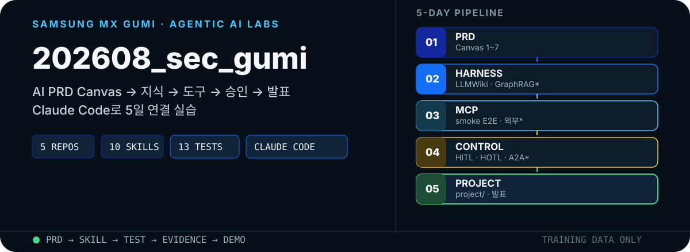
</p>

<p align="center">
  <a href="#개요">개요</a> ·
  <a href="#빠른-시작">빠른 시작</a> ·
  <a href="./docs/github-deployment-and-quickstart.md">배포 가이드</a> ·
  <a href="#day-1--ai-prd-정의">Day 1</a> ·
  <a href="#day-2--harness--llmwiki">Day 2</a> ·
  <a href="#day-3--mcp-연동">Day 3</a> ·
  <a href="#day-4--hitl--multi-agent">Day 4</a> ·
  <a href="#day-5--최종-프로젝트">Day 5</a> ·
  <a href="#검증-기준">검증</a>
</p>

## 개요

**삼성 MX 구미 에이전틱 AI 5일 실습** 모노레포입니다. 교육생이 오전 기획서를 AI PRD Canvas로 옮기고, 4대 기술 기둥을 하루씩 실습한 뒤 Day 5에 본인 업무 에이전트를 `project/`에 모아 발표합니다.

| 구분 | 내용 |
|---|---|
| **대상** | 삼성 MX 구미 현업·기술 담당자, 에이전틱 AI 도입을 검토하는 팀 |
| **형식** | 1일 8시간 × 5일, 강사 진행 + 팀 실습 |
| **실행 환경** | Claude Code (일자 폴더 `CLAUDE.md` + `/skill-name`) |
| **방법** | AI PRD Canvas 10칸 → 4대 기술 기둥 → `project/` 통합 |
| **데이터** | 합성 데이터만. 실제 사업장·개인정보·API 키 금지 |

### 교육 목표

1. **정의** — 기획서를 AI가 실행 가능한 PRD로 옮긴다 (Day 1).
2. **신뢰** — 지식을 추적 가능한 자산으로 만들고 eval로 품질을 측정한다 (Day 2).
3. **실행** — PRD의 AI 역할을 MCP 도구 계약으로 구현한다 (Day 3).
4. **거버넌스** — 역할 분리·승인 게이트·이관으로 운영 리스크를 통제한다 (Day 4).
5. **통합** — Day 1~4 산출물을 `project/`에 모아 5~7분 발표로 마무리한다 (Day 5).

### 공통 실습 시나리오 (참조 PRD)

Day 2~4는 팀 PRD와 별도로, 동일한 **참조 시나리오**를 구현합니다: **생산 설비·금형 변경(ECO) 연계 분석 에이전트**.

```text
[입력]  ECO 지식 + 설비 로그 + 품질 결함 (합성 데이터)
   ↓
[처리]  Day 2 검색 → Day 3 MCP 집계 → Day 4 역할·승인
   ↓
[출력]  근거 ID(ECO-*, LOG-*, QUALITY-*)가 붙은 분석 초안
```

- **MVP:** 30분 수동 분석 → 5분 초안 (추측 금지, `UNKNOWN` 유지)
- **팀 PRD vs 참조 PRD:** Day 1 `docs/prd.md`는 본인 업무용. Day 2~4는 [`reference-prd.md`](./docs/reference-prd.md)로 기술 기둥을 익힌 뒤, Day 5에서 팀 PRD로 통합합니다.

> [5일 커리큘럼](./docs/curriculum-5day.md) · [기술 기둥](./docs/tech-pillars.md) · [참조 PRD](./docs/reference-prd.md) · [문서 인덱스](./docs/README.md)

### 일차 요약

| 실습 | 기술 기둥 | Canvas | 질문 | 산출물 |
|---|---|---|---|---|
| **Day 1** | (정의) | 1~7 (+ 8·9·10 예약) | 무엇을 만들고 AI에게 무엇을 맡길까? | `prd.md`, `sample-data/` |
| **Day 2** | Harness + LLMWiki/GraphRAG | **8** | 지식을 어떻게 믿을 수 있게 만들까? | 지식 12건, Top-3 eval |
| **Day 3** | MCP 제작·외부 연동 | **5·6** | AI 역할을 어떤 도구로 실행할까? | 3도구, smoke E2E |
| **Day 4** | HITL + Multi-agent | **9·10** | 언제 멈추고 누가 승인할까? | 역할 계약, 승인 게이트 |
| **Day 5** | 통합 | 8·9·10 완성 | 4기둥을 내 업무 에이전트로 어떻게 묶을까? | `project/`, 발표 |

### AI PRD Canvas 10칸 (5일 흐름)

| # | 항목 | Day 1 | Day 2~4에서 채움 |
|---|---|:---:|---|
| 1~4 | 배경·목표·사용자·흐름 | ✅ | — |
| 5 | AI 역할 + 금지 행동 | ✅ | Day 3 MCP 도구화 |
| 6 | 데이터 + 누락 시 규칙 | ✅ | Day 2 지식 자산화 |
| 7 | 출력 + fallback | ✅ | Day 2~4 evidence |
| 8 | 평가 기준 | 예약 | **Day 2** Top-3 eval |
| 9 | 안전·거버넌스 | 예약 | **Day 4** HITL 승인 게이트 |
| 10 | 운영 지표 | 예약 | **Day 4** HOTL 이관 |

## 다이어그램

`assets/diagrams/` HTML 파일. 브라우저에서 엽니다.

<p align="center">
  
</p>

| 다이어그램 | 유형 | 설명 |
|---|---|---|
| [5일 일정](./assets/diagrams/curriculum-timeline.html) | Timeline | Day 1~5 제목·산출물 |
| [4대 기술 기둥](./assets/diagrams/four-pillars-layers.html) | Layer stack | Harness · Wiki · MCP · HITL · project/ |
| [Day 5 project/](./assets/diagrams/architecture-day5.html) | Architecture | final-prd · knowledge · mcp · agents |
| [Day 1~4 → project/](./assets/diagrams/curriculum-handoff.html) | Process | assemble_project.py 조립 경로 |
| [승인 게이트](./assets/diagrams/day-gate-flowchart.html) | Flowchart | validate → request → approve → enter-day |

<p align="center">
  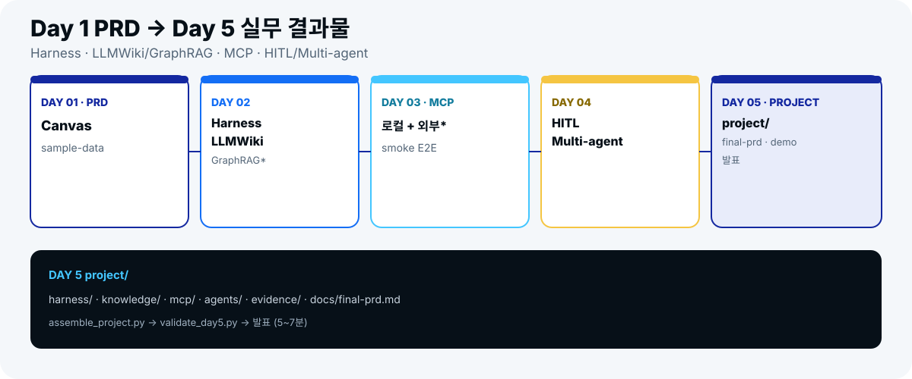
</p>

<p align="center">
  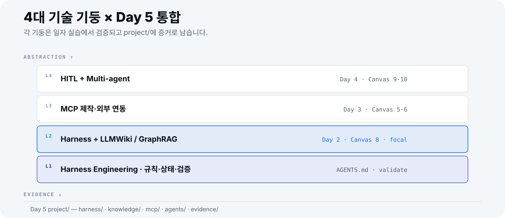
</p>

## 빠른 시작

### 환경 요구사항

| 도구 | 버전 | 사용 일차 |
|---|---|---|
| Git | 2.x | 전체 |
| Python | 3.x | Day 1·2·5 |
| Node.js | 20+ | Day 3·4 |
| Claude Code CLI | 최신 | 전체 (`claude --version`) |

```bash
git clone https://github.com/saewookkangboy/202608_sec_gumi.git
cd 202608_sec_gumi
```

일자별 첫 검증:

```bash
python3 scripts/check_day_gate.py --status
# Day 1~5 실습은 일자 폴더에서 claude 실행 후 /skill-name 사용
(cd mx-agentic-ai-day1-prd && python3 scripts/validate_day1.py --example quotation-bot)
(cd mx-agentic-ai-day2-knowledge-harness && python3 -m unittest discover -s tests -v)
(cd mx-agentic-ai-day3-mcp-tools && npm test && npm run smoke)
(cd mx-agentic-ai-day4-multi-agent-hitl && npm test && npm run demo)
(cd mx-agentic-ai-day5-final-project && python3 scripts/assemble_project.py && python3 scripts/validate_day5.py)
```

### 교육생 본인 PRD 여정 (일차 간 사람 승인 필수)

자동 검증 **PASS ≠ 다음 일차 진입**. 각 Day 종료 후 강사·멘토 **사람 승인**이 있어야 합니다. [`docs/handoffs/README.md`](./docs/handoffs/README.md)

<p align="center">
  
</p>

| 다이어그램 | 설명 |
|---|---|
| [승인 게이트](./assets/diagrams/day-gate-flowchart.html) | `validate` → `request_handoff` → `approve_handoff` → `check_day_gate` |
| [핸드오프 가이드](./docs/handoffs/README.md) | 체크리스트·승인 패킷 경로 |

```bash
# Day 1 완료 후
cd mx-agentic-ai-day1-prd
python3 scripts/init_project_profile.py
python3 ../scripts/request_handoff.py --day 1
python3 ../scripts/approve_handoff.py --day 1 --reviewer "강사명" --role instructor

# Day 2 진입 전
python3 ../scripts/check_day_gate.py --enter-day 2
```

| 승인자 role | 설명 |
|---|---|
| `instructor` | 강사 (권장) |
| `mentor` | 현업 멘토 |
| `team_lead` | 팀 리드 |
| `trainee_lead` | 교육생 대표 (자가 점검 후 강사 확인 병행 시) |

강사 배포·팀 제출·스킬 호출: [GitHub 배포 가이드](./docs/github-deployment-and-quickstart.md)

<p align="center">
  
</p>

## 일차별 가이드 (비개발자용)

<p align="center">
  
</p>

각 Day README는 같은 섹션 구조입니다: **이론 → 사용법 → 저장소 → 예제 → 실행 → 문제 해결**.

| Day | 가이드 | 구조도 |
|:---:|---|---|
| 1 | [Day 1 README](./mx-agentic-ai-day1-prd/README.md) | Canvas 10칸 · 견적봇 예제 |
| 2 | [Day 2 README](./mx-agentic-ai-day2-knowledge-harness/README.md) | 지식 파이프라인 · ECO 12건 |
| 3 | [Day 3 README](./mx-agentic-ai-day3-mcp-tools/README.md) | MCP E2E · 3도구·승인 게이트 |
| 4 | [Day 4 README](./mx-agentic-ai-day4-multi-agent-hitl/README.md) | 4역할 · 상태 머신 · HITL |
| 5 | [Day 5 README](./mx-agentic-ai-day5-final-project/README.md) | 4층 통합 · project/ · 발표 |

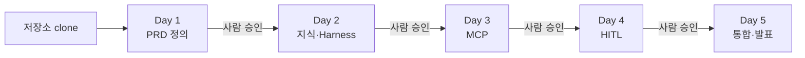
```mermaid
flowchart LR
  G[저장소 clone] --> D1[Day 1<br/>PRD 정의]
  D1 -->|사람 승인| D2[Day 2<br/>지식·Harness]
  D2 -->|사람 승인| D3[Day 3<br/>MCP]
  D3 -->|사람 승인| D4[Day 4<br/>HITL]
  D4 -->|사람 승인| D5[Day 5<br/>통합·발표]
```

> 터미널 명령은 **복사·붙여넣기**만 하면 됩니다. Git·배포 절차: [배포 가이드](./docs/github-deployment-and-quickstart.md)

## Day 1 · AI PRD 정의

**목표:** 오전 기획서를 AI PRD Canvas로 옮기고, Day 2~4에서 채울 평가·거버넌스 칸을 예약합니다.

**교육 질문:** "AI에게 무엇을 맡기고, 무엇을 절대 하지 말게 할까?"

<p align="center">
  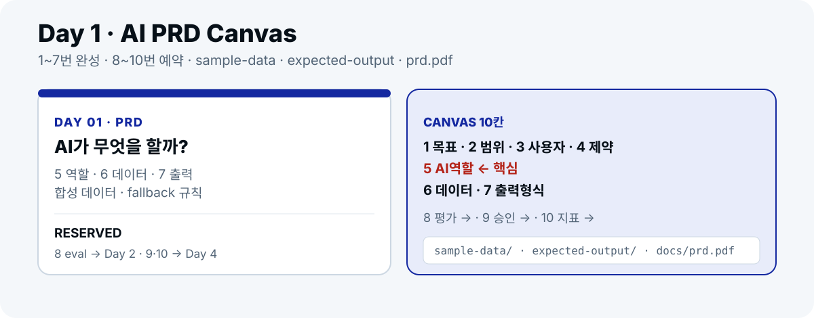
</p>

```bash
cd mx-agentic-ai-day1-prd
claude
# docs/proposal.pdf 추가 후 /prd-canvas-builder 또는 완성형 프롬프트 붙여넣기
```

| 입력 | 산출물 | 완료 증거 |
|---|---|---|
| 오전 기획서 (`proposal.pdf`) | `docs/prd.md`, `docs/prd.pdf` | Canvas 5·6·7, 8·9·10 예약 |
| 인터뷰 답변 | `sample-data/`, `expected-output/` | 합성 데이터, fallback 규칙 |
| 프로필 초기화 | `.lab/project-profile.json` | 팀·도메인 메타데이터 |

**예시 PRD:** [`quotation-bot`](./mx-agentic-ai-day1-prd/docs/examples/quotation-bot/prd.md) (견적 메일 초안)

Repo skill: `/prd-canvas-builder`

[Day 1 가이드 →](./mx-agentic-ai-day1-prd/README.md)

## Day 2 · Harness + LLMWiki

**기둥:** Harness Engineering + LLMWiki (+ GraphRAG* Advanced)  
**Canvas 8:** Day 1 PRD 8번 "아직 모르는 것"을 eval·하네스로 채웁니다.

**교육 질문:** "지식을 에이전트가 믿을 수 있는 자산으로 만들고, 관계 질의까지 확장하려면?"

<p align="center">
  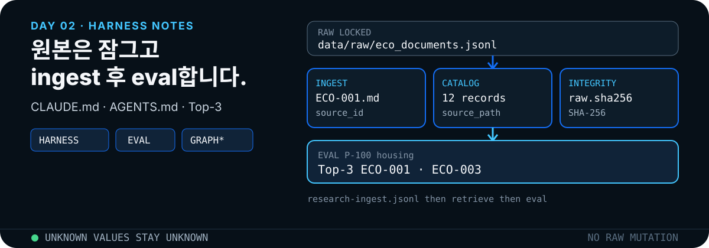
</p>

```bash
cd mx-agentic-ai-day2-knowledge-harness
python3 scripts/normalize_docs.py
python3 scripts/search_knowledge.py "P-100 하우징 변경과 관련된 ECO는?"
python3 -m unittest discover -s tests -v
```

| 개념 | Standard | Advanced |
|---|---|---|
| Harness | `AGENTS.md`, 상태 파일, `validate_repo.py` | `/repo-harness-auditor` 확장 |
| LLMWiki | `knowledge/eco/*.md` + `WIKI.md` | 팀 도메인 위키 구조 |
| GraphRAG | Top-3 키워드 검색 + `source_id` | `relations.json` 2-hop |

**규칙:** `data/raw/` 원본 SHA-256 잠금 · 근거 없는 값은 `UNKNOWN` · Top-3 eval PASS

Repo skills: `/eco-knowledge-builder` · `/repo-harness-auditor`

[Day 2 가이드 →](./mx-agentic-ai-day2-knowledge-harness/README.md)

## Day 3 · MCP 연동

**기둥:** MCP 제작·외부 연동  
**Canvas 5·6:** AI 역할·데이터를 도구 계약으로 구현합니다.

**교육 질문:** "PRD의 AI 역할을 도구로 쪼개고, 외부 시스템까지 어떻게 연결할까?"

<p align="center">
  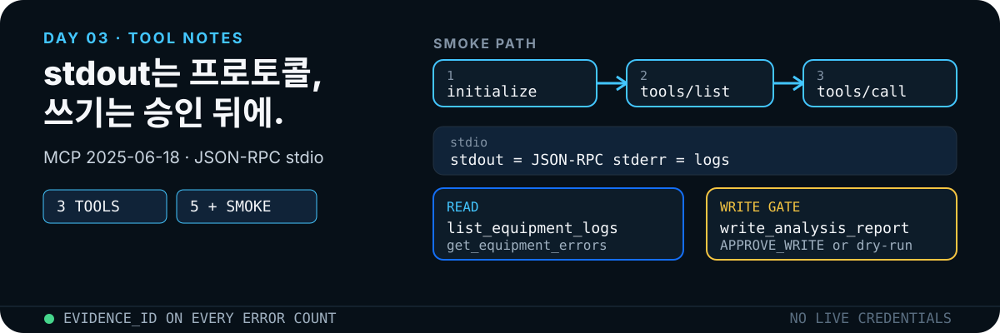
</p>

```bash
cd mx-agentic-ai-day3-mcp-tools
npm test && npm run smoke
```

| 도구 | 역할 | 쓰기 |
|---|---|---|
| `list_equipment_logs` | 기간별 설비 로그 | 없음 |
| `get_equipment_errors` | 오류 집계 + `evidence_id` | 없음 |
| `write_analysis_report` | 보고서 미리보기/저장 | 승인 토큰 필요 |

**E2E 경로:** `initialize → tools/list → tools/call` · 승인 없는 쓰기 차단 · `.mcp.json` stdio 서버

Repo skills: `/mcp-tool-designer` · `/mcp-smoke-test`

[Day 3 가이드 →](./mx-agentic-ai-day3-mcp-tools/README.md)

## Day 4 · HITL + Multi-agent

**기둥:** HITL + Multi-agent  
**Canvas 9·10:** 승인 게이트·운영 지표를 상태 머신으로 채웁니다.

**교육 질문:** "검증 통과 후에도 왜 멈추고, 역할을 왜 코드로 나누나?"

<p align="center">
  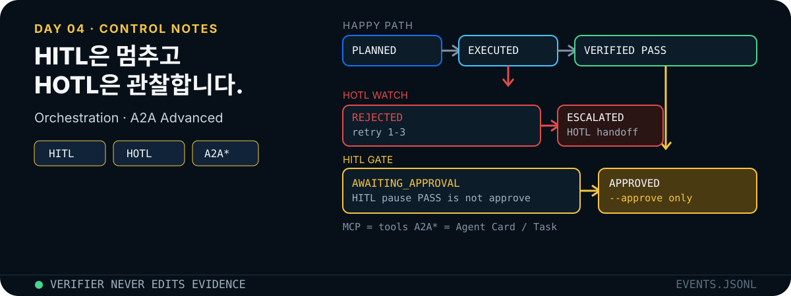
</p>

```bash
cd mx-agentic-ai-day4-multi-agent-hitl
npm test && npm run demo && npm run demo:approve
```

| 역할 | 책임 |
|---|---|
| Planner | 분석 계획 수립 |
| Executor | MCP·데이터 조회 실행 |
| Verifier | 근거·수치 검증 |
| Human | 최종 승인·반려 (`--approve`) |

**상태 흐름:** `VERIFIED` → `AWAITING_APPROVAL` → `APPROVED` · 동일 결함 3회 → `ESCALATED` (HOTL)

Repo skills: `/plan-maintenance-analysis` · `/execute-evidence-plan` · `/verify-maintenance-report` · `/request-human-approval`

[Day 4 가이드 →](./mx-agentic-ai-day4-multi-agent-hitl/README.md) · [Day 5 핸드오프 →](./mx-agentic-ai-day4-multi-agent-hitl/docs/day5-handoff.md)

## Day 5 · 최종 프로젝트

**목표:** Day 1~4를 `project/`에 통합하고 발표합니다.

**교육 질문:** "Day 1~4를 내 업무 에이전트로 어떻게 통합·발표할까?"

<p align="center">
  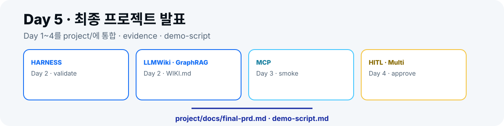
</p>

<p align="center">
  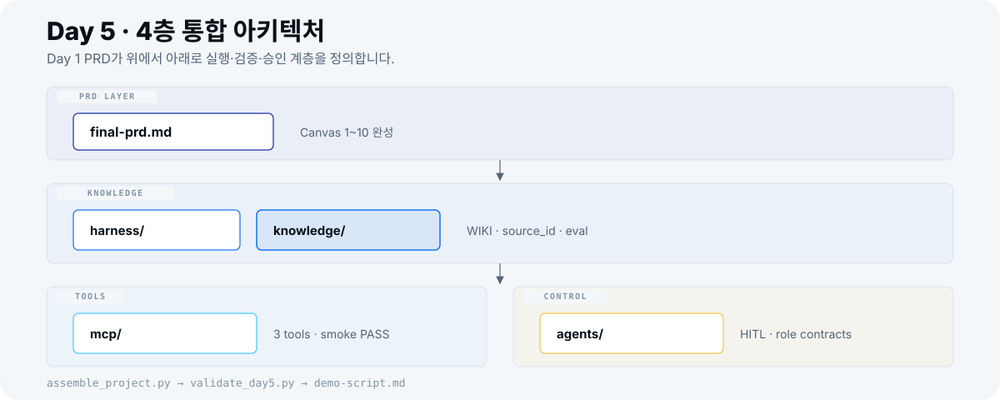
</p>

```bash
cd mx-agentic-ai-day5-final-project
python3 scripts/assemble_project.py   # Day 1~4 산출물 수집·manifest
python3 scripts/validate_day5.py      # 발표 전 구조 검증
```

| 산출물 | 설명 |
|---|---|
| `project/docs/final-prd.md` | Canvas 1~10 완성 (Day 1 + 2~4 회고 반영) |
| `project/docs/architecture.md` | Harness / Knowledge / MCP / Agents 4층 스택 |
| `project/docs/integration-map.md` | Day 2~4 증거·PASS·파일 경로 |
| `project/docs/demo-script.md` | 5~7분 발표 (문제→구현→검증→한계) |
| `project/evidence/` | Day 2~4 테스트·실행 요약 |
| `project/harness/` · `knowledge/` · `mcp/` · `agents/` | 4대 기둥별 산출물 |

핸드오프 다이어그램: [`assets/diagrams/curriculum-handoff.html`](./assets/diagrams/curriculum-handoff.html) · [다이어그램 목록](#다이어그램)

Repo skill: `/final-project-assembler`

[Day 5 가이드 →](./mx-agentic-ai-day5-final-project/README.md) · [발표 루브릭 →](./mx-agentic-ai-day5-final-project/docs/presentation-rubric.md)

## Repo skill 사용법

스킬 본문은 `.agents/skills/<name>/SKILL.md`에 있고, Claude Code는 `.claude/skills/` 브리지를 통해 `/skill-name`으로 호출합니다. 일자 폴더에서 `claude`를 연 뒤 아래 skill을 사용합니다.

| 일차 | Skill | 용도 |
|:---:|---|---|
| 1 | `/prd-canvas-builder` | PRD Canvas 1~7, sample-data, expected-output |
| 2 | `/eco-knowledge-builder` | ECO 지식 정규화, `source_id` 부여 |
| 2 | `/repo-harness-auditor` | 하네스·원본 잠금·상태 파일 감사 |
| 3 | `/mcp-tool-designer` | MCP 도구 계약·JSON Schema 설계 |
| 3 | `/mcp-smoke-test` | initialize → tools/call E2E smoke |
| 4 | `/plan-maintenance-analysis` | Planner 역할 — 분석 계획 |
| 4 | `/execute-evidence-plan` | Executor 역할 — 도구 실행 |
| 4 | `/verify-maintenance-report` | Verifier 역할 — 근거 검증 |
| 4 | `/request-human-approval` | Human 역할 — 승인 패킷 |
| 5 | `/final-project-assembler` | `project/` 통합·manifest·발표 자료 |

## 검증 기준

| 실습 | 자동 검증 | 사람 승인 | 확인 항목 |
|---|---|:---:|---|
| Day 1 | `validate_day1.py` | `approve_handoff --day 1` | Canvas 5·6·7, sample-data, prd.pdf |
| Day 2 | 3 tests + `validate_repo.py` | `approve_handoff --day 2` | 지식 12건, 근거 추적, Top-3 |
| Day 3 | 5 tests + smoke | `approve_handoff --day 3` | MCP 초기화, 도구 호출, 승인 없는 쓰기 차단 |
| Day 4 | 5 tests | `approve_handoff --day 4` | 반려·복구·재시도·이관·승인 대기 |
| Day 5 | assemble + validate | Day 4 승인 후 진입 | final-prd, 4층 문서, evidence, manifest |

승인 게이트: `python3 scripts/check_day_gate.py --enter-day N`

검증 PASS를 사람 승인으로 간주하지 않습니다. `approve_handoff.py`는 사람이 직접 실행합니다.

## 저장소 구조

```text
202608_sec_gumi/
├── AGENTS.md / CLAUDE.md          # 에이전트 하네스 (Claude Code)
├── docs/                          # 커리큘럼, 기술 기둥, 배포·핸드오프 가이드
│   ├── curriculum-5day.md
│   ├── tech-pillars.md
│   ├── reference-prd.md
│   ├── handoffs/                  # 일차 간 승인·체크리스트
│   └── github-deployment-and-quickstart.md
├── scripts/                       # check_day_gate, request/approve_handoff
├── assets/
│   ├── readme/                    # README SVG 비주얼
│   └── diagrams/                  # diagram-design HTML 다이어그램
├── .agents/skills/                # repo 공통 skill (beautify, diagram-design)
├── mx-agentic-ai-day1-prd/        # AI PRD Canvas
├── mx-agentic-ai-day2-knowledge-harness/  # Harness + LLMWiki
├── mx-agentic-ai-day3-mcp-tools/  # MCP stdio 서버
├── mx-agentic-ai-day4-multi-agent-hitl/   # HITL + Multi-agent
└── mx-agentic-ai-day5-final-project/      # project/ 통합·발표
```

## 참고 자료

<p align="center">
  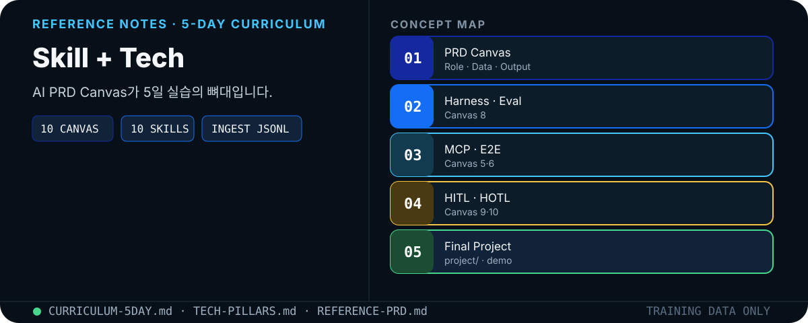
</p>

| 문서 | 설명 |
|---|---|
| [5일 커리큘럼](./docs/curriculum-5day.md) | 일차별 목표·타임라인·산출물 |
| [기술 기둥](./docs/tech-pillars.md) | 4대 기둥 × Day 매핑·Standard/Advanced |
| [참조 PRD](./docs/reference-prd.md) | Day 2~4 공통 시나리오 (ECO·설비·품질) |
| [문서 인덱스](./docs/README.md) | 개념 맵·Claude Code 기준·skill 참고 |
| [일차 간 핸드오프](./docs/handoffs/README.md) | 사람 승인 게이트·체크리스트 |
| [GitHub 배포 가이드](./docs/github-deployment-and-quickstart.md) | 강사 배포·팀 브랜치 제출 |
| [3_AI PRD 가이드 (Notion)](https://adorable-hail-415.notion.site/3_AI-PRD-3c4137efedf680f7a491f3bd50c832c9) | Canvas 10칸 셀프 가이드 |

## 안전 원칙

- 합성 데이터만 사용합니다. 실제 사업장 정보·개인정보·API 키를 넣지 않습니다.
- 원본 입력 폴더(`data/raw/`, `data/`, `fixtures/`)는 수정하지 않습니다.
- 문서에 없는 값은 추정하지 않고 `UNKNOWN` 또는 구조화 실패로 남깁니다.
- 검증 PASS를 사람 승인으로 간주하지 않습니다.
- 모든 수치·목록에는 근거 ID(`ECO-*`, `LOG-*`, `QUALITY-*`)가 있어야 합니다.
