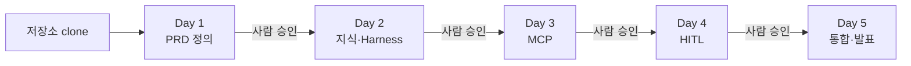

<p align="center">
  
</p>

<p align="center">
  <a href="#개요">개요</a> ·
  <a href="#빠른-시작">빠른 시작</a> ·
  <a href="./docs/github-deployment-and-quickstart.md">배포 가이드</a> ·
  <a href="#day-1--ai-prd-정의">Day 1</a> ·
  <a href="#day-2--harness--llmwiki">Day 2</a> ·
  <a href="#day-3--mcp-연동">Day 3</a> ·
  <a href="#day-4--hitl--multi-agent">Day 4</a> ·
  <a href="#day-5--최종-프로젝트">Day 5</a> ·
  <a href="#검증-기준">검증</a>
</p>

## 개요

**삼성 MX 구미 에이전틱 AI 5일 실습** 모노레포입니다. 교육생이 오전 기획서를 AI PRD Canvas로 옮기고, 4대 기술 기둥을 하루씩 실습한 뒤 Day 5에 본인 업무 에이전트를 `project/`에 모아 발표합니다.

| 구분 | 내용 |
|---|---|
| **대상** | 삼성 MX 구미 현업·기술 담당자, 에이전틱 AI 도입을 검토하는 팀 |
| **형식** | 1일 8시간 × 5일, 강사 진행 + 팀 실습 |
| **실행 환경** | Claude Code (일자 폴더 `CLAUDE.md` + `/skill-name`) |
| **방법** | AI PRD Canvas 10칸 → 4대 기술 기둥 → `project/` 통합 |
| **데이터** | Day 2~4 더미 데이터는 저장소에 들어 있습니다([가이드](./docs/dummy-data.md)). 실제 사업장 정보·개인정보·API 키는 넣지 않습니다 |

### 교육 목표

1. **정의** — 기획서를 AI가 그대로 실행할 수 있는 PRD로 옮깁니다 (Day 1).
2. **신뢰** — 지식을 출처까지 따라갈 수 있는 자산으로 만들고, eval로 품질을 측정합니다 (Day 2).
3. **실행** — PRD에 적은 AI 역할을 MCP 도구 계약으로 구현합니다 (Day 3).
4. **거버넌스** — 역할을 나누고 승인 게이트와 이관 규칙으로 운영 리스크를 통제합니다 (Day 4).
5. **통합** — Day 1~4 산출물을 `project/`에 모아 5~7분 발표로 마무리합니다 (Day 5).

### 공통 실습 시나리오 (참조 PRD)

Day 2~4는 팀 PRD와는 별도로 모두 같은 **참조 시나리오**를 구현합니다. 바로 **생산 설비와 금형 변경(ECO)을 엮어 분석하는 에이전트**입니다.

```text
[입력]  ECO 지식 + 설비 로그 + 품질 결함 (합성 데이터)
   ↓
[처리]  Day 2 검색 → Day 3 MCP 집계 → Day 4 역할·승인
   ↓
[출력]  근거 ID(ECO-*, LOG-*, QUALITY-*)가 붙은 분석 초안
```

- **MVP:** 30분 걸리던 수동 분석을 5분짜리 초안으로 줄입니다. 대신 추측은 하지 않고, 모르는 값은 `UNKNOWN`으로 남깁니다.
- **팀 PRD와 참조 PRD:** Day 1의 `docs/prd.md`는 본인 업무를 다룹니다. Day 2~4는 [`reference-prd.md`](./docs/reference-prd.md)로 기술 기둥을 먼저 익히고, Day 5에서 팀 PRD에 통합합니다.

> [5일 커리큘럼](./docs/curriculum-5day.md) · [기술 기둥](./docs/tech-pillars.md) · [참조 PRD](./docs/reference-prd.md) · [문서 인덱스](./docs/README.md)

### 일차 요약

| 실습 | 기술 기둥 | Canvas | 질문 | 산출물 |
|---|---|---|---|---|
| **Day 1** | (정의) | 1~7 (+ 8·9·10 예약) | 무엇을 만들고, AI에게 무엇을 맡길까요? | `prd.md`, `sample-data/` |
| **Day 2** | Harness + LLMWiki/GraphRAG | **8** | 근거 없이 아는 척하는 지식은 무엇일까요? | `knowledge/`, `relations.json`, `eval-top3.md` |
| **Day 3** | MCP 제작·외부 연동 | **5·6** | AI 역할을 어떤 도구 계약으로 쪼갤까요? | `mcp/*/contract.json`, mock, 승인 규칙 |
| **Day 4** | HITL + Multi-agent | **9·10** | 언제 멈추고, 누가 승인할까요? | `agents/`, `gate-log.md` |
| **Day 5** | 통합 | 8·9·10 완성 | 4기둥을 내 업무 에이전트로 어떻게 묶을까요? | `project/`, 발표 |

### AI PRD Canvas 10칸 (5일 흐름)

| # | 항목 | Day 1 | Day 2~4에서 채움 |
|---|---|:---:|---|
| 1~4 | 배경·목표·사용자·흐름 | ✅ | — |
| 5 | AI 역할 + 금지 행동 | ✅ | Day 3 MCP 도구화 |
| 6 | 데이터 + 누락 시 규칙 | ✅ | Day 2 지식 자산화 |
| 7 | 출력 + fallback | ✅ | Day 2~4 evidence |
| 8 | 평가 기준 | 예약 | **Day 2** Top-3 eval |
| 9 | 안전·거버넌스 | 예약 | **Day 4** HITL 승인 게이트 |
| 10 | 운영 지표 | 예약 | **Day 4** HOTL 이관 |

## 다이어그램

다이어그램은 `assets/diagrams/` 폴더에 HTML 파일로 들어 있습니다. 브라우저에서 열어 보세요.

<p align="center">
  
</p>

| 다이어그램 | 유형 | 설명 |
|---|---|---|
| [5일 일정](./assets/diagrams/curriculum-timeline.html) | Timeline | Day 1~5 제목·산출물 |
| [4대 기술 기둥](./assets/diagrams/four-pillars-layers.html) | Layer stack | Harness · Wiki · MCP · HITL · project/ |
| [Day 5 project/](./assets/diagrams/architecture-day5.html) | Architecture | final-prd · knowledge · mcp · agents |
| [Day 1~4 → project/](./assets/diagrams/curriculum-handoff.html) | Process | Day 5 조립 프롬프트로 project/에 모으는 흐름 |
| [승인 게이트](./assets/diagrams/day-gate-flowchart.html) | Flowchart | validate → request → approve → enter-day |

<p align="center">
  
</p>

<p align="center">
  
</p>

## 빠른 시작

### 환경 요구사항

| 도구 | 버전 | 사용 일차 |
|---|---|---|
| Git | 2.x | 전체 |
| Python | 3.x | Day 1·2·5 |
| Node.js | 20+ | Day 3·4 |
| Claude Code CLI | 최신 | 전체 (`claude --version`) |

```bash
git clone https://github.com/saewookkangboy/202608_sec_gumi.git
cd 202608_sec_gumi
python3 scripts/verify_dummy_data.py   # Day 2~4 합성 데이터가 있는지 확인
```

일자별 첫 검증은 다음과 같이 실행합니다.

```bash
python3 scripts/check_day_gate.py --status
# Day 1~5 실습은 일자 폴더에서 claude 실행 후 /skill-name 사용
(cd mx-agentic-ai-day1-prd && python3 scripts/validate_day1.py --example quotation-bot)
(cd mx-agentic-ai-day2-knowledge-harness && python3 -m unittest discover -s tests -v)
(cd mx-agentic-ai-day3-mcp-tools && npm test && npm run smoke)
(cd mx-agentic-ai-day4-multi-agent-hitl && npm test && npm run demo)
# Day 5: cd mx-agentic-ai-day5-final-project && claude  → README 예제 1)~9)
```

Day 2~4 데이터 경로·스키마·조인 키: [`docs/dummy-data.md`](./docs/dummy-data.md)

### 교육생 본인 PRD 여정 (일차 간 사람 승인 필수)

자동 검증이 PASS라고 해서 바로 다음 일차로 넘어가지는 않습니다. 각 Day를 마친 뒤 강사나 멘토의 **사람 승인**이 있어야 합니다. 자세한 내용은 [`docs/handoffs/README.md`](./docs/handoffs/README.md)에 있습니다.

<p align="center">
  
</p>

| 다이어그램 | 설명 |
|---|---|
| [승인 게이트](./assets/diagrams/day-gate-flowchart.html) | `validate` → `request_handoff` → `approve_handoff` → `check_day_gate` |
| [핸드오프 가이드](./docs/handoffs/README.md) | 체크리스트·승인 패킷 경로 |

```bash
# Day 1 완료 후
cd mx-agentic-ai-day1-prd
python3 scripts/init_project_profile.py
python3 ../scripts/request_handoff.py --day 1
python3 ../scripts/approve_handoff.py --day 1 --reviewer "강사명" --role instructor

# Day 2 진입 전
python3 ../scripts/check_day_gate.py --enter-day 2
```

| 승인자 role | 설명 |
|---|---|
| `instructor` | 강사 (권장) |
| `mentor` | 현업 멘토 |
| `team_lead` | 팀 리드 |
| `trainee_lead` | 교육생 대표 (자가 점검 후 강사 확인을 함께 받을 때) |

강사 배포와 팀 제출, 스킬 호출 방법은 [GitHub 배포 가이드](./docs/github-deployment-and-quickstart.md)를 참고하세요.

<p align="center">
  
</p>

## 일차별 가이드 (비개발자용)

<p align="center">
  
</p>

각 Day README는 모두 같은 섹션 구조를 따릅니다.

**이론 → 사용법 → 저장소 구조 → 예제 → 실행 → 테스트 조건 → 문제 해결**

| Day | 가이드 | 핵심 산출 |
|:---:|---|---|
| 1 | [Day 1 README](./mx-agentic-ai-day1-prd/README.md) | `prd.md` · sample-data · 견적봇 예제 |
| 2 | [Day 2 README](./mx-agentic-ai-day2-knowledge-harness/README.md) | `knowledge/` · `relations.json` · `eval-top3.md` |
| 3 | [Day 3 README](./mx-agentic-ai-day3-mcp-tools/README.md) | `mcp/*/contract.json` · mock · 승인 규칙 |
| 4 | [Day 4 README](./mx-agentic-ai-day4-multi-agent-hitl/README.md) | `agents/` · `gate-log.md` · HITL/HOTL |
| 5 | [Day 5 README](./mx-agentic-ai-day5-final-project/README.md) | `project/` 통합 · 데모 · 발표 |


```mermaid
flowchart LR
  G[저장소 clone] --> D1[Day 1<br/>PRD 정의]
  D1 -->|사람 승인| D2[Day 2<br/>지식·Harness]
  D2 -->|사람 승인| D3[Day 3<br/>MCP]
  D3 -->|사람 승인| D4[Day 4<br/>HITL]
  D4 -->|사람 승인| D5[Day 5<br/>통합·발표]
```

> 터미널 명령은 **복사해서 붙여넣기**만 하면 됩니다. Git과 배포 절차는 [배포 가이드](./docs/github-deployment-and-quickstart.md)에 정리돼 있습니다.

## Day 1 · AI PRD 정의

**목표:** 오전 기획서를 AI PRD Canvas로 옮기고, Day 2~4에서 채울 평가·거버넌스 칸을 예약합니다.

**교육 질문:** "AI에게 무엇을 맡기고, 무엇은 절대 하지 말게 할까요?"

<p align="center">
  
</p>

```bash
cd mx-agentic-ai-day1-prd
claude
# docs/proposal.pdf를 넣은 뒤 /prd-canvas-builder를 쓰거나 완성형 프롬프트를 붙여넣어요
```

| 입력 | 산출물 | 완료 증거 |
|---|---|---|
| 오전 기획서 (`proposal.pdf`) | `docs/prd.md`, `docs/prd.pdf` | Canvas 5·6·7, 8·9·10 예약 |
| 인터뷰 답변 | `sample-data/`, `expected-output/` | 합성 데이터, fallback 규칙 |
| 프로필 초기화 | `.lab/project-profile.json` | 팀·도메인 메타데이터 |

**예시 PRD:** [`quotation-bot`](./mx-agentic-ai-day1-prd/docs/examples/quotation-bot/prd.md) — 견적 메일 초안을 만드는 에이전트입니다.

Repo skill: `/prd-canvas-builder`

[Day 1 가이드 →](./mx-agentic-ai-day1-prd/README.md)

## Day 2 · Harness + LLMWiki

**기둥:** Harness Engineering + LLMWiki (+ GraphRAG* Advanced)  
**Canvas 8:** Day 1 PRD 8번에 남겨 둔 "아직 모르는 것"을 eval과 하네스로 채웁니다.

**교육 질문:** "내 PRD Canvas 5를 수행하려면 AI가 알아야 하는데, 지금은 근거 없이 아는 척하는 부분이 뭘까요?"

<p align="center">
  
</p>

```bash
cd mx-agentic-ai-day2-knowledge-harness
claude   # README의 예제 프롬프트를 순서대로 붙여넣어요 (확산 → 수렴 → GraphRAG → Memory → Eval)
# [선택] 참조 시나리오를 자동 검증하려면:
python3 scripts/validate_repo.py && python3 -m unittest discover -s tests -v
```

| 트랙 | 산출 |
|---|---|
| **PRD 연속형** | `knowledge/`의 근거 ID, `relations.json`, `eval-top3.md`, `CLAUDE.md` Memory |
| **참조(선택)** | `knowledge/eco/*.md`, `normalize_docs.py`, Top-3 검색 스크립트 |

**규칙:** 근거가 없으면 `UNKNOWN`으로 남기고, 가상 테스트는 `_sandbox/`에서만 하며, Top-3 eval이 PASS여야 합니다.

Repo skills: `/eco-knowledge-builder` · `/repo-harness-auditor`

[Day 2 가이드 →](./mx-agentic-ai-day2-knowledge-harness/README.md)

## Day 3 · MCP 연동

**기둥:** MCP 제작·외부 연동  
**Canvas 5·6:** AI 역할과 데이터를 도구 계약으로 구현합니다.

**교육 질문:** "PRD Canvas 5의 AI 역할을 도구로 쪼갠다면, 계약은 어떤 모양이어야 할까요?"

<p align="center">
  
</p>

```bash
cd mx-agentic-ai-day3-mcp-tools
claude   # 계약 설계 → mock → approval-rule.md 순서로 진행해요
# [선택] 기존 Node 서버를 쓰려면:
npm test && npm run smoke
```

| 트랙 | 산출 |
|---|---|
| **PRD 연속형** | `mcp/*/contract.json`, `mock-response.json`, `approval-rule.md` |
| **참조(포함)** | `list_equipment_logs`, `get_equipment_errors`, `write_analysis_report` |

**규칙:** 쓰기 도구에는 승인 토큰이 필요하고, 가상 호출은 `_sandbox/`에서만 하며, 결과에는 반드시 근거 ID를 붙입니다.

Repo skills: `/mcp-tool-designer` · `/mcp-smoke-test`

[Day 3 가이드 →](./mx-agentic-ai-day3-mcp-tools/README.md)

## Day 4 · HITL + Multi-agent

**기둥:** HITL + Multi-agent  
**Canvas 9·10:** 승인 게이트와 운영 지표를 상태 머신으로 채웁니다.

**교육 질문:** "역할을 나누고, A2A로 되물을 곳은 어디이며, 사람은 언제 멈춰야 할까요?"

<p align="center">
  
</p>

```bash
cd mx-agentic-ai-day4-multi-agent-hitl
claude   # agents/, gate-log.md, 상태도를 차례로 만들어요
# [선택] 기존 Node 데모를 쓰려면:
npm test && npm run demo && npm run demo:approve
```

| 트랙 | 산출 |
|---|---|
| **PRD 연속형** | `agents/`의 `planner.md`, `executor.md`, `verifier.md`, `a2a-protocol.md`, `gate-log.md` |
| **참조(선택)** | `src/` 데모, 반려 3회 시 `ESCALATED` |

**상태 흐름:** `VERIFIED` → `AWAITING_APPROVAL` → `APPROVED` 순으로 진행하고, 같은 결함이 3번 반복되면 `ESCALATED`로 올려 사람이 넘겨받습니다(HOTL).

Repo skills: `/plan-maintenance-analysis` · `/execute-evidence-plan` · `/verify-maintenance-report` · `/request-human-approval`

[Day 4 가이드 →](./mx-agentic-ai-day4-multi-agent-hitl/README.md) · [Day 5 핸드오프 →](./mx-agentic-ai-day4-multi-agent-hitl/docs/day5-handoff.md)

## Day 5 · 최종 프로젝트

**목표:** Day 1~4를 `project/`에 통합하고 발표합니다.

**교육 질문:** "Day 1~4를 내 업무 에이전트로 어떻게 묶어서 발표할까요?"

<p align="center">
  
</p>

<p align="center">
  
</p>

```bash
cd mx-agentic-ai-day5-final-project
claude
# README의 예제 1)~9)를 순서대로 붙여넣어요 — project/ 조립부터 발표 점검까지
# (선택) /final-project-assembler
```

| 산출물 | 설명 |
|---|---|
| `project/manifest.json` | 레이어 점검 결과 (READY / NOT_READY) |
| `project/docs/final-prd.md` | Canvas 1~10을 모두 채운 완성본 |
| `project/docs/architecture.md` | Knowledge / MCP / Agents 4층 구조 |
| `project/docs/integration-map.md` · `demo-script.md` | 통합 맵과 5~7분 발표 대본 |
| `project/evidence/` | demo-data, demo-run, self/final-check 증거 |

핸드오프 다이어그램은 [`assets/diagrams/curriculum-handoff.html`](./assets/diagrams/curriculum-handoff.html)에 있습니다. 전체 목록은 [다이어그램](#다이어그램)에서 볼 수 있습니다.

Repo skill: `/final-project-assembler`

[Day 5 가이드 →](./mx-agentic-ai-day5-final-project/README.md) · [발표 루브릭 →](./mx-agentic-ai-day5-final-project/docs/presentation-rubric.md)

## Repo skill 사용법

스킬 본문은 `.agents/skills/<name>/SKILL.md`에 있고, Claude Code는 `.claude/skills/` 브리지를 통해 `/skill-name`으로 불러옵니다. 일자 폴더에서 `claude`를 연 뒤 아래 스킬을 사용하세요.

| 일차 | Skill | 용도 |
|:---:|---|---|
| 1 | `/prd-canvas-builder` | PRD Canvas 1~7, sample-data, expected-output |
| 2 | `/eco-knowledge-builder` | ECO 지식 정규화, `source_id` 부여 |
| 2 | `/repo-harness-auditor` | 하네스와 원본 잠금, 상태 파일 감사 |
| 3 | `/mcp-tool-designer` | MCP 도구 계약과 JSON Schema 설계 |
| 3 | `/mcp-smoke-test` | initialize → tools/call E2E 스모크 테스트 |
| 4 | `/plan-maintenance-analysis` | Planner 역할 — 분석 계획 세우기 |
| 4 | `/execute-evidence-plan` | Executor 역할 — 도구 실행하기 |
| 4 | `/verify-maintenance-report` | Verifier 역할 — 근거 검증하기 |
| 4 | `/request-human-approval` | Human 역할 — 승인 패킷 만들기 |
| 5 | `/final-project-assembler` | `project/` 통합, manifest, 발표 자료 |

## 검증 기준

| 실습 | 자동 검증 | 사람 승인 | 확인 항목 |
|---|---|:---:|---|
| Day 1 | `validate_day1.py` | `approve_handoff --day 1` | Canvas 5·6·7, sample-data, prd.pdf |
| Day 2 | `eval-top3.md` + (선택) `validate_repo.py` | `approve_handoff --day 2` | 지식 10건 이상, 근거 ID, Top-3, `_sandbox/` |
| Day 3 | 계약·mock 검토 + (선택) smoke | `approve_handoff --day 3` | 계약 2건 이상(읽기+쓰기), 승인 규칙 |
| Day 4 | 역할·게이트 문서 + (선택) demo | `approve_handoff --day 4` | 역할 3개 이상, HITL, HOTL, `_sandbox/` |
| Day 5 | README 예제 1~9 (프롬프트) | Day 4 승인 후 진입 | manifest READY, demo-run, demo-script |

승인 게이트는 `python3 scripts/check_day_gate.py --enter-day N`으로 통과합니다.

검증 PASS는 사람 승인이 아닙니다. `approve_handoff.py`는 반드시 사람이 직접 실행합니다.

## 저장소 구조

```text
202608_sec_gumi/
├── AGENTS.md / CLAUDE.md
├── docs/                          # 커리큘럼, 기둥, 핸드오프, 배포
├── scripts/                       # check_day_gate, request/approve_handoff
├── assets/readme · assets/diagrams
├── mx-agentic-ai-day1-prd/        # docs/prd.md · sample-data/
├── mx-agentic-ai-day2-knowledge-harness/
│   ├── knowledge/, relations.json, eval-top3.md, _sandbox/
│   └── scripts/, tests/           # [선택] 참조 검증
├── mx-agentic-ai-day3-mcp-tools/
│   ├── mcp/*/contract.json        # 계약과 mock (PRD 연속형)
│   └── src/                       # [선택] Node MCP 서버
├── mx-agentic-ai-day4-multi-agent-hitl/
│   ├── agents/, gate-log.md, _sandbox/
│   └── src/                       # [선택] Node 데모
└── mx-agentic-ai-day5-final-project/
    ├── README.md                  # 예제 1~9 자연어 프롬프트
    └── project/                   # Day 1~4를 모은 발표 패키지
```

## 참고 자료

<p align="center">
  
</p>

| 문서 | 설명 |
|---|---|
| [5일 커리큘럼](./docs/curriculum-5day.md) | 일차별 목표·타임라인·산출물 |
| [기술 기둥](./docs/tech-pillars.md) | 4대 기둥과 Day 매핑, Standard/Advanced 구분 |
| [참조 PRD](./docs/reference-prd.md) | Day 2~4 공통 시나리오 (ECO·설비·품질) |
| [문서 인덱스](./docs/README.md) | 개념 맵, Claude Code 기준, 스킬 참고 |
| [일차 간 핸드오프](./docs/handoffs/README.md) | 사람 승인 게이트와 체크리스트 |
| [GitHub 배포 가이드](./docs/github-deployment-and-quickstart.md) | 강사 배포와 팀 브랜치 제출 |
| [3_AI PRD 가이드 (Notion)](https://adorable-hail-415.notion.site/3_AI-PRD-3c4137efedf680f7a491f3bd50c832c9) | Canvas 10칸 셀프 가이드 |

## 안전 원칙

- 합성 데이터만 사용합니다. 실제 사업장 정보·개인정보·API 키를 넣지 않습니다.
- 원본 입력 폴더(`data/raw/`, `data/`, `fixtures/`)는 고치지 않습니다.
- 문서에 없는 값은 추측하지 않고 `UNKNOWN` 또는 구조화 실패로 남깁니다.
- 검증이 PASS라도 그것을 사람 승인으로 보지 않습니다.
- 모든 수치·목록에는 근거 ID(`ECO-*`, `LOG-*`, `QUALITY-*`)가 있어야 합니다.
