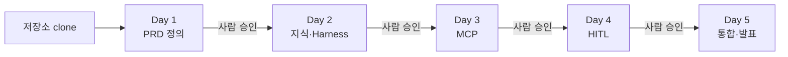

<p align="center">
  
</p>

<p align="center">
  <strong>삼성 MX 구미 · 에이전틱 AI 5일 실습 모노레포</strong><br/>
  AI PRD Canvas로 정의하고 · 4대 기술 기둥으로 실습하며 · Day 5에 <code>project/</code>로 발표합니다
</p>

<p align="center">
  <a href="#이-저장소는">이 저장소는</a> ·
  <a href="#5일-한눈에">5일 한눈에</a> ·
  <a href="#모노레포-지도">모노레포 지도</a> ·
  <a href="#빠른-시작">빠른 시작</a> ·
  <a href="#일차-간-사람-승인">승인 게이트</a> ·
  <a href="#day-1--ai-prd-정의">Day 1</a> ·
  <a href="#day-2--harness--llmwiki">Day 2</a> ·
  <a href="#day-3--mcp-연동">Day 3</a> ·
  <a href="#day-4--hitl--multi-agent">Day 4</a> ·
  <a href="#day-5--최종-프로젝트">Day 5</a> ·
  <a href="#검증-기준">검증</a> ·
  <a href="./docs/README.md">문서 인덱스</a>
</p>

---

## 이 저장소는

현업·기술 담당자가 **본인 업무 에이전트**를 5일 안에 정의·실습·통합·발표할 수 있도록 만든 **교육용 모노레포**입니다. 실행 환경은 **Claude Code**입니다. 각 일자 폴더의 `CLAUDE.md`와 `/skill-name`으로 같은 계약을 따릅니다.

| 구분 | 내용 |
|---|---|
| **대상** | 삼성 MX 구미 현업·기술 담당자, 에이전틱 AI 도입을 검토하는 팀 |
| **형식** | 1일 8시간 × 5일 (강사 진행 + 팀 실습) |
| **축** | AI PRD Canvas 10칸 × 4대 기술 기둥 × Day 5 `project/` 통합 |
| **데이터** | Day 2~4 합성(더미) 데이터 포함 · [가이드](./docs/dummy-data.md) · 실제 사업장·개인정보·API 키 금지 |
| **검증** | 자동 검증 + **사람 승인(handoff)** 이 있어야 다음 일차 진입 |

### 교육 목표

1. **정의 (Day 1)** — 기획서를 AI가 그대로 실행할 수 있는 PRD로 옮깁니다.
2. **신뢰 (Day 2)** — 지식을 출처까지 따라갈 수 있는 자산으로 만들고, eval로 품질을 측정합니다.
3. **실행 (Day 3)** — PRD의 AI 역할을 MCP 도구 계약으로 구현합니다.
4. **거버넌스 (Day 4)** — 역할 분리·승인 게이트·이관으로 운영 리스크를 통제합니다.
5. **통합 (Day 5)** — Day 1~4 산출물을 `project/`에 모아 5~7분 발표로 마무리합니다.

### 두 갈래 PRD

| 종류 | 위치 | 역할 |
|---|---|---|
| **팀 PRD** | Day 1 `docs/prd.md` | 본인 업무용 정의 (Canvas 1~7 + 8·9·10 예약) |
| **참조 PRD** | [`docs/reference-prd.md`](./docs/reference-prd.md) | Day 2~4가 공통으로 쓰는 ECO·설비·품질 시나리오 |

Day 2~4는 팀 PRD와 별도로 **같은 참조 시나리오**로 기술 기둥을 익힙니다. Day 5에서 팀 PRD와 합칩니다.

```text
[입력]  ECO 지식 + 설비 로그 + 품질 결함 (합성 데이터)
   ↓
[처리]  Day 2 검색 → Day 3 MCP 집계 → Day 4 역할·승인
   ↓
[출력]  근거 ID(ECO-*, LOG-*, QUALITY-*)가 붙은 분석 초안
```

- **MVP:** 30분 수동 분석 → 5분 초안. 추측 금지, 모르는 값은 `UNKNOWN`.
- **트랙:** Day 2~4는 **PRD 연속형**(문서·계약·가상 테스트)이 기본이고, 기존 Node/Python 자동 검증은 **[선택] 참조 트랙**입니다.

> [5일 커리큘럼](./docs/curriculum-5day.md) · [기술 기둥](./docs/tech-pillars.md) · [참조 PRD](./docs/reference-prd.md) · [문서 인덱스](./docs/README.md) · [배포 가이드](./docs/github-deployment-and-quickstart.md)

---

## 5일 한눈에

| Day | 기술 기둥 | Canvas | 교육 질문 | 핵심 산출 |
|:---:|---|:---:|---|---|
| **1** | (정의) | 1~7 (+8·9·10 예약) | 무엇을 만들고, AI에게 무엇을 맡길까요? | `prd.md`, `sample-data/` |
| **2** | Harness + LLMWiki/GraphRAG | **8** | 근거 없이 아는 척하는 지식은? | `knowledge/`, `relations.json`, `eval-top3.md` |
| **3** | MCP 제작·외부 연동 | **5·6** | AI 역할을 어떤 도구 계약으로? | `mcp/*/contract.json`, mock, 승인 규칙 |
| **4** | HITL + Multi-agent | **9·10** | 언제 멈추고, 누가 승인할까요? | `agents/`, `gate-log.md` |
| **5** | 통합 | 8·9·10 완성 | 4기둥을 내 업무 에이전트로? | `project/`, 발표 |

### AI PRD Canvas × 일차

| # | 항목 | Day 1 | 이후 |
|---|---|:---:|---|
| 1~4 | 배경·목표·사용자·흐름 | ✅ | — |
| 5 | AI 역할 + 금지 행동 | ✅ | **Day 3** MCP 도구화 |
| 6 | 데이터 + 누락 시 규칙 | ✅ | **Day 2** 지식 자산화 |
| 7 | 출력 + fallback | ✅ | Day 2~4 evidence |
| 8 | 평가 기준 | 예약 | **Day 2** Top-3 eval |
| 9 | 안전·거버넌스 | 예약 | **Day 4** HITL 승인 게이트 |
| 10 | 운영 지표 | 예약 | **Day 4** HOTL 이관 |


```mermaid
flowchart LR
  G[저장소 clone] --> D1[Day 1<br/>PRD 정의]
  D1 -->|사람 승인| D2[Day 2<br/>지식·Harness]
  D2 -->|사람 승인| D3[Day 3<br/>MCP]
  D3 -->|사람 승인| D4[Day 4<br/>HITL]
  D4 -->|사람 승인| D5[Day 5<br/>통합·발표]
```

<p align="center">
  
</p>

<p align="center">
  
</p>

---

## 모노레포 지도

```text
202608_sec_gumi/
├── README.md / AGENTS.md / CLAUDE.md   # 저장소 계약
├── docs/                               # 커리큘럼·기둥·핸드오프·배포·더미데이터
├── scripts/                            # request/approve_handoff, check_day_gate
├── assets/readme · assets/diagrams     # README·교육용 비주얼
├── mx-agentic-ai-day1-prd/             # AI PRD Canvas · sample-data
├── mx-agentic-ai-day2-knowledge-harness/  # knowledge · relations · eval-top3
├── mx-agentic-ai-day3-mcp-tools/       # mcp/*/contract.json · mock · 승인 규칙
├── mx-agentic-ai-day4-multi-agent-hitl/   # agents · gate-log
└── mx-agentic-ai-day5-final-project/   # project/ 통합 · 발표
```

각 Day `README.md`는 **이론 → 사용법 → 저장소 구조 → 예제 → 실행 → 테스트 조건 → 문제 해결** 순서로 통일되어 있습니다.

| Day | 실습 가이드 | Repo skill |
|:---:|---|---|
| 1 | [Day 1 README](./mx-agentic-ai-day1-prd/README.md) | `/prd-canvas-builder` |
| 2 | [Day 2 README](./mx-agentic-ai-day2-knowledge-harness/README.md) | `/eco-knowledge-builder` · `/repo-harness-auditor` |
| 3 | [Day 3 README](./mx-agentic-ai-day3-mcp-tools/README.md) | `/mcp-tool-designer` · `/mcp-smoke-test` |
| 4 | [Day 4 README](./mx-agentic-ai-day4-multi-agent-hitl/README.md) | `/plan-maintenance-analysis` 등 4역할 |
| 5 | [Day 5 README](./mx-agentic-ai-day5-final-project/README.md) | `/final-project-assembler` |

### 다이어그램 (브라우저에서 HTML 열기)

| 다이어그램 | 유형 | 설명 |
|---|---|---|
| [5일 일정](./assets/diagrams/curriculum-timeline.html) | Timeline | Day 1~5 제목·산출물 |
| [4대 기술 기둥](./assets/diagrams/four-pillars-layers.html) | Layer stack | Harness · Wiki · MCP · HITL · project/ |
| [Day 5 project/](./assets/diagrams/architecture-day5.html) | Architecture | PRD · knowledge · mcp · agents |
| [Day 1~4 → project/](./assets/diagrams/curriculum-handoff.html) | Process | Day 5 조립 프롬프트 흐름 |
| [승인 게이트](./assets/diagrams/day-gate-flowchart.html) | Flowchart | validate → request → approve → enter-day |

---

## 빠른 시작

### 환경

| 도구 | 버전 | 사용 일차 |
|---|---|---|
| Git | 2.x | 전체 |
| Python | 3.x | Day 1·2·5 |
| Node.js | 20+ | Day 3·4 (선택 참조 트랙) |
| Claude Code CLI | 최신 | 전체 (`claude --version`) |

```bash
git clone https://github.com/saewookkangboy/202608_sec_gumi.git
cd 202608_sec_gumi
python3 scripts/verify_dummy_data.py   # Day 2~4 합성 데이터 확인
python3 scripts/check_day_gate.py --status
```

### 일자 폴더에서 실습

```bash
cd mx-agentic-ai-day1-prd   # 또는 day2~day5 폴더
claude
# /skill-name 또는 README 완성형 프롬프트를 순서대로 붙여넣기
```

### (선택) 참조 트랙 자동 검증

```bash
(cd mx-agentic-ai-day1-prd && python3 scripts/validate_day1.py --example quotation-bot)
(cd mx-agentic-ai-day2-knowledge-harness && python3 -m unittest discover -s tests -v)
(cd mx-agentic-ai-day3-mcp-tools && npm test && npm run smoke)
(cd mx-agentic-ai-day4-multi-agent-hitl && npm test && npm run demo)
# Day 5: README 예제 1)~9) 프롬프트
```

데이터 경로·스키마·조인 키: [`docs/dummy-data.md`](./docs/dummy-data.md)  
실습 예제만 모은 슬라이드: [`docs/day2-4-practice-examples/`](./docs/day2-4-practice-examples/README.md)

---

## 일차 간 사람 승인

자동 검증 PASS만으로는 다음 일차로 가지 않습니다. 강사·멘토의 **사람 승인**이 필요합니다. 상세: [`docs/handoffs/README.md`](./docs/handoffs/README.md)

<p align="center">
  
</p>

```bash
# Day 1 완료 후
cd mx-agentic-ai-day1-prd
python3 scripts/init_project_profile.py
python3 ../scripts/request_handoff.py --day 1
python3 ../scripts/approve_handoff.py --day 1 --reviewer "강사명" --role instructor

# Day 2 진입 전
python3 ../scripts/check_day_gate.py --enter-day 2
```

| role | 설명 |
|---|---|
| `instructor` | 강사 (권장) |
| `mentor` | 현업 멘토 |
| `team_lead` | 팀 리드 |
| `trainee_lead` | 교육생 대표 (자가 점검 후 강사 확인과 함께) |

강사 배포·팀 제출: [GitHub 배포 가이드](./docs/github-deployment-and-quickstart.md)

<p align="center">
  
</p>

---

## Day 1 · AI PRD 정의

**목표:** 오전 기획서를 AI PRD Canvas로 옮기고, Day 2~4에서 채울 평가·거버넌스 칸을 예약합니다.  
**교육 질문:** "AI에게 무엇을 맡기고, 무엇은 절대 하지 말게 할까요?"

<p align="center">
  
</p>

```bash
cd mx-agentic-ai-day1-prd
claude
# docs/proposal.pdf 첨부 후 /prd-canvas-builder 또는 README 완성형 프롬프트
```

| 입력 | 산출물 | 완료 증거 |
|---|---|---|
| 오전 기획서 (`proposal.pdf`) | `docs/prd.md`, `docs/prd.pdf` | Canvas 5·6·7, 8·9·10 예약 |
| 인터뷰 답변 | `sample-data/`, `expected-output/` | 합성 데이터, fallback 규칙 |
| 프로필 초기화 | `.lab/project-profile.json` | 팀·도메인 메타데이터 |

**예시 PRD:** [`quotation-bot`](./mx-agentic-ai-day1-prd/docs/examples/quotation-bot/prd.md) — 견적 메일 초안 에이전트  
Repo skill: `/prd-canvas-builder` · [Day 1 가이드 →](./mx-agentic-ai-day1-prd/README.md)

---

## Day 2 · Harness + LLMWiki

**기둥:** Harness Engineering + LLMWiki (+ GraphRAG* Advanced)  
**Canvas 8:** Day 1에 예약한 "아직 모르는 것"을 eval·하네스로 채웁니다.  
**교육 질문:** "내 PRD Canvas 5를 수행하려면 AI가 알아야 하는데, 지금은 근거 없이 아는 척하는 부분이 뭘까요?"

<p align="center">
  
</p>

```bash
cd mx-agentic-ai-day2-knowledge-harness
claude   # 예제 프롬프트: 확산 → 수렴 → GraphRAG → Memory → Eval
# [선택] python3 scripts/validate_repo.py && python3 -m unittest discover -s tests -v
```

| 트랙 | 산출 |
|---|---|
| **PRD 연속형** | `knowledge/` 근거 ID, `relations.json`, `eval-top3.md`, Memory |
| **참조(선택)** | `knowledge/eco/*.md`, `normalize_docs.py`, Top-3 검색 |

**규칙:** 근거 없으면 `UNKNOWN` · 가상 테스트는 `_sandbox/`만 · Top-3 eval PASS  
Repo skills: `/eco-knowledge-builder` · `/repo-harness-auditor`  
소크라테스 리딩: [`docs/socratic-md-reading-prompt.md`](./mx-agentic-ai-day2-knowledge-harness/docs/socratic-md-reading-prompt.md)  
[Day 2 가이드 →](./mx-agentic-ai-day2-knowledge-harness/README.md)

---

## Day 3 · MCP 연동

**기둥:** MCP 제작·외부 연동  
**Canvas 5·6:** AI 역할·데이터를 도구 계약으로 구현합니다.  
**교육 질문:** "PRD Canvas 5의 AI 역할을 도구로 쪼갠다면, 계약은 어떤 모양이어야 할까요?"

<p align="center">
  
</p>

```bash
cd mx-agentic-ai-day3-mcp-tools
claude   # 계약 설계 → mock → approval-rule.md
# [선택] npm test && npm run smoke
```

| 트랙 | 산출 |
|---|---|
| **PRD 연속형** | `mcp/*/contract.json`, `mock-response.json`, `approval-rule.md` |
| **참조(포함)** | `list_equipment_logs`, `get_equipment_errors`, `write_analysis_report` |

**규칙:** 쓰기 도구는 승인 토큰 · `_sandbox/`만 가상 호출 · 결과에 근거 ID  
Repo skills: `/mcp-tool-designer` · `/mcp-smoke-test`  
[Day 3 가이드 →](./mx-agentic-ai-day3-mcp-tools/README.md)

---

## Day 4 · HITL + Multi-agent

**기둥:** HITL + Multi-agent  
**Canvas 9·10:** 승인 게이트·운영 지표를 상태 머신으로 채웁니다.  
**교육 질문:** "역할을 나누고, A2A로 되물을 곳은 어디이며, 사람은 언제 멈춰야 할까요?"

<p align="center">
  
</p>

```bash
cd mx-agentic-ai-day4-multi-agent-hitl
claude   # agents/, gate-log.md, 상태도
# [선택] npm test && npm run demo && npm run demo:approve
```

| 트랙 | 산출 |
|---|---|
| **PRD 연속형** | `planner.md`, `executor.md`, `verifier.md`, `a2a-protocol.md`, `gate-log.md` |
| **참조(선택)** | `src/` 데모, 반려 3회 시 `ESCALATED` |

**상태:** `VERIFIED` → `AWAITING_APPROVAL` → `APPROVED` · 동일 결함 3회 → `ESCALATED`(HOTL)  
Repo skills: `/plan-maintenance-analysis` · `/execute-evidence-plan` · `/verify-maintenance-report` · `/request-human-approval`  
[Day 4 가이드 →](./mx-agentic-ai-day4-multi-agent-hitl/README.md) · [Day 5 핸드오프 →](./mx-agentic-ai-day4-multi-agent-hitl/docs/day5-handoff.md)

---

## Day 5 · 최종 프로젝트

**목표:** Day 1~4를 `project/`에 통합하고 발표합니다.  
**교육 질문:** "Day 1~4를 내 업무 에이전트로 어떻게 묶어서 발표할까요?"

<p align="center">
  
</p>

<p align="center">
  
</p>

```bash
cd mx-agentic-ai-day5-final-project
claude
# README 예제 1)~9) 순서대로 — project/ 조립부터 발표 점검까지
# (선택) /final-project-assembler
```

| 산출물 | 설명 |
|---|---|
| `project/manifest.json` | 레이어 점검 (READY / NOT_READY) |
| `project/docs/final-prd.md` | Canvas 1~10 완성본 |
| `project/docs/architecture.md` | Knowledge / MCP / Agents 구조 |
| `project/docs/integration-map.md` · `demo-script.md` | 통합 맵 · 5~7분 대본 |
| `project/evidence/` | demo-data, demo-run, self/final-check |

Repo skill: `/final-project-assembler`  
[Day 5 가이드 →](./mx-agentic-ai-day5-final-project/README.md) · [발표 루브릭 →](./mx-agentic-ai-day5-final-project/docs/presentation-rubric.md)

---

## Repo skill 사용법

스킬 본문: `.agents/skills/<name>/SKILL.md` · Claude Code 브리지: `.claude/skills/` → `/skill-name`

| Day | Skill | 용도 |
|:---:|---|---|
| 1 | `/prd-canvas-builder` | PRD Canvas 1~7, sample-data, expected-output |
| 2 | `/eco-knowledge-builder` | ECO 지식 정규화, `source_id` |
| 2 | `/repo-harness-auditor` | 하네스·원본 잠금·상태 파일 감사 |
| 3 | `/mcp-tool-designer` | MCP 도구 계약·JSON Schema |
| 3 | `/mcp-smoke-test` | initialize → tools/call E2E |
| 4 | `/plan-maintenance-analysis` | Planner |
| 4 | `/execute-evidence-plan` | Executor |
| 4 | `/verify-maintenance-report` | Verifier |
| 4 | `/request-human-approval` | Human 승인 패킷 |
| 5 | `/final-project-assembler` | `project/` 통합·발표 |

---

## 검증 기준

| Day | 자동/문서 검증 | 사람 승인 | 확인 항목 |
|---|---|:---:|---|
| 1 | `validate_day1.py` | `approve_handoff --day 1` | Canvas 5·6·7, sample-data, prd.pdf |
| 2 | `eval-top3.md` + (선택) `validate_repo.py` | `--day 2` | 지식 ≥10, 근거 ID, Top-3, `_sandbox/` |
| 3 | 계약·mock + (선택) smoke | `--day 3` | 계약 ≥2(읽기+쓰기), 승인 규칙 |
| 4 | 역할·게이트 문서 + (선택) demo | `--day 4` | 역할 ≥3, HITL, HOTL, `_sandbox/` |
| 5 | README 예제 1~9 | Day 4 승인 후 진입 | manifest READY, demo-run, demo-script |

```bash
python3 scripts/check_day_gate.py --enter-day N
```

**검증 PASS ≠ 사람 승인.** `approve_handoff.py`는 사람이 직접 실행합니다.

---

## 참고 자료

<p align="center">
  
</p>

| 문서 | 설명 |
|---|---|
| [5일 커리큘럼](./docs/curriculum-5day.md) | 일차별 목표·타임라인·산출물 |
| [기술 기둥](./docs/tech-pillars.md) | 4대 기둥 × Day, Standard/Advanced |
| [참조 PRD](./docs/reference-prd.md) | Day 2~4 공통 ECO·설비·품질 시나리오 |
| [문서 인덱스](./docs/README.md) | 개념 맵, Claude Code, 스킬 참고 |
| [핸드오프](./docs/handoffs/README.md) | 사람 승인 게이트·체크리스트 |
| [배포 가이드](./docs/github-deployment-and-quickstart.md) | 강사 배포·팀 브랜치 제출 |
| [실습 예제 덱](./docs/day2-4-practice-examples/README.md) | Day 1~4 명령·프롬프트 슬라이드 |
| [AI PRD 가이드 (Notion)](https://adorable-hail-415.notion.site/3_AI-PRD-3c4137efedf680f7a491f3bd50c832c9) | Canvas 10칸 셀프 가이드 |

---

## 안전 원칙

- 합성 데이터만 사용합니다. 실제 사업장 정보·개인정보·API 키를 넣지 않습니다.
- 원본 입력(`data/raw/`, `data/`, `fixtures/`)은 수정하지 않습니다.
- 문서에 없는 값은 추측하지 않고 `UNKNOWN` 또는 구조화 실패로 남깁니다.
- 가상 테스트는 `_sandbox/`(Day 5는 `project/evidence/`)에서만 합니다.
- 검증 PASS를 사람 승인으로 간주하지 않습니다.
- 수치·목록에는 근거 ID(`ECO-*`, `LOG-*`, `QUALITY-*`)가 있어야 합니다.
