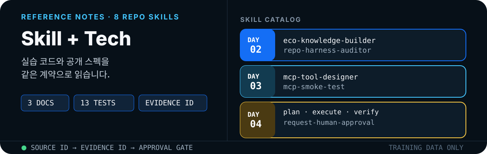

  

  <a href="#문서">문서</a> ·
  <a href="#개념-맵">개념 맵</a> ·
  <a href="#claude-code--codex-기준">Claude · Codex</a> ·
  <a href="../mx-agentic-ai-day2-knowledge-harness/docs/skill-and-tech-reference.md">Day 2</a> ·
  <a href="../mx-agentic-ai-day3-mcp-tools/docs/skill-and-tech-reference.md">Day 3</a> ·
  <a href="../mx-agentic-ai-day4-multi-agent-hitl/docs/skill-and-tech-reference.md">Day 4</a>

실습 README를 대체하지 않습니다. 과제를 시작하기 전, 또는 `$스킬`을 호출한 뒤 계약을 확인할 때 읽습니다.

## 문서

| 실습 | skill | 이 페이지가 보여주는 것 |
|---|---|---|
| [Day 2](../mx-agentic-ai-day2-knowledge-harness/docs/skill-and-tech-reference.md) | `$eco-knowledge-builder` · `$repo-harness-auditor` | 원본 잠금, `source_id`, SHA-256, Top-3 검색, Claude/Codex 하네스 |
| [Day 3](../mx-agentic-ai-day3-mcp-tools/docs/skill-and-tech-reference.md) | `$mcp-tool-designer` · `$mcp-smoke-test` | MCP stdio, E2E smoke, Claude/Codex MCP 호스트 |
| [Day 4](../mx-agentic-ai-day4-multi-agent-hitl/docs/skill-and-tech-reference.md) | `$plan-maintenance-analysis` · `$execute-evidence-plan` · `$verify-maintenance-report` · `$request-human-approval` | 역할 그래프, 복구 루프, HITL/HOTL, A2A |

기계가 읽는 출처 목록은 [`research-ingest.jsonl`](./research-ingest.jsonl)에 있습니다. 각 줄은 `day`, `concept`, `url`, 한국어 요약, 실습 매핑, 도입 수준과 검증일을 포함합니다.

## 개념 맵

| 개념 | 교육용 정의 | 주 적용일 | 구현 증거 |
|---|---|---|---|
| Harness Engineering | 에이전트를 둘러싼 규칙·상태·도구·검증·재개 장치 설계 | Day 2 | `AGENTS.md`, 상태 파일, 원본 해시, 검증 스크립트 |
| Graph Engineering | 엔터티·관계·상태 전이를 그래프로 표현하고 탐색하는 설계 | Day 2 → 4 | Advanced 관계 그래프, Day 4 상태 전이 |
| Loop Engineering | 실행→관찰→판정→재시도/중단을 명시한 제어 루프 | Day 3 → 4 | MCP smoke loop, 최대 3회 복구 루프 |
| E2E | 사용자/클라이언트 요청부터 실제 결과와 부작용까지 전체 경로 검증 | Day 3 | `initialize → tools/list → tools/call`, 승인 없는 쓰기 차단 |
| A2A | 서로 독립적인 에이전트 시스템 사이의 발견·메시지·작업·산출물 교환 표준 | Day 4 Advanced | Agent Card와 Task/Artifact 계약 설계 |
| Agent Orchestration | 전문 역할의 소유권·handoff·순서를 코드 또는 모델 판단으로 조정 | Day 4 | Planner→Executor→Verifier→Human |
| Eval Check | 고정 데이터·판정 기준·회귀 테스트로 품질을 반복 측정 | Day 2 → 4 | Top-k eval, 프로토콜 smoke, 결함 주입 테스트 |
| HITL | 위험 행동 전에 실행을 멈추고 명시적 사람 결정을 기다림 | Day 4 | `AWAITING_APPROVAL` |
| HOTL | 자동 실행을 계속 관찰하다 임계치·이상 시 사람이 개입 | Day 4 Advanced | `events.jsonl`, 동일 결함 3회 `ESCALATED` |

> 요청에 적힌 `HILT`는 일반적으로 쓰이는 `HITL`(Human-in-the-Loop)의 오기로 보고 문서 전체에서 `HITL`로 통일했습니다. `HOTL`은 Human-on-the-Loop를 뜻하는 교육용 운영 구분이며, 특정 SDK의 단일 표준 API 이름은 아닙니다.

## Claude Code · Codex 기준

세 실습을 에이전트로 진행할 때의 인터페이스 비교 기준은 Claude Code와 Codex입니다. 실습 코드는 Python·Node.js로 독립 실행되며 OpenAI Agents API·GraphRAG·NIST는 보조 참고입니다.

| 층 | Claude Code | Codex | 실습 매핑 |
|---|---|---|---|
| Harness | `CLAUDE.md`, `.claude/skills`, hooks | `AGENTS.md`, `.agents/skills`, `config.toml` | Day 2 원본 잠금·상태 파일·검증 |
| Loop | [Agent SDK loop](https://code.claude.com/docs/en/agent-sdk/agent-loop) | [Codex agent loop](https://openai.com/index/unrolling-the-codex-agent-loop/) | Day 3 smoke, Day 4 3회 복구 |
| Graph | subagent 관계를 명시적 workflow로 구성 | [Subagents](https://developers.openai.com/codex/concepts/subagents) | Day 2 지식 관계, Day 4 역할·상태 전이 |
| Tools | [MCP](https://code.claude.com/docs/en/mcp) | [MCP](https://developers.openai.com/codex/mcp) | Day 3 로컬 stdio 서버 |
| A2A | MCP로 도구, A2A로 독립 에이전트 | 동일. A2A는 별도 adapter가 필요 | Day 4 Advanced Agent Card |
| Eval | 테스트·max_turns·측정 후 복잡도 | 테스트·린트·repair loop | Day 2 Top-3, Day 3 smoke, Day 4 결함 주입 |
| HITL | `default` 권한, `canUseTool` | `approval_policy=on-request` | `APPROVE_WRITE`, `--approve` |
| HOTL | hooks·외부 모니터링으로 이상 감시 | events·trace·외부 모니터링으로 이상 감시 | `events.jsonl`, 3회 후 `ESCALATED` |

기본 skill·repo:

- [anthropics/skills](https://github.com/anthropics/skills) — Claude Agent Skills 카탈로그
- [openai/codex](https://github.com/openai/codex) — Codex CLI·하네스
- [openai/skills](https://github.com/openai/skills) — Codex 스킬(배포는 [plugins](https://github.com/openai/plugins))
- [a2aproject/A2A](https://github.com/a2aproject/A2A) — Agent-to-Agent 스펙·SDK
- [modelcontextprotocol/modelcontextprotocol](https://github.com/modelcontextprotocol/modelcontextprotocol) — MCP 스펙

  

## 세 실습이 공유하는 계약

1. **원본은 건드리지 않는다.** Day 2 `data/raw/`, Day 3 `data/`, Day 4 `fixtures/`.
2. **없는 값은 추정하지 않는다.** `UNKNOWN`, 빈 집계, 조인 실패를 모델이 메우지 않는다.
3. **근거 ID가 없으면 결과가 아니다.** `ECO-*`, `LOG-*`, `QUALITY-*`.
4. **스킬은 점진적으로 로드된다.** `name`·`description`만 상시 적재되고, 본문은 해당 작업에서만 읽힌다.
5. **검증 PASS는 사람 승인이 아니다.** Day 3 dry-run과 Day 4 `AWAITING_APPROVAL`.

## 공통 외부 자료

Claude Code · Codex를 먼저 읽고, 필요하면 Agents API와 운영 가이드를 보조로 봅니다.

- [Agent Skills Specification](https://agentskills.io/specification)
- [Equipping agents for the real world with Agent Skills](https://www.anthropic.com/engineering/equipping-agents-for-the-real-world-with-agent-skills)
- [Building effective agents](https://www.anthropic.com/engineering/building-effective-agents)
- [Claude Code · Skills](https://code.claude.com/docs/en/skills)
- [Claude Agent SDK · agent loop](https://code.claude.com/docs/en/agent-sdk/agent-loop)
- [Codex AGENTS.md](https://developers.openai.com/codex/guides/agents-md)
- [Codex · Build skills](https://developers.openai.com/codex/skills)
- [Unrolling the Codex agent loop](https://openai.com/index/unrolling-the-codex-agent-loop/)
- [Unlocking the Codex harness](https://openai.com/index/unlocking-the-codex-harness/)
- [MCP Specification 2025-06-18](https://modelcontextprotocol.io/specification/2025-06-18)
- [MCP Tools](https://modelcontextprotocol.io/specification/2025-06-18/server/tools)
- [A2A Protocol](https://a2a-protocol.org/latest/)
- [공식 리서치 ingest 인덱스](./research-ingest.jsonl)
