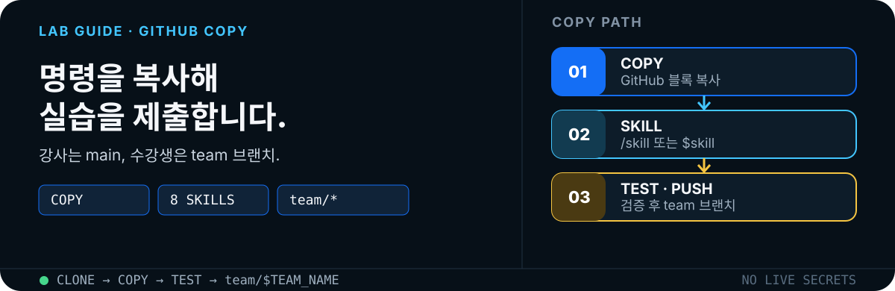
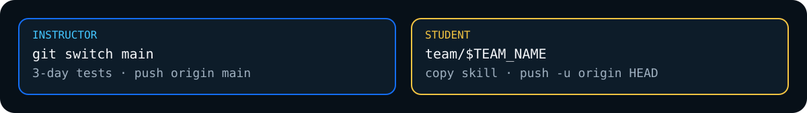
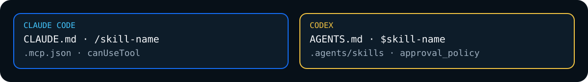
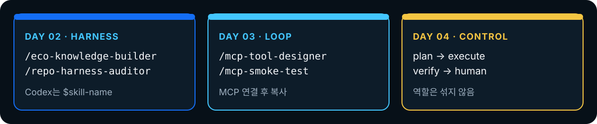

<p align="center">
  
</p>

<p align="center">
  <a href="./README.md">참고 자료</a> ·
  <a href="#1-준비-사항">준비</a> ·
  <a href="#2-github-배포-순서">배포</a> ·
  <a href="#3-에이전트-실행-공통-패턴">에이전트</a> ·
  <a href="#4-day-2-빠른-시작--knowledge-harness">Day 2</a> ·
  <a href="#5-day-3-빠른-시작--mcp-tool-extension">Day 3</a> ·
  <a href="#6-day-4-빠른-시작--multi-agent-hitl">Day 4</a> ·
  <a href="#7-최종-완료-체크리스트">체크리스트</a>
</p>

강사가 `main`을 배포하고, 수강생이 일자별 repo skill로 과제를 수행한 뒤 팀 브랜치에 제출하는 순서입니다. 명령과 완성형 프롬프트는 GitHub **Copy** 버튼으로 그대로 복사합니다.

<p align="center">
  
</p>

## 1. 준비 사항

- Git 2.x
- Python 3.x: Day 2
- Node.js 20 이상: Day 3~4
- Claude Code 또는 Codex CLI 중 하나
- `saewookkangboy/202608_sec_gumi` 저장소 읽기 권한
- 팀 결과를 push하려면 저장소 쓰기 권한 또는 개인 fork

버전을 먼저 확인합니다.

```bash
git --version
python3 --version
node --version
claude --version
codex --version
```

> Claude Code와 Codex를 모두 설치할 필요는 없습니다. 실습 코드는 동일하고, Claude Code는 `CLAUDE.md`와 `/skill-name`, Codex는 `AGENTS.md`와 `$skill-name`을 사용합니다.

## 2. GitHub 배포 순서

### 2-1. 강사·저장소 관리자: main 배포

저장소 관리자가 검증된 교육 자료를 `main`에 배포할 때 사용합니다.

```bash
git clone https://github.com/saewookkangboy/202608_sec_gumi.git
cd 202608_sec_gumi
git switch main
git pull --ff-only origin main
git status -sb
```

세 일자의 회귀 테스트를 실행합니다.

```bash
(cd mx-agentic-ai-day2-knowledge-harness && python3 scripts/validate_repo.py && python3 -m unittest discover -s tests -v)
(cd mx-agentic-ai-day3-mcp-tools && npm test && npm run smoke)
(cd mx-agentic-ai-day4-multi-agent-hitl && npm test)
```

검증이 모두 통과한 경우에만 변경 파일을 명시적으로 추가하고 배포합니다.

```bash
git status -sb
git diff --check
git add README.md docs/ mx-agentic-ai-day2-knowledge-harness/README.md mx-agentic-ai-day3-mcp-tools/README.md mx-agentic-ai-day4-multi-agent-hitl/README.md
git diff --cached --stat
git commit -m "docs: add Claude Code and Codex lab quickstarts"
git push origin main
```

원격 반영을 확인합니다.

```bash
git fetch origin main
git status -sb
git log -1 --oneline --decorate
```

### 2-2. 수강생: 팀 브랜치 제출

팀별 브랜치를 만들면 다른 팀의 결과와 충돌하지 않습니다. `TEAM_NAME`을 영문 소문자·숫자·하이픈 조합으로 지정합니다.

```bash
git clone https://github.com/saewookkangboy/202608_sec_gumi.git
cd 202608_sec_gumi
TEAM_NAME="team-01"
git switch -c "team/$TEAM_NAME"
git status -sb
```

실습 후에는 생성 결과와 테스트를 확인하고 팀 브랜치에 push합니다.

```bash
git status -sb
git diff --check
git add mx-agentic-ai-day2-knowledge-harness/knowledge/ mx-agentic-ai-day2-knowledge-harness/tests/
git diff --cached --stat
git commit -m "feat: complete team lab"
git push -u origin HEAD
```

쓰기 권한이 없다면 먼저 GitHub에서 저장소를 fork한 뒤 개인 원격으로 push합니다.

```bash
gh repo fork saewookkangboy/202608_sec_gumi --clone
cd 202608_sec_gumi
TEAM_NAME="team-01"
git switch -c "team/$TEAM_NAME"
git push -u origin HEAD
```

### 2-3. 제출 전 공통 안전 점검

```bash
git status --short
git diff --check
git diff --cached --name-only
git grep -n -E '(API_KEY|SECRET|PASSWORD|TOKEN)=' -- ':!*.md' || true
```

- 실제 설비 데이터·개인정보·자격증명을 커밋하지 않습니다.
- Day 2 `data/raw/`, Day 3 `data/`, Day 4 `fixtures/`는 수정하지 않습니다.
- `git add .` 대신 제출할 파일을 명시합니다.
- 테스트 PASS와 사람의 최종 승인은 서로 다른 단계입니다.

## 3. 에이전트 실행 공통 패턴

<p align="center">
  
</p>

실습 코드는 동일합니다. Claude Code와 Codex를 모두 설치할 필요는 없습니다. 일자 폴더에서 에이전트를 연 뒤, 아래 완성형 프롬프트를 붙여넣습니다.

### Claude Code

실습 일자 폴더에서 Claude Code를 시작합니다.

```bash
claude
```

대화창에서 `/skill-name`을 입력하거나 아래의 완성형 프롬프트를 붙여넣습니다. 처음 열 때 프로젝트 MCP 또는 파일 접근 승인 화면이 나오면 저장소 경로와 명령을 확인한 뒤 승인합니다.

### Codex

같은 일자 폴더에서 Codex를 시작합니다.

```bash
codex
```

대화창에서 `$skill-name`을 포함한 완성형 프롬프트를 붙여넣습니다. Codex는 현재 폴더의 `AGENTS.md`와 `.agents/skills/`를 기준으로 작업합니다.

<p align="center">
  
</p>

개념 계약은 [Day 2](../mx-agentic-ai-day2-knowledge-harness/docs/skill-and-tech-reference.md) · [Day 3](../mx-agentic-ai-day3-mcp-tools/docs/skill-and-tech-reference.md) · [Day 4](../mx-agentic-ai-day4-multi-agent-hitl/docs/skill-and-tech-reference.md) 참고 자료를 봅니다.

## 4. Day 2 빠른 시작 · Knowledge Harness

### 4-1. 기준 상태 확인

```bash
cd mx-agentic-ai-day2-knowledge-harness
python3 scripts/normalize_docs.py
python3 scripts/search_knowledge.py "P-100 하우징 변경과 관련된 ECO는?"
python3 scripts/validate_repo.py
python3 -m unittest discover -s tests -v
```

### 4-2. Claude Code 적용

```bash
claude
```

다음 내용을 Claude Code에 복사합니다.

```text
/eco-knowledge-builder를 사용해 Day 2 실습을 수행해줘.

목표:
1. data/raw/eco_documents.jsonl은 절대 수정하지 않는다.
2. 합성 ECO 12건을 knowledge/eco/*.md와 knowledge/catalog.json으로 정규화한다.
3. 각 결과에 source_id, source_path, 원본 SHA-256 근거를 유지한다.
4. "P-100 하우징 변경과 관련된 ECO는?" 질문의 Top-3 결과와 근거 ID를 보고한다.
5. 문서에 없는 값은 추정하지 말고 UNKNOWN으로 남긴다.

완료 전 반드시 python3 scripts/validate_repo.py와 전체 unittest를 실행하고,
변경 파일, 테스트 결과, 남은 위험을 요약해줘.
```

하네스 검사를 이어서 실행합니다.

```text
/repo-harness-auditor로 AGENTS.md, 원본 불변 경계, plan.md,
progress.md, decisions.md, source_id/source_path, raw.sha256와 완료 검증을 감사해줘.
실패가 있으면 파일명과 수정 방법을 정확히 알려주고 raw 데이터는 고치지 마.
```

### 4-3. Codex 적용

```bash
codex
```

다음 내용을 Codex에 복사합니다.

```text
$eco-knowledge-builder를 사용해 data/raw/eco_documents.jsonl을 추적 가능한
지식 자산으로 변환해줘. raw 입력은 수정하지 말고, 각 산출물에 source_id와
source_path를 유지해. 검색 질문 "P-100 하우징 변경과 관련된 ECO는?"의
Top-3와 근거 ID를 확인하고, validate_repo.py와 전체 unittest를 실행해.
완료 후 변경 파일, 검증 결과, 남은 위험만 요약해줘.
```

```text
$repo-harness-auditor로 저장소 하네스를 감사해줘. AGENTS.md의 출력 경계,
상태 파일 3종, catalog의 근거 필드, 원본 SHA-256, 전체 테스트를 확인해.
검증 실패를 임의로 숨기거나 raw 파일을 수정하지 마.
```

### 4-4. 핵심 팀 과제

Advanced 과제는 기존 정규화 계약을 유지하면서 `knowledge/relations.json`에 부품→ECO→도면 관계를 추가하고 2-hop 질의를 검증하는 것입니다.

```text
Day 2 팀 과제: 기존 knowledge/catalog.json 계약과 raw 입력을 변경하지 않고,
knowledge/relations.json에 part_id -> eco_id -> drawing_id 관계를 추가해줘.
"P-100과 연결된 ECO 및 도면은?" 질문에 대해 관계 경로와 source_id를 반환하고,
정상 경로·관계 없음·잘못된 ID를 포함한 테스트를 추가해줘.
완료 전 repo harness 감사와 전체 회귀 테스트를 실행해.
```

### 4-5. 결과 확인과 제출

```bash
python3 scripts/validate_repo.py
python3 -m unittest discover -s tests -v
git status --short
git diff --check
git add knowledge/ plan.md progress.md decisions.md tests/
git commit -m "feat(day2): complete knowledge harness lab"
git push -u origin HEAD
```

## 5. Day 3 빠른 시작 · MCP Tool Extension

### 5-1. 기준 상태 확인

```bash
cd mx-agentic-ai-day3-mcp-tools
npm test
npm run smoke
```

### 5-2. Claude Code에 로컬 MCP 연결

저장소에는 프로젝트 공유 설정인 `.mcp.json`이 포함되어 있습니다. 연결 상태를 확인합니다.

```bash
claude mcp list
claude
```

연결이 보이지 않을 때만 프로젝트 범위로 다시 등록합니다.

```bash
claude mcp add --scope project --transport stdio equipment-log -- node src/server.mjs
claude mcp get equipment-log
```

Claude Code에 다음 내용을 복사합니다.

```text
/mcp-tool-designer를 사용해 src/server.mjs의 세 도구 계약을 감사해줘.
각 도구의 단일 책임, 입력 스키마, evidence_id, 오류 형식, 읽기/쓰기 권한을 표로 정리해.
write_analysis_report는 outputs/에만 쓰고 APPROVE_WRITE가 없으면 dry-run이어야 해.
stdout은 JSON-RPC 전용이고 진단은 stderr로 보내는지도 확인해.
코드를 바꾸기 전 변경 계약과 추가할 테스트를 먼저 제안해줘.
```

```text
/mcp-smoke-test를 실행해 initialize -> tools/list -> tools/call E2E 경로를 검증해줘.
정확히 3개 도구, 오류 집계와 evidence_id, 역전 날짜의 구조화 오류,
승인 없는 write의 dry-run과 원본 CSV 불변성을 확인하고 결과를 보고해줘.
```

### 5-3. Codex에 로컬 MCP 연결

Codex CLI는 로컬 stdio 서버를 사용자 설정에 등록합니다. Day 3 폴더의 절대 경로를 사용하면 다른 폴더에서 Codex를 열어도 서버 파일을 찾을 수 있습니다.

```bash
DAY3_DIR="$(pwd)"
codex mcp add equipment-log -- node "$DAY3_DIR/src/server.mjs"
codex mcp get equipment-log
codex
```

이미 같은 이름이 등록되어 있으면 `codex mcp get equipment-log`로 명령을 먼저 확인하고, 이 교육 저장소와 다른 경우에만 기존 항목을 제거한 뒤 다시 등록합니다.

Codex에 다음 내용을 복사합니다.

```text
$mcp-tool-designer로 equipment-log MCP의 세 도구 계약을 점검해줘.
읽기와 쓰기를 분리하고, write_analysis_report는 APPROVE_WRITE 없이는
파일을 만들지 않는 dry-run이어야 해. 입력·출력·실패 사례와 필요한 테스트를
먼저 명시한 뒤, 승인된 범위만 수정하고 npm test와 npm run smoke를 실행해.
```

```text
$mcp-smoke-test로 initialize, tools/list, 안전한 tools/call, 역전 날짜 오류,
승인 없는 쓰기를 E2E 검증해줘. stdout JSON-RPC 오염과 data/equipment_logs.csv
변경 여부도 확인하고, 실패 method와 교정 조치를 정확히 보고해줘.
```

### 5-4. 핵심 실습: 조회 → 오류 → 쓰기 승인

에이전트에 다음 시나리오를 순서대로 요청합니다.

```text
equipment-log MCP를 사용해 다음을 순서대로 수행해줘.
1. 2026-08-11~2026-08-15 로그의 설비별 레코드 수를 조회한다.
2. 해당 기간 오류 코드를 집계하고 모든 수치에 evidence_id를 붙인다.
3. 시작일이 종료일보다 늦은 요청을 보내 구조화 오류를 확인한다.
4. write_analysis_report를 승인 토큰 없이 호출해 dry-run과 파일 미생성을 확인한다.
5. 사람의 명시적 승인을 받기 전에는 실제 쓰기를 수행하지 않는다.
각 단계의 도구명, 입력, 핵심 출력, 검증 결과를 표로 정리해줘.
```

실제 쓰기 단계는 교육 진행자가 승인한 경우에만 사용합니다.

```text
APPROVE_WRITE를 승인 토큰으로 사용해 앞서 검증한 분석만 outputs/에 저장해줘.
저장 경로, 포함된 evidence_id, 원본 CSV 해시 불변 여부를 확인해줘.
```

### 5-5. 결과 확인과 제출

```bash
npm test
npm run smoke
git status --short
git diff --check
git add src/ scripts/ test/ README.md
git commit -m "feat(day3): complete MCP E2E lab"
git push -u origin HEAD
```

승인된 보고서를 과제 증거로 제출할 때만 ignore를 해제해 명시적으로 추가합니다.

```bash
git add -f outputs/analysis-report.md
```

원본 로그는 추가하지 않습니다.

## 6. Day 4 빠른 시작 · Multi-Agent HITL

### 6-1. 기준 상태와 네 가지 종료 경로 확인

```bash
cd mx-agentic-ai-day4-multi-agent-hitl
npm test
npm run demo
npm run demo:approve
node src/cli.mjs --fault missing-evidence
node src/cli.mjs --fault missing-evidence --persistent-fault
```

기본 실행은 `AWAITING_APPROVAL`, `--approve` 실행만 `APPROVED`, 지속 결함은 재시도 한도 후 `ESCALATED`인지 확인합니다.

### 6-2. Claude Code 적용

```bash
claude
```

계획자부터 승인자까지 역할을 섞지 않고 순서대로 호출합니다.

```text
/plan-maintenance-analysis로 설비 오류와 품질 결함의 연관 분석 계획을 만들어줘.
목표, 순서가 있는 단계, 필요한 LOG/QUALITY evidence, PASS 기준을 정의하되
도구 조회·계산·설비 추천·승인은 하지 마. 결과는 planner 계약으로 넘겨줘.
```

```text
/execute-evidence-plan으로 승인된 plan만 실행해 evidence.json을 만들어줘.
fixtures/ 또는 승인된 MCP 도구만 사용하고 모든 수치에 로그 evidence ID와
품질 evidence ID를 연결해. 검증이나 최종 승인은 하지 마.
```

```text
/verify-maintenance-report로 evidence를 독립 검증해줘.
source evidence, equipment join key, defect-rate 계산을 확인하고 PASS, REJECT,
ESCALATE 중 하나만 구체적 사유와 함께 반환해. 실행자 결과를 직접 고치지 마.
```

```text
/request-human-approval로 verifier PASS 이후의 승인 패킷을 만들어줘.
추천안, 근거 요약, 검증 결과, 남은 불확실성을 포함하고 명시적인
approve/reject/revise 입력 전에는 AWAITING_APPROVAL에서 멈춰.
```

### 6-3. Codex 적용

```bash
codex
```

다음 통합 프롬프트를 복사합니다.

```text
Day 4 역할 계약을 순서대로 실행해줘.
1. $plan-maintenance-analysis: 실행 없이 계획과 PASS 기준만 작성
2. $execute-evidence-plan: 승인된 계획을 근거 ID와 함께 실행
3. $verify-maintenance-report: 결과를 수정하지 않고 독립 검증
4. $request-human-approval: PASS 후 승인 패킷을 만들고 사람 입력까지 정지

역할별 입력·출력 파일을 섞지 말고, 동일 결함이 반복되면 최대 3회까지만
복구한 뒤 ESCALATED로 전환해. verifier PASS를 사람 승인으로 간주하지 말고,
마지막에 npm test와 생성된 runs/<run-id>/ 이벤트 순서를 검증해줘.
```

### 6-4. 핵심 실습: 정상·반려·이관·승인

```text
Day 4 팀 과제를 네 시나리오로 수행해줘.
A. 정상 근거: VERIFIED 후 AWAITING_APPROVAL에서 정지
B. missing-evidence: Verifier REJECT 후 Executor 재실행
C. persistent missing-evidence: 동일 결함 3회 후 ESCALATED
D. 명시적 --approve: 검증 PASS 이후에만 APPROVED

각 시나리오에서 plan.json, evidence.json, verification.json, approval.json,
events.jsonl을 확인하고 상태 전이가 계약과 일치하는지 표로 비교해줘.
HITL은 승인 전 정지, HOTL은 events 감시와 임계치 이관으로 구분해 설명해줘.
```

최근 실행 결과를 확인합니다.

```bash
LATEST_RUN="$(find runs -mindepth 1 -maxdepth 1 -type d | sort | tail -n 1)"
printf '%s\n' "$LATEST_RUN"
sed -n '1,200p' "$LATEST_RUN/events.jsonl"
```

### 6-5. 결과 확인과 제출

```bash
npm test
git status --short
git diff --check
git add src/ test/ README.md
git commit -m "feat(day4): complete multi-agent HITL lab"
git push -u origin HEAD
```

> `runs/`는 실행 증거입니다. 팀 제출 정책에 따라 대표 run만 선별하고, 자격증명이나 실제 업무 데이터가 없는지 확인한 후 추가합니다.

## 7. 최종 완료 체크리스트

| 확인 항목 | Day 2 | Day 3 | Day 4 |
|---|---|---|---|
| 원본 입력 불변 | `data/raw/` | `data/` | `fixtures/` |
| 에이전트 계약 | Harness · Knowledge skill | Tool contract · Smoke skill | Planner · Executor · Verifier · Human |
| 자동 검증 | validate + unittest | unit + MCP smoke | state-machine tests |
| 핵심 증거 | `source_id`, `source_path`, SHA-256 | `evidence_id`, JSON-RPC, dry-run | run JSON, `events.jsonl` |
| 사람 통제 | 완료 기준 확인 | 쓰기 토큰 | `AWAITING_APPROVAL` |
| 제출 | 팀 브랜치 push | 팀 브랜치 push | 팀 브랜치 push |

전체 테스트와 Git 상태를 마지막으로 확인합니다.

```bash
(cd mx-agentic-ai-day2-knowledge-harness && python3 scripts/validate_repo.py && python3 -m unittest discover -s tests -v)
(cd mx-agentic-ai-day3-mcp-tools && npm test && npm run smoke)
(cd mx-agentic-ai-day4-multi-agent-hitl && npm test)
git status -sb
```
