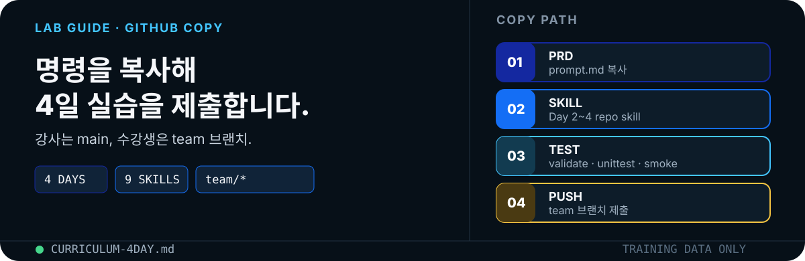
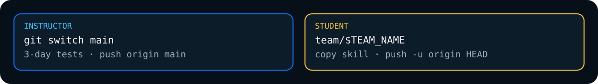
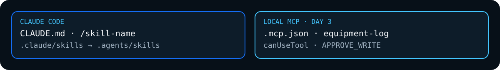
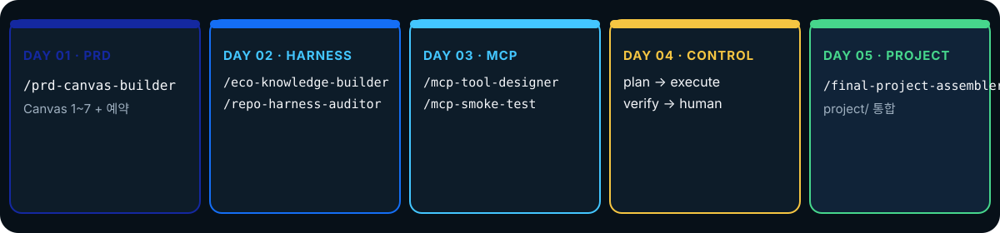

<p align="center">
  
</p>

<p align="center">
  <a href="./README.md">참고 자료</a> ·
  <a href="#1-준비-사항">준비</a> ·
  <a href="#2-github-배포-순서">배포</a> ·
  <a href="#3-claude-code-실행-패턴">에이전트</a> ·
  <a href="#4-day-1-빠른-시작--ai-prd">Day 1</a> ·
  <a href="#5-day-2-빠른-시작--knowledge-harness">Day 2</a> ·
  <a href="#6-day-3-빠른-시작--mcp-tool-extension">Day 3</a> ·
  <a href="#7-day-4-빠른-시작--multi-agent-hitl">Day 4</a> ·
  <a href="#8-day-5-빠른-시작--final-project">Day 5</a> ·
  <a href="#9-최종-완료-체크리스트">체크리스트</a>
</p>

강사가 `main`을 배포하고, 수강생이 일자별 repo 스킬로 과제를 마친 뒤 팀 브랜치에 제출하는 순서입니다. 명령과 완성형 프롬프트는 GitHub의 **Copy** 버튼으로 그대로 복사해서 쓰세요.

<p align="center">
  
</p>

## 1. 준비 사항

- Git 2.x
- Python 3.x (Day 2에서 사용)
- Node.js 20 이상 (Day 3~4에서 사용)
- Claude Code CLI
- `saewookkangboy/202608_sec_gumi` 저장소 읽기 권한
- 팀 결과를 push하려면 저장소 쓰기 권한이나 개인 fork

먼저 버전부터 확인하세요.

```bash
git --version
python3 --version
node --version
claude --version
```

> 실습은 **Claude Code**에서 진행합니다. 일자 폴더의 `CLAUDE.md`와 `/skill-name`을 사용하세요.

## 2. GitHub 배포 순서

### 2-1. 강사·저장소 관리자: main 배포

저장소 관리자가 검증을 마친 교육 자료를 `main`에 배포할 때 쓰는 순서입니다.

```bash
git clone https://github.com/saewookkangboy/202608_sec_gumi.git
cd 202608_sec_gumi
git switch main
git pull --ff-only origin main
git status -sb
```

세 일자의 회귀 테스트를 실행하세요.

```bash
# Day 1 — 예제 검증 (수강생 산출물은 validate_day1.py로, 예제 체험은 --example로)
python3 mx-agentic-ai-day1-prd/scripts/validate_day1.py --example quotation-bot
# Day 1 — 예제를 내 산출물로 복사한 뒤 검증
python3 mx-agentic-ai-day1-prd/scripts/bootstrap_example.py quotation-bot
python3 mx-agentic-ai-day1-prd/scripts/validate_day1.py
(cd mx-agentic-ai-day2-knowledge-harness && python3 scripts/validate_repo.py && python3 -m unittest discover -s tests -v)
(cd mx-agentic-ai-day3-mcp-tools && npm test && npm run smoke)
(cd mx-agentic-ai-day4-multi-agent-hitl && npm test)
```

검증을 모두 통과했을 때만 변경 파일을 하나씩 지정해서 추가하고 배포합니다.

```bash
git status -sb
git diff --check
git add README.md docs/ mx-agentic-ai-day2-knowledge-harness/README.md mx-agentic-ai-day3-mcp-tools/README.md mx-agentic-ai-day4-multi-agent-hitl/README.md
git diff --cached --stat
git commit -m "docs: add Claude Code lab quickstarts"
git push origin main
```

원격에 반영됐는지 확인합니다.

```bash
git fetch origin main
git status -sb
git log -1 --oneline --decorate
```

### 2-2. 수강생: 팀 브랜치 제출

팀별로 브랜치를 만들면 다른 팀의 결과와 충돌하지 않습니다. `TEAM_NAME`은 영문 소문자와 숫자, 하이픈만 써서 지으세요.

```bash
git clone https://github.com/saewookkangboy/202608_sec_gumi.git
cd 202608_sec_gumi
TEAM_NAME="team-01"
git switch -c "team/$TEAM_NAME"
git status -sb
```

실습이 끝나면 만들어진 결과와 테스트를 확인한 뒤 팀 브랜치에 push합니다.

```bash
git status -sb
git diff --check
git add mx-agentic-ai-day2-knowledge-harness/knowledge/ mx-agentic-ai-day2-knowledge-harness/tests/
git diff --cached --stat
git commit -m "feat: complete team lab"
git push -u origin HEAD
```

쓰기 권한이 없다면 GitHub에서 저장소를 먼저 fork하고, 개인 원격으로 push하세요.

```bash
gh repo fork saewookkangboy/202608_sec_gumi --clone
cd 202608_sec_gumi
TEAM_NAME="team-01"
git switch -c "team/$TEAM_NAME"
git push -u origin HEAD
```

### 2-3. 제출 전 공통 안전 점검

```bash
git status --short
git diff --check
git diff --cached --name-only
git grep -n -E '(API_KEY|SECRET|PASSWORD|TOKEN)=' -- ':!*.md' || true
```

- 실제 설비 데이터나 개인정보, 자격증명은 커밋하지 않습니다.
- Day 2 `data/raw/`, Day 3 `data/`, Day 4 `fixtures/`는 고치지 않습니다.
- clone 직후에는 `python3 scripts/verify_dummy_data.py`로 더미 데이터가 있는지 확인하세요. 경로와 스키마는 [`dummy-data.md`](./dummy-data.md)에 있습니다.
- `git add .` 대신 제출할 파일을 하나씩 지정합니다.
- 테스트 PASS와 사람의 최종 승인은 서로 다른 단계입니다.

## 3. Claude Code 실행 패턴

<p align="center">
  
</p>

일자 폴더에서 Claude Code를 연 다음, `/skill-name`을 입력하거나 아래 완성형 프롬프트를 붙여넣으세요.

```bash
cd mx-agentic-ai-dayN-...
claude
```

처음 열 때 프로젝트 MCP나 파일 접근을 승인하라는 화면이 뜨면, 저장소 경로와 명령을 확인한 뒤 승인하세요.

<p align="center">
  
</p>

개념 계약은 [5일 커리큘럼](./curriculum-5day.md), [기술 기둥](./tech-pillars.md), [Day 2](../mx-agentic-ai-day2-knowledge-harness/docs/skill-and-tech-reference.md), [Day 3](../mx-agentic-ai-day3-mcp-tools/docs/skill-and-tech-reference.md), [Day 4](../mx-agentic-ai-day4-multi-agent-hitl/docs/skill-and-tech-reference.md), [Day 5](../mx-agentic-ai-day5-final-project/docs/skill-and-tech-reference.md) 참고 자료에서 확인하세요.

## 4. Day 1 빠른 시작 · AI PRD

### 4-1. 폴더 준비

```bash
cd mx-agentic-ai-day1-prd
# docs/proposal.pdf 에 오전 기획서를 복사해요
ls docs/ sample-data/ expected-output/
```

### 4-2. Claude Code

[Notion 3_AI PRD 가이드](https://adorable-hail-415.notion.site/3_AI-PRD-3c4137efedf680f7a491f3bd50c832c9) 아래쪽에 있는 **복사용 프롬프트**를 통째로 붙여넣으세요. 자가 점검 8항목을 통과하면 `docs/prd.pdf`를 패들렛에 제출합니다.

### 4-3. Day 2 연결

Day 1에서 만든 `sample-data/`와 `expected-output/`은 Day 2 eval, Day 3 MCP, Day 4 HITL의 **PASS 기준을 설계할 때** 그대로 하나씩 대응됩니다. 참조 구현은 [`reference-prd.md`](./reference-prd.md)에서 볼 수 있습니다.

## 5. Day 2 빠른 시작 · Knowledge Harness

### 5-1. 기준 상태 확인

```bash
cd mx-agentic-ai-day2-knowledge-harness
python3 scripts/normalize_docs.py
python3 scripts/search_knowledge.py "P-100 하우징 변경과 관련된 ECO는?"
python3 scripts/validate_repo.py
python3 -m unittest discover -s tests -v
```

### 5-2. Claude Code 프롬프트

```bash
claude
```

다음 내용을 Claude Code에 복사해서 붙여넣으세요.

```text
/eco-knowledge-builder로 Day 2 실습을 진행해 주세요.

목표는 이렇습니다.
1. data/raw/eco_documents.jsonl은 절대 수정하지 말아 주세요.
2. 합성 ECO 12건을 knowledge/eco/*.md와 knowledge/catalog.json으로 정규화해 주세요.
3. 각 결과에 source_id, source_path, 원본 SHA-256 근거를 남겨 주세요.
4. "P-100 하우징 변경과 관련된 ECO는?" 질문의 Top-3 결과와 근거 ID를 알려 주세요.
5. 문서에 없는 값은 추측하지 말고 UNKNOWN으로 남겨 주세요.

끝내기 전에 python3 scripts/validate_repo.py와 전체 unittest를 꼭 실행하고,
바뀐 파일과 테스트 결과, 남아 있는 위험을 정리해 주세요.
```

이어서 하네스 검사를 실행합니다.

```text
/repo-harness-auditor로 AGENTS.md, 원본 불변 경계, plan.md, progress.md,
decisions.md, source_id/source_path, raw.sha256, 완료 검증을 감사해 주세요.
실패한 항목이 있으면 파일명과 고치는 방법을 정확히 알려 주시고,
raw 데이터는 건드리지 말아 주세요.
```

### 5-3. 팀 과제

Advanced 과제는 기존 정규화 계약은 그대로 두면서, `knowledge/relations.json`에 부품 → ECO → 도면 관계를 추가하고 2-hop 질의를 검증하는 것입니다.

```text
Day 2 팀 과제예요. 기존 knowledge/catalog.json 계약과 raw 입력은 그대로 두고,
knowledge/relations.json에 part_id -> eco_id -> drawing_id 관계를 추가해 주세요.
"P-100과 연결된 ECO 및 도면은?" 질문에는 관계 경로와 source_id를 함께 돌려주세요.
정상 경로, 관계 없음, 잘못된 ID까지 포함한 테스트도 만들어 주세요.
끝내기 전에 repo harness 감사와 전체 회귀 테스트를 실행해 주세요.
```

### 5-4. 결과 확인과 제출

```bash
python3 scripts/validate_repo.py
python3 -m unittest discover -s tests -v
git status --short
git diff --check
git add knowledge/ plan.md progress.md decisions.md tests/
git commit -m "feat(day2): complete knowledge harness lab"
git push -u origin HEAD
```

## 6. Day 3 빠른 시작 · MCP Tool Extension

### 6-1. 기준 상태 확인

```bash
cd mx-agentic-ai-day3-mcp-tools
npm test
npm run smoke
```

### 6-2. 로컬 MCP 연결 (Claude Code)

저장소에는 프로젝트 공유 설정인 `.mcp.json`이 들어 있습니다. 먼저 연결 상태를 확인하세요.

```bash
claude mcp list
claude
```

연결이 보이지 않을 때만 프로젝트 범위로 다시 등록하세요.

```bash
claude mcp add --scope project --transport stdio equipment-log -- node src/server.mjs
claude mcp get equipment-log
```

Claude Code에 다음 내용을 복사해서 붙여넣으세요.

```text
/mcp-tool-designer로 src/server.mjs에 있는 세 도구의 계약을 감사해 주세요.
각 도구의 단일 책임, 입력 스키마, evidence_id, 오류 형식, 읽기·쓰기 권한을 표로 정리해 주세요.
write_analysis_report는 outputs/에만 쓰고, APPROVE_WRITE가 없으면 dry-run이어야 해요.
stdout은 JSON-RPC 전용으로 쓰고 진단 메시지는 stderr로 보내는지도 확인해 주세요.
코드를 고치기 전에 바꿀 계약과 추가할 테스트를 먼저 제안해 주세요.
```

```text
/mcp-smoke-test로 initialize -> tools/list -> tools/call E2E 경로를 검증해 주세요.
도구가 정확히 3개인지, 오류 집계와 evidence_id가 붙는지, 날짜가 뒤집힌 요청에서
구조화 오류가 나는지, 승인 없는 write가 dry-run으로 처리되고 원본 CSV가 그대로인지
확인한 뒤 결과를 알려 주세요.
```

### 6-3. 실습: 조회 → 오류 → 쓰기 승인

에이전트에 다음 시나리오를 순서대로 요청하세요.

```text
equipment-log MCP로 다음을 순서대로 진행해 주세요.
1. 2026-08-11~2026-08-15 로그에서 설비별 레코드 수를 조회해 주세요.
2. 같은 기간의 오류 코드를 집계하고, 모든 수치에 evidence_id를 붙여 주세요.
3. 시작일이 종료일보다 늦은 요청을 보내 구조화 오류가 나는지 확인해 주세요.
4. write_analysis_report를 승인 토큰 없이 호출해서 dry-run으로 처리되고
   파일이 만들어지지 않는지 확인해 주세요.
5. 사람의 명시적인 승인을 받기 전에는 실제 쓰기를 하지 말아 주세요.
각 단계의 도구 이름, 입력, 출력, 검증 결과를 표로 정리해 주세요.
```

실제로 쓰는 단계는 교육 진행자가 승인했을 때만 실행하세요.

```text
APPROVE_WRITE를 승인 토큰으로 써서, 앞서 검증한 분석만 outputs/에 저장해 주세요.
저장 경로와 들어간 evidence_id, 원본 CSV 해시가 그대로인지 확인해 주세요.
```

### 6-4. 결과 확인과 제출

```bash
npm test
npm run smoke
git status --short
git diff --check
git add src/ scripts/ test/ README.md
git commit -m "feat(day3): complete MCP E2E lab"
git push -u origin HEAD
```

승인받은 보고서를 과제 증거로 제출할 때만 ignore를 풀고 직접 지정해서 추가하세요.

```bash
git add -f outputs/analysis-report.md
```

원본 로그는 추가하지 마세요.

## 7. Day 4 빠른 시작 · Multi-Agent HITL

### 7-1. 기준 상태와 네 가지 종료 경로 확인

```bash
cd mx-agentic-ai-day4-multi-agent-hitl
npm test
npm run demo
npm run demo:approve
node src/cli.mjs --fault missing-evidence
node src/cli.mjs --fault missing-evidence --persistent-fault
```

기본 실행은 `AWAITING_APPROVAL`에서 멈추고, `--approve`를 붙였을 때만 `APPROVED`가 되며, 결함이 계속 나면 재시도 한도를 넘긴 뒤 `ESCALATED`가 되는지 확인하세요.

### 7-2. Claude Code 프롬프트

```bash
claude
```

계획자부터 승인자까지, 역할을 섞지 말고 순서대로 호출하세요.

```text
/plan-maintenance-analysis로 설비 오류와 품질 결함을 연결해 볼 분석 계획을 세워 주세요.
목표와 순서가 있는 단계, 필요한 LOG/QUALITY evidence, PASS 기준을 정해 주시고,
도구 조회나 계산, 설비 추천, 승인은 하지 말아 주세요. 결과는 planner 계약으로 넘겨 주세요.
```

```text
/execute-evidence-plan으로 승인된 plan만 실행해서 evidence.json을 만들어 주세요.
fixtures/나 승인된 MCP 도구만 쓰고, 모든 수치에 로그 evidence ID와
품질 evidence ID를 연결해 주세요. 검증이나 최종 승인은 하지 말아 주세요.
```

```text
/verify-maintenance-report로 evidence를 따로 검증해 주세요.
source evidence, equipment join key, defect-rate 계산을 확인하고
PASS, REJECT, ESCALATE 중 하나만 구체적인 사유와 함께 돌려주세요.
실행자가 만든 결과를 직접 고치지는 말아 주세요.
```

```text
/request-human-approval로 verifier가 PASS를 준 뒤의 승인 패킷을 만들어 주세요.
추천안과 근거 요약, 검증 결과, 남아 있는 불확실성을 담아 주시고,
approve/reject/revise 중 하나를 명시적으로 입력하기 전에는 AWAITING_APPROVAL에서 멈춰 주세요.
```

### 7-3. 실습: 정상·반려·이관·승인

```text
Day 4 팀 과제를 네 가지 시나리오로 진행해 주세요.
A. 정상 근거: VERIFIED 뒤 AWAITING_APPROVAL에서 멈추기
B. missing-evidence: Verifier가 REJECT한 뒤 Executor가 다시 실행하기
C. persistent missing-evidence: 같은 결함이 3번 반복되면 ESCALATED
D. 명시적 --approve: 검증을 PASS한 뒤에만 APPROVED

각 시나리오에서 plan.json, evidence.json, verification.json, approval.json,
events.jsonl을 확인하고, 상태 전이가 계약과 맞는지 표로 비교해 주세요.
HITL은 승인 전에 멈추는 것, HOTL은 events를 지켜보다 임계치를 넘으면 넘기는 것으로
구분해서 설명해 주세요.
```

가장 최근 실행 결과를 확인하세요.

```bash
LATEST_RUN="$(find runs -mindepth 1 -maxdepth 1 -type d | sort | tail -n 1)"
printf '%s\n' "$LATEST_RUN"
sed -n '1,200p' "$LATEST_RUN/events.jsonl"
```

### 7-4. 결과 확인과 제출

```bash
npm test
git status --short
git diff --check
git add src/ test/ README.md
git commit -m "feat(day4): complete multi-agent HITL lab"
git push -u origin HEAD
```

> `runs/`는 실행 증거입니다. 팀 제출 정책에 맞춰 대표 run만 골라 담고, 자격증명이나 실제 업무 데이터가 섞이지 않았는지 확인한 뒤 추가하세요.

## 8. Day 5 빠른 시작 · Final Project

### 8-1. Day 1~4 완료 후 조립 (자연어)

```bash
cd mx-agentic-ai-day5-final-project
claude
```

Day 5 README의 **예제 1) project/ 조립** 프롬프트를 붙여넣으세요.  
그다음 `project/manifest.json`의 `overall_status`가 `READY`인지 확인합니다. `NOT_READY`라면 모자란 Day를 채운 뒤 같은 프롬프트를 다시 실행하세요.

### 8-2. 최종 산출물 작성

```text
/final-project-assembler로 Day 5 최종 프로젝트를 완성해 주세요.
README 예제 1)~9)의 순서를 그대로 따르고, 파이썬 스크립트는 쓰지 말아 주세요.
1. project/ 조립하고 manifest를 READY로 만들기
2. 자가 점검하기 (day5-self-check.md)
3. demo-data → E2E → HITL 순으로 확인하기
4. architecture, final-prd, demo-script 작성하기
5. 발표 직전 최종 점검하기 (day5-final-check.md)
```

### 8-3. 발표 전 검증

README의 **예제 9) 최종 점검** 프롬프트를 실행하세요.  
`python3 scripts/validate_day5.py`는 강사용 보조 도구이며, 쓰지 않아도 됩니다.

## 9. 최종 완료 체크리스트

| 확인 항목 | Day 1 | Day 2 | Day 3 | Day 4 | Day 5 |
|---|---|---|---|---|---|
| 산출물 | `prd.md`, `prd.pdf`, 샘플 | `knowledge/` | MCP 서버 | 파이프라인 |
| 에이전트 계약 | PRD Canvas, `/prd-canvas-builder` | Harness, Knowledge skill | Tool contract, Smoke | Planner, Executor, Verifier, Human |
| 자동 검증 | `validate_day1.py` | validate + unittest | unit + MCP smoke | state-machine tests |
| 증거 | sample-data, expected-output | `source_id`, SHA-256 | `evidence_id`, dry-run | `events.jsonl` |
| 사람 통제 | 하지 않는 일 명시 | 완료 기준 확인 | 쓰기 토큰 | `AWAITING_APPROVAL` |
| 제출 | 패들렛 `prd.pdf` | 팀 브랜치 | 팀 브랜치 | 팀 브랜치 | **발표** + `project/` |

마지막으로 전체 테스트와 Git 상태를 확인하세요.

```bash
# Day 1은 docs/prd.md 작성 후
(cd mx-agentic-ai-day1-prd && python3 scripts/validate_day1.py)
(cd mx-agentic-ai-day2-knowledge-harness && python3 scripts/validate_repo.py && python3 -m unittest discover -s tests -v)
(cd mx-agentic-ai-day3-mcp-tools && npm test && npm run smoke)
(cd mx-agentic-ai-day4-multi-agent-hitl && npm test)
# Day 5는 claude를 열고 README 예제 1)~9)로 진행해요 (선택: scripts/*.py)
git status -sb
```
