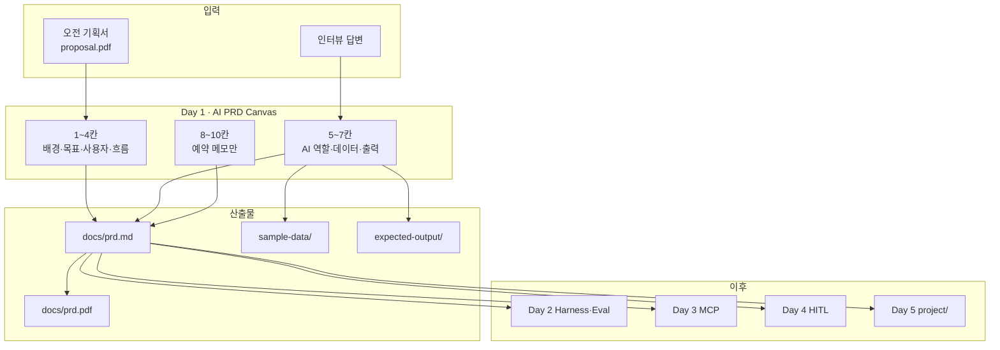
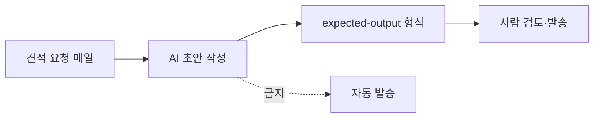

<p align="center">
  
</p>

<p align="center">
  <a href="#이론">이론</a> ·
  <a href="#사용법">사용법</a> ·
  <a href="#저장소-받기-및-실행">저장소</a> ·
  <a href="#실습-예제-안내">예제</a> ·
  <a href="#실습-예제-실행-방법">실행</a> ·
  <a href="#어려움이-생기면">문제 해결</a> ·
  <a href="#완료-기준">완료</a> ·
  <a href="#day-2-연결">Day 2</a>
</p>

오전에 만든 **기획서**를 **AI PRD**로 바꿉니다. AI가 읽고 바로 실행할 수 있도록 *역할·데이터·출력·금지 행동*을 정의하고, Day 2~4에서 채울 **평가·거버넌스·운영** 칸은 예약석으로 남깁니다.

| 구분 | 기획서 (오전) | AI PRD (Day 1) |
|---|---|---|
| 독자 | 사람 | AI + 사람 |
| 질문 | 무엇을 만들까? | AI를 어떻게 일하게 할까? |
| 예시 | "견적 메일 초안 자동 생성" | "이 형식으로 출력 / 발송 금지 / 애매하면 [확인 필요]" |

---

## 이론

### Day 1이 하는 일

Day 1은 **코딩이 아니라 정의**입니다. "어떤 AI 에이전트를 만들지"를 10칸짜리 **AI PRD Canvas**에 적어, 이후 Day 2~5가 그대로 따라갈 **계약서**를 만듭니다.

### 구조도



### AI PRD Canvas 10칸

| # | 항목 | Day 1 | 이후 |
|---|---|:---:|---|
| 1~4 | 배경·목표·사용자·흐름 | ✅ 기획서 이관 | — |
| 5 | AI 역할 + 하면 안 되는 일 | 🔥 | Day 3 MCP로 도구화 |
| 6 | 데이터 + 누락 시 규칙 | 🔥 | Day 2 지식 자산화 |
| 7 | 출력 + fallback | 🔥 | Day 2~4 evidence |
| 8 | 평가 기준 | 예약 메모 | **Day 2** |
| 9 | 안전·거버넌스 | 예약 메모 | **Day 4** |
| 10 | 운영 지표 | 예약 메모 | **Day 4** |

> 8·9·10은 **비워 둡니다.** *"지금 아는 것 / 아직 모르는 것"*만 한 줄씩 적으세요.

### 산출물 폴더 구조

```text
mx-agentic-ai-day1-prd/
├── docs/
│   ├── proposal.pdf      ← 오전 기획서 (직접 추가)
│   ├── prd.md            ← PRD 본문
│   ├── prd.pdf           ← Canvas 1장 (제출용)
│   └── prd-template.md   ← 빈 템플릿
├── sample-data/          ← 가상 입력 샘플
├── expected-output/      ← 목표 출력 예시
└── scripts/              ← 검증·PDF 생성
```

셀프 가이드: **[3_AI PRD 가이드 (Notion)](https://adorable-hail-415.notion.site/3_AI-PRD-3c4137efedf680f7a491f3bd50c832c9)**

---

## 사용법

| 순서 | 할 일 | 팁 |
|:---:|---|---|
| 1 | **기획서 PDF**를 `docs/proposal.pdf`에 넣기 | 스캔·Word→PDF 모두 가능 |
| 2 | **Claude Code**를 이 폴더에서 실행 | AI가 파일을 읽고 PRD를 작성 |
| 3 | **인터뷰에 솔직하게** 답하기 | 모르는 것은 Day 2~4 예약 메모로 남김 |
| 4 | **"하면 안 되는 일"**을 2개 이상 적기 | 발송·삭제·승인·숫자 임의 수정 등 |
| 5 | **검증 스크립트**로 PASS 확인 | PASS ≠ 강사 승인 (둘 다 필요) |
| 6 | **견적봇 예제**로 먼저 체험 (선택) | 본인 PRD 전에 흐름 익히기 |

**비개발자 안내**

- 터미널 명령은 **복사·붙여넣기**만 하면 됩니다. 타이핑 실수가 나면 다시 복사하세요.
- 코딩은 AI(Claude Code)가 합니다. 여러분은 **기획서·인터뷰·검토**에 집중합니다.
- `sample-data/`는 **가상 데이터**입니다. 실제 고객·사업장 정보를 넣지 마세요.

---

## 저장소 받기 및 실행

### 처음 한 번 — 저장소 받기

```bash
# 1. 저장소 복사 (인터넷 연결 필요)
git clone https://github.com/saewookkangboy/202608_sec_gumi.git

# 2. 폴더로 이동
cd 202608_sec_gumi

# 3. Day 1 폴더로 이동
cd mx-agentic-ai-day1-prd
```

> **터미널 여는 법:** Mac → `터미널` 앱 · Windows → `PowerShell` · VS Code/Cursor → 하단 `터미널` 탭

### 매 실습 시작할 때

```bash
cd 202608_sec_gumi/mx-agentic-ai-day1-prd
claude
```

Claude Code 대화창이 열리면 `/prd-canvas-builder` 또는 [Notion 복사용 프롬프트](https://adorable-hail-415.notion.site/3_AI-PRD-3c4137efedf680f7a491f3bd50c832c9)를 붙여넣습니다.

**소요 시간:** 약 35~45분

---

## 실습 예제 안내

### 예제: 견적요청 초안봇 (`quotation-bot`)

본인 기획서 없이 **흐름만 먼저 익히고 싶을 때** 사용합니다.

| 항목 | 내용 |
|---|---|
| 시나리오 | 견적 요청 메일을 받아 **초안만** 작성 (발송은 사람) |
| 예제 위치 | [`docs/examples/quotation-bot/`](./docs/examples/quotation-bot/) |
| 배울 점 | Canvas 5·6·7 작성법, sample-data·expected-output 구조 |



### 본인 PRD 실습

| 항목 | 내용 |
|---|---|
| 입력 | 오전에 만든 `docs/proposal.pdf` |
| 출력 | `docs/prd.md`, `docs/prd.pdf`, `sample-data/`, `expected-output/` |
| 참고 | Day 2~4는 별도 **참조 PRD**([`reference-prd.md`](../docs/reference-prd.md))로 기술을 익힙니다. 팀 PRD와 데이터가 달라도 됩니다. |

---

## 실습 예제 실행 방법

### A. 예제만 검증 (파일 복사 없이)

```bash
cd mx-agentic-ai-day1-prd
python3 scripts/validate_day1.py --example quotation-bot
```

`PASS`가 나오면 예제 구조가 올바릅니다.

### B. 예제를 내 폴더로 복사 후 체험

```bash
cd mx-agentic-ai-day1-prd
python3 scripts/bootstrap_example.py quotation-bot
python3 scripts/validate_day1.py
```

### C. 본인 PRD 작성 (Claude Code)

```bash
cd mx-agentic-ai-day1-prd
# docs/proposal.pdf 에 기획서를 넣은 뒤
claude
```

**AI 진행 순서**

1. **1~4 이관** — 기획서 → 배경·목표·사용자·흐름
2. **5·6·7 인터뷰** — AI 역할, 데이터(가상 샘플), 출력(목표 예시)
3. **8·9·10 예약** — 아는 것 / 모르는 것만
4. **자가 점검** — 8항목 ✅/⚠️
5. **파일 생성** — `prd.md`, `prd.pdf`, `sample-data/`, `expected-output/`

### D. 본인 PRD 검증

```bash
python3 scripts/generate_canvas_pdf.py docs/prd.md docs/prd.pdf
python3 scripts/validate_day1.py
```

### E. Day 1 완료 후 — 다음 일차 진입 준비

```bash
python3 scripts/init_project_profile.py
python3 ../scripts/request_handoff.py --day 1
# 강사가 승인 실행:
python3 ../scripts/approve_handoff.py --day 1 --reviewer "이름" --role instructor
python3 ../scripts/check_day_gate.py --enter-day 2
```

Repo skill: `/prd-canvas-builder`

---

## 어려움이 생기면

| 증상 | 원인 | 해결 |
|---|---|---|
| `git: command not found` | Git 미설치 | [Git 설치](https://git-scm.com/) 후 터미널 재시작 |
| `python3: command not found` | Python 미설치 | Mac: `python3 --version` 확인 · Windows: Microsoft Store에서 Python 3 설치 |
| `claude: command not found` | Claude Code 미설치 | [Claude Code 설치](https://code.claude.com/) 후 `claude --version` |
| `validate_day1.py` FAIL | PRD 필수 항목 누락 | 출력된 오류 메시지 항목을 `prd.md`에 보완 |
| `proposal.pdf` 없음 | 기획서 미추가 | `docs/proposal.pdf` 경로·파일명 확인 |
| §5 "하면 안 되는 일" 부족 | 2개 미만 | 발송·삭제·승인·임의 수정 등 구체적으로 추가 |
| §8·9·10이 비어 있음 | 예약 메모 누락 | "아직 모르는 것"을 솔직히 한 줄씩 작성 |
| Claude가 파일을 못 찾음 | 잘못된 폴더에서 실행 | `cd mx-agentic-ai-day1-prd` 후 `claude` 재실행 |
| PDF 생성 실패 | `prd.md` 형식 오류 | `validate_day1.py` 오류 메서지 먼저 해결 |

**추가 도움**

1. 터미널 **전체 오류 메시지**를 복사해 강사·멘토에게 전달
2. `python3 scripts/validate_day1.py` 결과 스크린샷
3. `docs/prd.md` 해당 섹션 공유

---

## 완료 기준

- [ ] 5번에 "하면 안 되는 일" ≥ 2개
- [ ] 6번에 누락 시 규칙 + `sample-data/` 생성
- [ ] 7번에 출력 구조 + fallback + `expected-output/` 생성
- [ ] 8·9·10에 "아직 모르는 것"이 솔직하게 적힘
- [ ] `python3 scripts/validate_day1.py` **PASS**
- [ ] `docs/prd.pdf` 제출
- [ ] 강사 **사람 승인** (`approve_handoff --day 1`)

---

## Day 2 연결

Day 1이 끝나면 **사람 승인 후** Day 2를 엽니다. [`docs/handoffs/day1-to-day2.md`](../docs/handoffs/day1-to-day2.md)

| Day 1 산출 | Day 2에서 하는 일 |
|---|---|
| `sample-data/` | 평가용 고정 입력 설계 참고 |
| `expected-output/` | Top-3·PASS 기준 설계 참고 |
| PRD 8번 "모르는 것" | Harness·Eval로 채우기 |

```bash
cd ../mx-agentic-ai-day2-knowledge-harness
```

## 참고 자료

- [5일 커리큘럼](../docs/curriculum-5day.md) · [루트 README](../README.md)
- [3_AI PRD 가이드 (Notion)](https://adorable-hail-415.notion.site/3_AI-PRD-3c4137efedf680f7a491f3bd50c832c9)
- [GitHub 배포·코드복사 가이드](../docs/github-deployment-and-quickstart.md)
- [skill·기술 참고](./docs/skill-and-tech-reference.md)
- [완성 예시: 견적요청 초안봇](./docs/examples/quotation-bot/)
