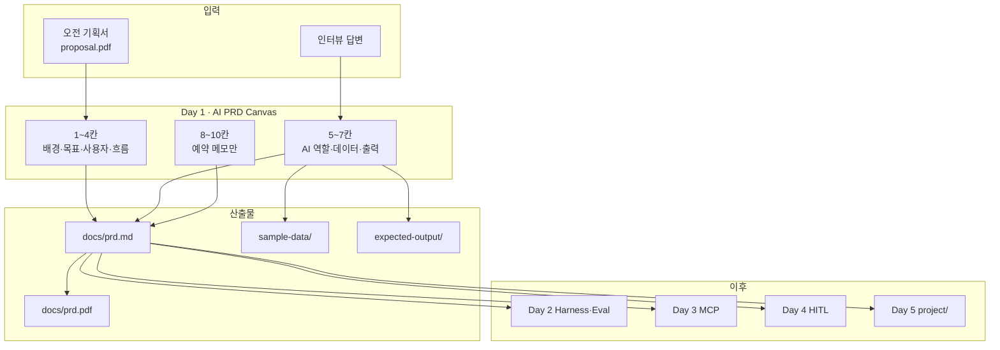

# Day 1 — AI PRD Canvas 정의

> 레포 경로: `mx-agentic-ai-day1-prd/README.md`

**교육 질문**: AI에게 무엇을 맡기고, 무엇을 절대 하지 말게 할까요?

오전에 만든 **기획서**를 **AI PRD**로 바꿉니다. AI가 읽고 바로 실행할 수 있도록 *역할·데이터·출력·금지 행동*을 정의하고, Day 2~4에서 채울 **평가·거버넌스·운영** 칸은 예약석으로 남깁니다.

| 구분 | 기획서 (오전) | AI PRD (Day 1) |
|---|---|---|
| 독자 | 사람 | AI + 사람 |
| 질문 | 무엇을 만들까? | AI를 어떻게 일하게 할까? |
| 예시 | "견적 메일 초안 자동 생성" | "이 형식으로 출력 / 발송 금지 / 애매하면 [확인 필요]" |

---

## 이론

**Day 1이 하는 일**
코딩이 아니라 **정의**예요. "어떤 AI 에이전트를 만들지"를 10칸짜리 **AI PRD Canvas**에 적어, 이후 Day 2~5가 그대로 따라갈 계약서를 만들어요.



**AI PRD Canvas 10칸**

| # | 항목 | Day 1 | 이후 |
|---|---|:---:|---|
| 1~4 | 배경·목표·사용자·흐름 | ✅ 기획서 이관 | — |
| 5 | AI 역할 + 하면 안 되는 일 | 🔥 | Day 3 MCP로 도구화 |
| 6 | 데이터 + 누락 시 규칙 | 🔥 | Day 2 지식 자산화 |
| 7 | 출력 + fallback | 🔥 | Day 2~4 evidence |
| 8 | 평가 기준 | 예약 메모 | **Day 2** |
| 9 | 안전·거버넌스 | 예약 메모 | **Day 4** |
| 10 | 운영 지표 | 예약 메모 | **Day 4** |

> 8·9·10은 **비워 둡니다.** *"지금 아는 것 / 아직 모르는 것"*만 한 줄씩 적으세요.

셀프 가이드: **[3_AI PRD 가이드 (Notion)](https://adorable-hail-415.notion.site/3_AI-PRD-3c4137efedf680f7a491f3bd50c832c9)**

---

## 사용법

1. 레포 루트에서 `cd mx-agentic-ai-day1-prd` 후 Claude Code를 열어요.
2. 오전 기획서를 `docs/proposal.pdf`에 넣어요 (스캔·Word→PDF 가능).
3. `/prd-canvas-builder` 또는 [Notion 복사용 프롬프트](https://adorable-hail-415.notion.site/3_AI-PRD-3c4137efedf680f7a491f3bd50c832c9)를 붙여넣어요.
4. 인터뷰에 솔직하게 답하고, **"하면 안 되는 일"을 2개 이상** 적어요. 모르는 것은 Day 2~4 예약 메모로 남겨요.
5. 검증 스크립트로 PASS를 확인해요 — **PASS ≠ 강사 승인** (둘 다 필요해요).
6. 흐름만 먼저 익히고 싶으면 아래 [예제]의 견적봇을 먼저 써 보세요.

**비개발자 안내**
- 터미널 명령은 **복사·붙여넣기**만 하면 돼요.
- 코딩은 AI(Claude Code)가 해요. 여러분은 **기획서·인터뷰·검토**에 집중해요.
- `sample-data/`는 **가상 데이터**예요. 실제 고객·사업장 정보를 넣지 마세요.

---

## 저장소 구조

```
202608_sec_gumi/
└── mx-agentic-ai-day1-prd/
    ├── README.md                 # 이 문서
    ├── docs/
    │   ├── proposal.pdf          # 오전 기획서 (직접 추가)
    │   ├── prd.md                # PRD 본문 (Day 2~5 입력)
    │   ├── prd.pdf               # Canvas 1장 (제출용)
    │   ├── prd-template.md       # 빈 템플릿
    │   └── examples/quotation-bot/  # 견적봇 완성 예제
    ├── sample-data/              # 가상 입력 샘플
    ├── expected-output/          # 목표 출력 예시
    └── scripts/
        ├── validate_day1.py
        ├── generate_canvas_pdf.py
        ├── bootstrap_example.py
        └── init_project_profile.py
```

---

## 예제

### 1) 견적요청 초안봇 (`quotation-bot`) — 흐름 체험

| 항목 | 내용 |
|---|---|
| 시나리오 | 견적 요청 메일을 받아 **초안만** 작성 (발송은 사람) |
| 위치 | [`docs/examples/quotation-bot/`](./docs/examples/quotation-bot/) |
| 배울 점 | Canvas 5·6·7 작성법, sample-data·expected-output 구조 |

```bash
cd mx-agentic-ai-day1-prd
python3 scripts/validate_day1.py --example quotation-bot
# 또는 내 폴더로 복사 후 체험:
python3 scripts/bootstrap_example.py quotation-bot
python3 scripts/validate_day1.py
```

### 2) 본인 PRD 작성 (Claude Code에 붙여넣기)

```
docs/proposal.pdf를 읽고 AI PRD Canvas 1~7을 docs/prd.md에 채워 주세요.
5번에 "하면 안 되는 일"을 2개 이상, 6번에 누락 시 규칙,
7번에 출력 구조와 fallback을 넣고,
8·9·10은 "지금 아는 것 / 아직 모르는 것"만 한 줄씩 남겨 주세요.
sample-data/와 expected-output/도 가상 데이터로 만들어 주세요.
```

---

## 실행

1. (처음 한 번) 저장소를 받아요
   ```bash
   git clone https://github.com/saewookkangboy/202608_sec_gumi.git
   cd 202608_sec_gumi/mx-agentic-ai-day1-prd
   ```
2. `docs/proposal.pdf`에 기획서를 넣어요
3. `claude`를 실행하고 `/prd-canvas-builder` 또는 [예제] 프롬프트를 붙여넣어요
4. AI 진행 순서: **1~4 이관 → 5·6·7 인터뷰 → 8·9·10 예약 → 자가 점검 → 파일 생성**
5. 검증해요
   ```bash
   python3 scripts/generate_canvas_pdf.py docs/prd.md docs/prd.pdf
   python3 scripts/validate_day1.py
   ```
6. 가상 테스트(예제·본인 PRD 재검증)를 진행해도 되는지 나한테 먼저 물어봐요. 승인을 받으면 아래 [테스트 조건]에 따라 진행해요
7. 프로필·핸드오프를 준비해요
   ```bash
   python3 scripts/init_project_profile.py
   python3 ../scripts/request_handoff.py --day 1
   # 강사 승인:
   python3 ../scripts/approve_handoff.py --day 1 --reviewer "이름" --role instructor
   python3 ../scripts/check_day_gate.py --enter-day 2
   ```

**Day1 승인 조건**: Canvas 5·6·7 완성 / "하면 안 되는 일" ≥ 2 / `sample-data/`·`expected-output/` 존재 / `validate_day1.py` PASS / `prd.pdf` 제출 / 강사 사람 승인

**소요 시간:** 약 35~45분

---

## 테스트 조건 (가상 테스트 — 임시 환경)

| 조건 | 내용 |
|---|---|
| 실행 위치 | 검증은 이 폴더에서만 해요. Day 2~5 폴더는 건드리지 않아요 |
| 데이터 | 합성·가상 데이터만 사용해요. 실제 회사명·개인정보는 절대 넣지 않아요 |
| 테스트 범위 | (1) 견적봇 예제 `validate_day1.py --example quotation-bot` PASS / (2) 본인 `prd.md` 자가 점검 8항목 |
| 되돌리기 | 예제 체험은 `bootstrap_example.py`로 덮어쓴 파일을 git으로 되돌리거나, `docs/examples/` 원본을 다시 참고해요 |
| 시간 | 10분 안에 끝내요 |
| 결과 반영 | 검증 FAIL 항목만 `prd.md`·샘플에 반영해요. PASS를 사람 승인으로 간주하지 않아요 |

---

## 문제 해결

| 상황 | 대응 |
|---|---|
| `git` / `python3` / `claude` 명령을 못 찾음 | 각 도구 설치 후 터미널을 재시작해요 ([Git](https://git-scm.com/) · [Claude Code](https://code.claude.com/)) |
| `validate_day1.py` FAIL | 출력된 오류 항목을 `prd.md`에 보완해요 |
| `proposal.pdf` 없음 | `docs/proposal.pdf` 경로·파일명을 확인해요 |
| §5 "하면 안 되는 일" 부족 | 발송·삭제·승인·임의 수정 등 구체적으로 2개 이상 추가해요 |
| §8·9·10이 비어 있음 | "아직 모르는 것"을 솔직히 한 줄씩 작성해요 |
| Claude가 파일을 못 찾음 | `cd mx-agentic-ai-day1-prd` 후 `claude`를 다시 실행해요 |
| PDF 생성 실패 | `validate_day1.py` 오류를 먼저 해결해요 |

**다음:** 사람 승인 후 [`../mx-agentic-ai-day2-knowledge-harness/`](../mx-agentic-ai-day2-knowledge-harness/) · 핸드오프 [`docs/handoffs/day1-to-day2.md`](../docs/handoffs/day1-to-day2.md)
