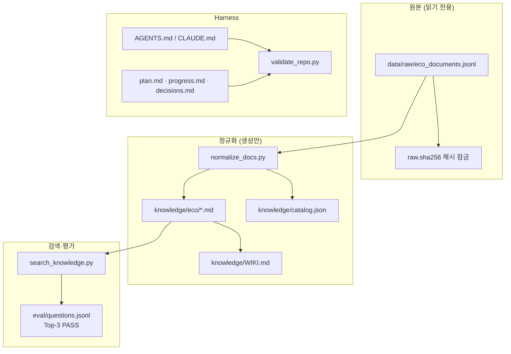
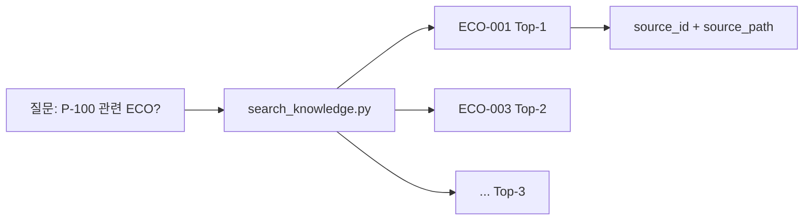

<p align="center">
  
</p>

<p align="center">
  <a href="#이론">이론</a> ·
  <a href="#사용법">사용법</a> ·
  <a href="#저장소-받기-및-실행">저장소</a> ·
  <a href="#실습-예제-안내">예제</a> ·
  <a href="#실습-예제-실행-방법">실행</a> ·
  <a href="#어려움이-생기면">문제 해결</a> ·
  <a href="#완료-기준">완료</a> ·
  <a href="#day-3-연결">Day 3</a>
</p>

합성 ECO 12건을 **근거 추적 가능한 지식 자산**으로 바꿉니다. **기술 기둥: Harness Engineering + LLMWiki (+ GraphRAG\*)**

---

## 이론

### Day 2가 하는 일

Day 2는 **"AI가 믿을 수 있는 지식"**을 만듭니다. 원본 문서는 **절대 수정하지 않고**, 정규화된 Markdown + `source_id`로 **어디서 왔는지 추적**할 수 있게 합니다. Harness는 에이전트가 지켜야 할 **규칙·상태·검증** 장치입니다.

### 지식 파이프라인



### PRD · 기술 기둥 연결

| 기둥 | Standard | Advanced |
|---|---|---|
| Harness Engineering | `AGENTS.md`, 상태 파일, `validate_repo.py` | `/repo-harness-auditor` |
| LLMWiki | `knowledge/WIKI.md` + `eco/*.md` | 팀 위키 구조 |
| GraphRAG | Top-3 eval | `relations.json` 2-hop |

| Day 1 PRD | Day 2 실습 |
|---|---|
| 6 데이터·누락 규칙 | `source_id`, `UNKNOWN` |
| 8 "아직 모르는 것" | eval + harness |

→ [LLMWiki + GraphRAG](./docs/llmwiki-graphrag-bridge.md) · [참조 PRD](../docs/reference-prd.md)

---

## 사용법

| 순서 | 할 일 | 팁 |
|:---:|---|---|
| 1 | **Day 1 승인** 후 진입 | `check_day_gate.py --enter-day 2` |
| 2 | **원본을 건드리지 않기** | `data/raw/`는 읽기만 |
| 3 | **정규화 → 검색 → 검증** 순서 | 스크립트가 대부분 자동 처리 |
| 4 | **Claude Code skill** | `/eco-knowledge-builder` |
| 5 | **상태 파일** 기록 | `plan.md`, `progress.md`, `decisions.md` |
| 6 | **Top-3 eval** 확인 | 정답 문서가 검색 상위 3개 안에 들어가야 PASS |

**비개발자 안내**

- Python 스크립트는 **검증 도구**입니다. 결과가 `PASS`/`FAIL`로 나옵니다.
- `source_id`는 **근거 번호**입니다. Day 3~4에서도 같은 개념을 씁니다.
- 팀 PRD(견적봇 등)와 데이터가 달라도 됩니다. **Canvas 8번 구조**만 같으면 됩니다.

---

## 저장소 받기 및 실행

### Day 2 진입 전 (Day 1 완료·승인 필수)

```bash
cd 202608_sec_gumi
python3 scripts/check_day_gate.py --enter-day 2
cd mx-agentic-ai-day2-knowledge-harness
```

### 매 실습 시작할 때

```bash
cd 202608_sec_gumi/mx-agentic-ai-day2-knowledge-harness
claude
```

---

## 실습 예제 안내

### 참조 시나리오: ECO 12건

| 항목 | 내용 |
|---|---|
| 배경 | 금형 설계변경(ECO) 문서가 흩어져 있어 연관 분석이 어려움 |
| 원본 | `data/raw/eco_documents.jsonl` (12건, 합성 데이터) |
| 질문 예시 | "P-100 하우징 변경과 관련된 ECO는?" |
| 기대 결과 | `ECO-001`, `ECO-003` 등이 Top-3에 포함, 각각 `source_id` 부여 |



### 폴더 구조

```text
mx-agentic-ai-day2-knowledge-harness/
├── data/raw/              ← 원본 (절대 수정 금지)
├── knowledge/
│   ├── eco/*.md           ← 정규화된 지식 (생성)
│   ├── catalog.json       ← 인덱스
│   └── WIKI.md            ← 위키 목차
├── eval/                  ← 평가 질문·정답
├── plan.md progress.md decisions.md  ← Harness 상태
└── scripts/               ← 정규화·검색·검증
```

---

## 실습 예제 실행 방법

### 1단계 — 자동 정규화·검색 (터미널)

```bash
cd mx-agentic-ai-day2-knowledge-harness
python3 scripts/normalize_docs.py
python3 scripts/search_knowledge.py "P-100 하우징 변경과 관련된 ECO는?"
python3 scripts/validate_repo.py
python3 -m unittest discover -s tests -v
```

모두 **PASS**이면 기본 실습 완료입니다.

### 2단계 — Claude Code로 심화 (선택)

```bash
claude
```

```text
/eco-knowledge-builder를 사용해 Day 2 실습을 수행해줘.
data/raw/eco_documents.jsonl은 절대 수정하지 말고, 합성 ECO 12건을
knowledge/eco/*.md와 knowledge/catalog.json으로 정규화해.
각 결과에 source_id, source_path, 원본 SHA-256 근거를 유지하고,
"P-100 하우징 변경과 관련된 ECO는?" 질문의 Top-3와 근거 ID를 확인해.
문서에 없는 값은 UNKNOWN으로 남겨. 완료 전 validate_repo.py와 전체
unittest를 실행하고 변경 파일, 테스트 결과, 남은 위험을 요약해줘.
```

```text
/repo-harness-auditor로 AGENTS.md의 원본·출력 경계, plan.md, progress.md,
decisions.md, catalog 근거 필드, raw.sha256와 전체 테스트를 감사해줘.
```

### 3단계 — Advanced (팀 과제, 선택)

```text
기존 knowledge/catalog.json 계약과 raw 입력을 변경하지 않고,
knowledge/relations.json에 part_id -> eco_id -> drawing_id 관계를 추가해줘.
"P-100과 연결된 ECO 및 도면은?"에 관계 경로와 source_id를 반환하고,
정상 경로·관계 없음·잘못된 ID 테스트를 추가해. 완료 전 하네스 감사와
전체 회귀 테스트를 실행해줘.
```

### 4단계 — 제출 (팀 브랜치)

```bash
python3 scripts/validate_repo.py
python3 -m unittest discover -s tests -v
git add knowledge/ plan.md progress.md decisions.md tests/
git commit -m "feat(day2): complete knowledge harness lab"
git push -u origin HEAD
```

### 5단계 — Day 3 진입

```bash
python3 ../scripts/request_handoff.py --day 2
python3 ../scripts/approve_handoff.py --day 2 --reviewer "이름" --role instructor
python3 ../scripts/check_day_gate.py --enter-day 3
```

---

## 어려움이 생기면

| 즹상 | 원인 | 해결 |
|---|---|---|
| `check_day_gate` 거부 | Day 1 미승인 | Day 1 `approve_handoff` 먼저 |
| `normalize_docs.py` 오류 | Python·경로 문제 | `cd mx-agentic-ai-day2-knowledge-harness` 확인 |
| ECO 12건 미만 | 정규화 미완료 | `normalize_docs.py` 재실행, `knowledge/eco/` 파일 수 확인 |
| `source_id` 없음 | Markdown 헤더 누락 | skill로 재생성 또는 템플릿 대조 |
| SHA-256 불일치 | `data/raw/` 수정됨 | **원본 복구** (수정 금지 규칙) |
| Top-3 eval FAIL | 검색 품질 부족 | 키워드·인덱스·catalog 확인, 강사에게 질문 |
| `unittest` FAIL | 테스트 기대값 불일치 | 오류 메시지의 파일명·줄 번호 확인 |
| `plan.md` 비어 있음 | Harness 상태 미기록 | 오늘 한 일·다음 단계·판단 근거 작성 |

**추가 도움:** `validate_repo.py` + `unittest` 전체 출력을 강사에게 전달하세요.

---

## 완료 기준

- [ ] 12개 ECO 레코드가 `knowledge/eco/`에 생성됨
- [ ] 모든 문서에 `source_id`와 `source_path` 존재
- [ ] 원본 SHA-256이 작업 전후 동일
- [ ] 평가 질문의 정답 문서가 Top-3에 포함
- [ ] `plan.md`, `progress.md`, `decisions.md`가 비어 있지 않음
- [ ] `validate_repo.py` + `unittest` **PASS**
- [ ] 강사 **사람 승인** (`approve_handoff --day 2`)

---

## Day 3 연결

[`docs/handoffs/day2-to-day3.md`](../docs/handoffs/day2-to-day3.md) — Day 2 `equipment` 필드가 Day 3 설비 ID(`PRESS-01` 등)와 조인 키입니다.

```bash
cd ../mx-agentic-ai-day3-mcp-tools
```

## 참고 자료

- [GitHub 배포 가이드](../docs/github-deployment-and-quickstart.md)
- [skill·기술 참고](./docs/skill-and-tech-reference.md)
- [5일 커리큘럼](../docs/curriculum-5day.md)
