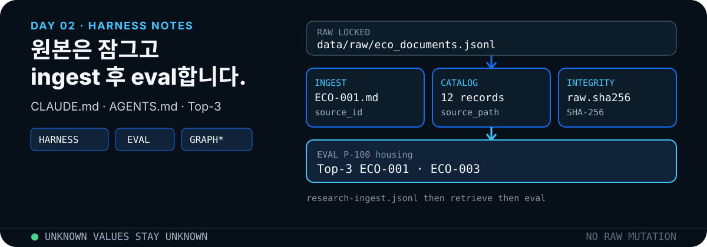

<p align="center">
  
</p>

원본 12건은 `data/raw/eco_documents.jsonl`에 고정합니다. 정규화된 Markdown과 카탈로그만 `knowledge/`에 만듭니다. 구현은 이 저장소 파일을, 개념은 Claude Code·Codex의 하네스와 [Agent Skills](https://agentskills.io/specification)를 기준으로 합니다.

## 먼저 확인하는 증거

```bash
python3 scripts/normalize_docs.py
python3 scripts/search_knowledge.py "P-100 하우징 변경과 관련된 ECO는?"
python3 scripts/validate_repo.py
python3 -m unittest discover -s tests -v
```

| 입력 | 생성 결과 | 완료 증거 |
|---|---|---|
| `data/raw/eco_documents.jsonl` | `knowledge/eco/*.md`, `knowledge/catalog.json` | ECO 12건, `source_id`, `source_path`, 원본 SHA-256 |

평가 질문(`eval/questions.jsonl`)의 정답은 Top-3에 들어가야 합니다.

| 질문 요지 | 기대 문서 |
|---|---|
| P-100 후면 하우징 변경 이력 | `ECO-001`, `ECO-003` |
| 카메라 브래킷 진동 내구 | `ECO-008` |
| PRESS-03 연결 ECO | `ECO-005`, `ECO-011` |
| 도면 정보가 없는 ECO | `ECO-007` |

`ECO-007`의 `drawing: UNKNOWN`, `ECO-012`의 `equipment: UNKNOWN`은 의도된 예시입니다. 문서에 없으면 채우지 않습니다.

## Repo skill

스킬은 `.agents/skills/<name>/SKILL.md`에 있습니다. 에이전트는 시작 시 `name`·`description`만 읽고, 작업이 맞을 때 본문을 로드합니다.

### `$eco-knowledge-builder`

| 항목 | 내용 |
|---|---|
| 입력 | `data/raw/eco_documents.jsonl` (읽기 전용) |
| 출력 | `knowledge/eco/*.md`, `knowledge/catalog.json`, `knowledge/raw.sha256` |
| 금지 | 원본 수정, 문서에 없는 값 추정 |

1. `AGENTS.md`에서 `data/raw/`가 불변인지 확인한다.
2. `python3 scripts/normalize_docs.py`를 실행한다.
3. 카탈로그와 Markdown 2건 이상을 검사한다.
4. 질문에 `source_id`와 `source_path`로 답한다.
5. `validate_repo.py`와 테스트를 통과시킨다.

Advanced는 `knowledge/relations.json`으로 부품→ECO→도면 2-hop을 추가하되, `source_id`·`source_path`·원본 해시는 바꾸지 않습니다.

### `$repo-harness-auditor`

하네스가 실제로 작업을 제약하는지 감사합니다. 원본 해시를 다시 찍어 실패를 숨기지 않습니다.

- `AGENTS.md`가 `data/raw/`를 보호하고 허용 출력 경로를 명시하는가
- `plan.md`, `progress.md`, `decisions.md`에 재개 가능한 상태가 있는가
- 지식 레코드에 `source_id`와 `source_path`가 있는가
- 원본 SHA-256이 `knowledge/raw.sha256`과 같은가
- `validate_repo.py`와 테스트가 통과하는가

## 기술 개념

### Agent Skills와 점진적 공개

| 단계 | 내용 | 토큰 비용 |
|---|---|---|
| 1. Metadata | `name`, `description`만 적재 | 스킬당 약 100 토큰 |
| 2. Instructions | 작업이 맞을 때 `SKILL.md` 본문 | 권장 5,000 토큰 미만 |
| 3. Resources | `scripts/` 등은 필요할 때만 | 읽기 전까지 0 |

이 실습의 결정적 작업(정규화·해시·검색)은 Python 스크립트가 수행합니다. 모델이 매번 재작성하지 않습니다.

- [Agent Skills Specification](https://agentskills.io/specification)
- [Equipping agents for the real world with Agent Skills](https://www.anthropic.com/engineering/equipping-agents-for-the-real-world-with-agent-skills)
- [Claude Code · Skills](https://code.claude.com/docs/en/skills)
- [Codex · Build skills](https://developers.openai.com/codex/skills)

### Claude · Codex 하네스

하네스는 모델 바깥에서 행동 범위를 고정합니다. Claude Code는 `CLAUDE.md`와 `.claude/`, Codex는 `AGENTS.md`와 `.agents/`를 같은 역할로 씁니다. 이 실습은 Codex 레이아웃(`.agents/skills`, `AGENTS.md`)을 쓰되 Claude에서도 같은 계약을 읽을 수 있게 둡니다.

| 층 | Claude Code | Codex | 이 실습 |
|---|---|---|---|
| 지속 지침 | [`CLAUDE.md`](https://code.claude.com/docs/en/memory) | [`AGENTS.md`](https://developers.openai.com/codex/guides/agents-md) | 원본 보호, 출력 경로, 완료 전 검증 |
| 스킬 | `.claude/skills/` | `.agents/skills/` | `$eco-knowledge-builder`, `$repo-harness-auditor` |
| 상태 | 세션 메모리 + 프로젝트 파일 | `plan.md` 등 저장소 산출물 | `plan.md` / `progress.md` / `decisions.md` |
| 완료 검사 | 테스트·훅 | 테스트·승인 정책 | `validate_repo.py`, Top-3 테스트 |

[Anthropic의 장기 실행 하네스](https://www.anthropic.com/engineering/effective-harnesses-for-long-running-agents)는 초기화, 점진적 진행, 다음 세션이 읽을 상태 산출물을 핵심으로 제시합니다. [Unlocking the Codex harness](https://openai.com/index/unlocking-the-codex-harness/)는 같은 루프를 App Server 프로토콜로 노출합니다. 이 저장소에서는 초기 데이터·규칙, 한 단계씩 실행하는 스크립트, 상태 파일 3개로 대응합니다.

### 리서치와 ingest

지식 자산화는 웹 검색 결과를 그대로 붙이는 일이 아닙니다. 원본을 잠근 뒤 파생 레코드로 **ingest**하고, 질문으로 **eval**합니다.

| 단계 | Claude / Codex에서 하는 일 | 이 실습 |
|---|---|---|
| Research | 공식 문서·스킬·레포를 읽고 출처를 남긴다 | `docs/research-ingest.jsonl`의 `url` |
| Ingest | 원본을 정규화하고 ID·경로·해시를 붙인다 | `normalize_docs.py` → `knowledge/` |
| Retrieve | 스킬·카탈로그에서 근거만 고른다 | `search_knowledge.py` |
| Eval | 고정 질문의 기대 ID가 Top-k에 있는지 확인한다 | `eval/questions.jsonl` |

### Graph Engineering

그래프 엔지니어링은 단순히 그래프 DB를 추가하는 일이 아닙니다. 어떤 항목을 노드로 보고, 어떤 관계를 엣지로 유지하며, 질의 결과를 원문 증거까지 되돌릴 수 있게 설계하는 일입니다.

| 그래프 요소 | Day 2 Advanced |
|---|---|
| Node | 부품, ECO, 도면, 설비 |
| Edge | `AFFECTS`, `REFERENCES`, `APPLIES_TO` |
| Provenance | 모든 노드·엣지에 `source_id`, `source_path` |
| Query | `P-100 → ECO → drawing` 2-hop |
| Eval | 기대 ECO가 결과 안에 있고 원문 경로가 유효함 |

Claude Agent SDK와 Codex 하네스는 **루프가 기본**입니다. 그래프는 지식 관계(이 실습 Advanced)나 여러 루프의 역할 전이(Day 4)가 필요할 때 도입합니다. [Microsoft GraphRAG](https://github.com/microsoft/graphrag)는 비정형 텍스트에서 엔터티·관계·커뮤니티를 추출하는 참고 구현이며 Standard에는 넣지 않습니다.

### Eval Check

평가는 “답이 그럴듯한가”가 아니라 고정 입력과 통과 기준을 반복 실행하는 회귀 검사입니다. Claude의 [Building effective agents](https://www.anthropic.com/engineering/building-effective-agents)는 측정 없이 복잡도를 올리지 말라고 하고, Codex 루프는 테스트·린트 결과를 다음 턴의 입력으로 씁니다. [OpenAI Evals 가이드](https://developers.openai.com/api/docs/guides/evals)를 참고해 `eval/questions.jsonl`을 평가 데이터셋으로 취급합니다.

- 입력: 질문과 기대 `source_id`
- 실행: 같은 검색 스크립트와 같은 Top-k
- 판정: 기대 ID가 Top-3 안에 존재
- 실패 시: 점수 규칙 또는 정규화 결과를 수정하고 다시 실행
- 금지: 실패한 기대값을 현재 출력에 맞춰 임의 변경

### 근거 추적과 SHA-256

지식 자산화는 원본을 버리는 복사가 아닙니다. 검색·인용·검증이 가능한 파생 자산을 만듭니다.

- 안정 ID: `source_id` (`ECO-001`)
- 원본 경로: `source_path`
- 파생 경로: `knowledge_path`
- 무결성: `knowledge/raw.sha256`

원본을 고친 뒤 해시를 갱신하면 감사 스킬의 목적이 무너집니다. 검색은 임베딩 없이 토큰 교집합으로 점수를 매깁니다. 외부 API 키 없이 재현하기 위해 `decisions.md`에서 표준 라이브러리를 선택했습니다.

### ECO 관계

[Engineering Change Order](https://en.wikipedia.org/wiki/Engineering_change_order)는 부품·도면·사유·영향을 공식 기록합니다. 합성 데이터는 부품 하나가 여러 ECO와 도면에 연결됩니다. Standard는 문서 검색까지, Advanced는 관계 엣지를 추가합니다.

### Claude · Codex 기준 skill·repo

| 출처 | 요약 | 이 실습에 쓰는 점 |
|---|---|---|
| [anthropics/skills](https://github.com/anthropics/skills) | Claude Agent Skills 공식 카탈로그. `SKILL.md` + 선택 스크립트 | repo skill 폴더 구조와 점진적 공개 |
| [openai/codex](https://github.com/openai/codex) | Codex CLI·하네스 런타임 | `AGENTS.md` 발견, 도구 루프, 승인 |
| [openai/skills](https://github.com/openai/skills) | Codex 스킬 카탈로그. 배포는 [plugins](https://github.com/openai/plugins)로 이동 | `$skill-installer`, `.agents/skills` |
| [Claude Code · CLAUDE.md](https://code.claude.com/docs/en/memory) | 세션 시작 시 읽는 지속 지침 | 각 일자 `CLAUDE.md`가 `AGENTS.md`를 import |

기계가 읽는 전체 목록은 [research-ingest.jsonl](../../docs/research-ingest.jsonl)입니다.

## 코드 대응

| 개념 | 구현 |
|---|---|
| 불변 입력 | `data/raw/eco_documents.jsonl` |
| 정규화 | `scripts/normalize_docs.py` |
| 카탈로그 | `knowledge/catalog.json` |
| 무결성 | `knowledge/raw.sha256` |
| 검색 | `scripts/search_knowledge.py` |
| 평가 | `eval/questions.jsonl` |
| 하네스 | `scripts/validate_repo.py` |
| 테스트 | `tests/test_day2.py` |

## 완료 기준

- [ ] ECO Markdown 12건
- [ ] 모든 레코드에 `source_id`, `source_path`
- [ ] 원본 SHA-256 불변
- [ ] 평가 질문 정답이 Top-3
- [ ] 상태 파일 3개가 비어 있지 않음
- [ ] `validate_repo.py`와 단위 테스트 통과
