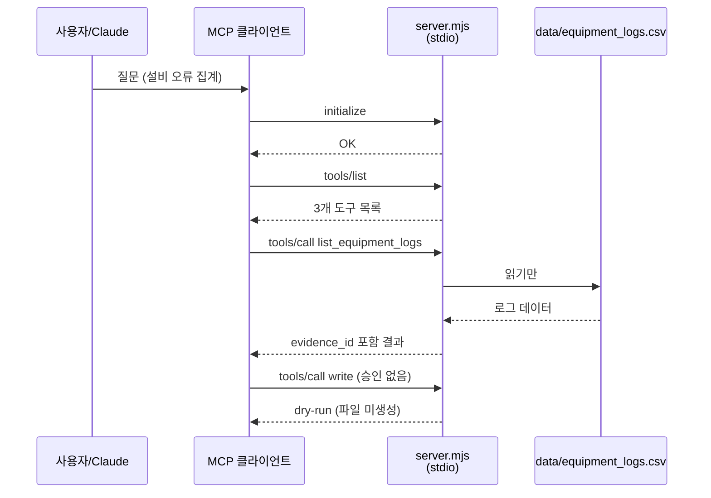
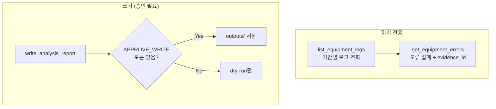

<p align="center">
  
</p>

<p align="center">
  <a href="#이론">이론</a> ·
  <a href="#사용법">사용법</a> ·
  <a href="#저장소-받기-및-실행">저장소</a> ·
  <a href="#실습-예제-안내">예제</a> ·
  <a href="#실습-예제-실행-방법">실행</a> ·
  <a href="#어려움이-생기면">문제 해결</a> ·
  <a href="#완료-기준">완료</a> ·
  <a href="#day-4-연결">Day 4</a>
</p>

외부 계정 없이 **로컬 MCP**로 AI가 설비 데이터에 안전하게 접근합니다. **기술 기둥: MCP 제작·외부 연동**

---

## 이론

### Day 3가 하는 일

Day 3는 PRD의 **"AI 역할"을 도구(Tool)로 쪼갭니다.** MCP(Model Context Protocol)는 AI가 **읽기·쓰기·집계**를 표준 방식으로 호출하는 **연결 규약**입니다. 위험한 **쓰기**는 승인 토큰 없이는 **dry-run**(시뮬레이션)만 합니다.

### MCP E2E



### 3개 도구 구조



### PRD 연결

| Day 1 PRD | Day 2 지식 | Day 3 실습 |
|---|---|---|
| 5 AI 역할 (조회) | ECO `equipment` 필드 | `list_equipment_logs`, `get_equipment_errors` |
| 5 하면 안 되는 일 | 원본 수정 금지 | `write` dry-run |
| 6 evidence | `source_id` | `evidence_id` = `LOG-*` |
| 8 E2E 평가 | Top-3 eval | `npm test` + `npm run smoke` |

---

## 사용법

| 순서 | 할 일 | 팁 |
|:---:|---|---|
| 1 | **Day 2 승인** 후 진입 | `check_day_gate.py --enter-day 3` |
| 2 | **Node.js 20+** 확인 | `node --version` |
| 3 | **npm test → npm run smoke** 순서 | test=로직, smoke=전체 E2E |
| 4 | **MCP 연결 확인** | `claude mcp list`에 `equipment-log` 표시 |
| 5 | **쓰기는 강사 승인 후만** | `APPROVE_WRITE` 토큰 |
| 6 | **stdout ≠ 로그** | 서버 진단은 stderr |

**비개발자 안내**

- `npm test`는 **자동 채점**입니다. 빨간 글씨(FAIL)가 나오면 해당 항목을 AI에게 수정 요청하세요.
- MCP는 **"AI용 USB 포트"**라고 생각하면 됩니다. Claude Code가 `.mcp.json`으로 같은 stdio 서버를 연결합니다.
- `data/equipment_logs.csv`는 **원본**입니다. 수정하지 마세요.

---

## 저장소 받기 및 실행

### Day 3 진입

```bash
cd 202608_sec_gumi
python3 scripts/check_day_gate.py --enter-day 3
cd mx-agentic-ai-day3-mcp-tools
```

### Node.js 확인 (처음 한 번)

```bash
node --version    # v20 이상 권장
npm --version
```

### 매 실습 시작할 때

```bash
cd 202608_sec_gumi/mx-agentic-ai-day3-mcp-tools
claude mcp list    # equipment-log 연결 확인
claude
```

MCP가 안 보이면:

```bash
claude mcp add --scope project --transport stdio equipment-log -- node src/server.mjs
claude mcp get equipment-log
```

---

## 실습 예제 안내

### 시나리오: 설비 로그 분석

| 항목 | 내용 |
|---|---|
| 데이터 | `data/equipment_logs.csv` (합성 설비 로그) |
| 목표 | 기간별 로그 조회 → 오류 코드 집계 → (승인 시) 보고서 저장 |
| Day 2 연결 | ECO의 `PRESS-01`, `PRESS-03` 등이 설비 ID와 동일 |

### 폴더 구조

```text
mx-agentic-ai-day3-mcp-tools/
├── data/equipment_logs.csv   ← 원본 (읽기 전용)
├── src/server.mjs            ← MCP 서버
├── .mcp.json                 ← Claude Code MCP 설정
├── outputs/                  ← 승인된 쓰기만
├── test/                     ← 단위 테스트
└── scripts/smoke-test.mjs    ← E2E smoke
```

### 제공 도구

| 도구 | 하는 일 | 부작용 |
|---|---|---|
| `list_equipment_logs` | 날짜 범위의 설비·레코드 수 조회 | 없음 |
| `get_equipment_errors` | 설비 ID·날짜별 오류 집계 | `evidence_id` 반환 |
| `write_analysis_report` | 분석 보고서 생성 | `APPROVE_WRITE`일 때만 `outputs/` 기록 |

---

## 실습 예제 실행 방법

### 1단계 — 자동 검증 (터미널)

```bash
cd mx-agentic-ai-day3-mcp-tools
npm test
npm run smoke
```

둘 다 **PASS**이면 기본 실습 완료입니다.

### 2단계 — Claude Code skill

```text
/mcp-tool-designer를 사용해 src/server.mjs의 세 도구 계약을 감사해줘.
단일 책임, 입력 스키마, evidence_id, 오류 형식, 읽기/쓰기 권한을 정리해.
write_analysis_report는 outputs/에만 쓰고 APPROVE_WRITE가 없으면 dry-run이어야 해.
```

```text
/mcp-smoke-test를 실행해 initialize -> tools/list -> tools/call을 검증해줘.
정확히 3개 도구, 오류 집계와 evidence_id, 역전 날짜의 구조화 오류,
승인 없는 write의 dry-run, data/equipment_logs.csv 불변성을 확인해줘.
```

### 3단계 — 시나리오 실행 (Claude Code)

```text
equipment-log MCP를 사용해 다음을 순서대로 수행해줘.
1. 2026-08-11~2026-08-15 로그의 설비별 레코드 수를 조회한다.
2. 같은 기간 오류 코드를 집계하고 모든 수치에 evidence_id를 붙인다.
3. 시작일이 종료일보다 늦은 요청으로 구조화 오류를 확인한다.
4. write_analysis_report를 승인 없이 호출해 dry-run과 파일 미생성을 확인한다.
5. 사람의 명시적 승인 전에는 실제 쓰기를 수행하지 않는다.
각 단계의 도구명, 입력, 출력, 검증 결과를 표로 정리해줘.
```

**강사 승인 후 쓰기 (선택)**

```text
APPROVE_WRITE를 승인 토큰으로 사용해 앞서 검증한 분석만 outputs/에 저장해줘.
```

### 4단계 — 제출

```bash
npm test && npm run smoke
git add src/ scripts/ test/ outputs/ README.md
git commit -m "feat(day3): complete MCP E2E lab"
git push -u origin HEAD
```

### 5단계 — Day 4 진입

```bash
python3 ../scripts/request_handoff.py --day 3
python3 ../scripts/approve_handoff.py --day 3 --reviewer "이름" --role instructor
python3 ../scripts/check_day_gate.py --enter-day 4
```

---

## 어려움이 생기면

| 즹상 | 원인 | 해결 |
|---|---|---|
| `node: command not found` | Node.js 미설치 | [Node.js 20 LTS](https://nodejs.org/) 설치 |
| `npm test` FAIL | 도구 로직 오류 | 오류 메시지를 Claude에게 전달해 수정 요청 |
| `npm run smoke` FAIL | MCP 프로토콜·E2E 문제 | `node src/server.mjs` 단독 실행 여부 확인 |
| `equipment-log` 미표시 | MCP 미등록 | `claude mcp add ...` 명령 재실행 |
| 승인 없이 파일 생성됨 | 쓰기 게이트 오류 | **즉시 강사 보고**, `outputs/` 확인 |
| CSV 변경됨 | 원본 수정 | git으로 복구, `data/` 수정 금지 |
| JSON-RPC 오류 | stdout에 로그 출력 | 서버는 stderr만 사용해야 함 |

**추가 도움:** `npm test` + `npm run smoke` 전체 출력을 강사에게 전달하세요.

---

## 완료 기준

- [ ] 정확히 **3개** MCP 도구
- [ ] 오류 집계에 `evidence_id` (`LOG-*`) 포함
- [ ] 역전 날짜 → 구조화 오류
- [ ] 승인 없는 `write` → dry-run, 파일 미생성
- [ ] `data/equipment_logs.csv` 불변
- [ ] `npm test` + `npm run smoke` **PASS**
- [ ] 강사 **사람 승인** (`approve_handoff --day 3`)

---

## Day 4 연결

[`docs/handoffs/day3-to-day4.md`](../docs/handoffs/day3-to-day4.md) — Day 4 Executor가 Day 3 MCP 도구를 호출합니다.

```bash
cd ../mx-agentic-ai-day4-multi-agent-hitl
```

## 참고 자료

- [외부 MCP 연동](./docs/external-mcp-integration.md)
- [GitHub 배포 가이드](../docs/github-deployment-and-quickstart.md)
- [skill·기술 참고](./docs/skill-and-tech-reference.md)
