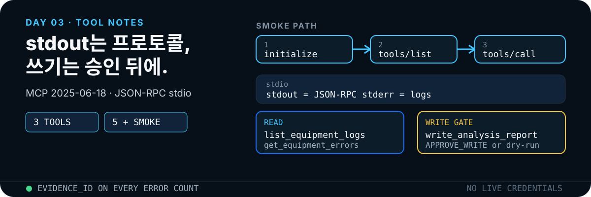

<p align="center">
  
</p>

외부 계정과 API 키 없이 로컬 stdio MCP 서버를 붙입니다. 구현은 이 저장소 코드를, 프로토콜은 [MCP Specification 2025-06-18](https://modelcontextprotocol.io/specification/2025-06-18)을 기준으로 합니다.

## 먼저 확인하는 증거

```bash
npm test
npm run smoke
```

| 도구 | 입력 | 부작용 |
|---|---|---|
| `list_equipment_logs` | `startDate`, `endDate` | 없음 |
| `get_equipment_errors` | `equipmentId`, 날짜 범위 | 없음. `evidence_id` 반환 |
| `write_analysis_report` | `title`, `body`, 선택 `approvalToken` | `APPROVE_WRITE`일 때만 `outputs/`에 기록 |

도메인 테스트는 날짜 역전을 거부하고, 승인 없이 `outputs/analysis-report.md`가 생기지 않는지를 단언합니다. 스모크는 `initialize` → `tools/list`(도구 3개) → `tools/call`을 한 프로세스에서 확인합니다.

## Repo skill

### `$mcp-tool-designer`

`src/server.mjs`를 바꾸기 **전에** 계약을 적습니다.

| 계약 | 이 실습 |
|---|---|
| 한 가지 일 | 조회, 집계, 쓰기 중 하나만 |
| 필수 입력 | JSON Schema `required` |
| 출력 근거 | `evidence_id` 또는 파일 경로 |
| 실패 | 날짜 역전, 형식 오류, 승인 없음 |
| 권한 | 쓰기는 `outputs/` + 승인 토큰 |

stdout은 JSON-RPC 전용, 진단은 stderr입니다. 자격증명과 실제 업무 데이터를 넣지 않습니다.

### `$mcp-smoke-test`

1. `npm test`로 도메인 로직을 검증한다.
2. `npm run smoke`로 프로토콜 순서를 확인한다.
3. 도구가 3개인지, 오류 집계에 근거 ID가 있는지 확인한다.
4. 날짜 역전은 구조화 오류를 내고 서버가 죽지 않아야 한다.
5. 토큰이 없으면 dry-run이고 원본 CSV는 그대로다.

수동 연결 (Claude Code):

```bash
claude mcp add --scope project --transport stdio equipment-log -- node src/server.mjs
claude mcp list
```

Codex는 `.mcp.json` 또는 `config.toml`의 `[mcp_servers.equipment-log]`로 같은 stdio 서버를 붙입니다. 쓰기 도구는 `default_tools_approval_mode = "writes"`처럼 승인 모드를 읽기보다 엄하게 둡니다.

## 기술 개념

### MCP와 stdio

호스트가 `node src/server.mjs`를 자식 프로세스로 띄우고, stdin/stdout으로 한 줄 JSON을 주고받습니다. `console.log` 한 줄이면 JSON 파서가 깨집니다. 이 서버는 `console.error("equipment-log-mcp ready on stdio")`로만 준비 메시지를 보냅니다.

`.mcp.json` 등록:

```json
{
  "mcpServers": {
    "equipment-log": {
      "type": "stdio",
      "command": "node",
      "args": ["src/server.mjs"]
    }
  }
}
```

- [MCP Architecture](https://modelcontextprotocol.io/specification/2025-06-18/architecture)
- [MCP Tools](https://modelcontextprotocol.io/specification/2025-06-18/server/tools)
- [JSON-RPC 2.0](https://www.jsonrpc.org/specification)
- [Serve over stdio](https://ts.sdk.modelcontextprotocol.io/v2/serving/stdio.html)
- [MCP 공식 스펙·문서 저장소](https://github.com/modelcontextprotocol/modelcontextprotocol)

### 도구 계약

최소 필드는 `name`, `description`, `inputSchema`입니다. `description`은 모델이 도구를 고르는 주된 신호입니다. `get_equipment_errors`가 돌려주는 `LOG-002` 같은 ID는 Day 4 조인 키입니다.

스펙의 `annotations`(`readOnlyHint` 등)는 힌트일 뿐이며, 신뢰하지 않는 서버의 주석을 보안 보장으로 쓰지 않습니다. 이 실습은 주석 대신 서버 쪽 계약으로 읽기/쓰기를 나눕니다.

### 승인 게이트와 오류

`approvalToken !== "APPROVE_WRITE"`이면 `{ status: "dry-run", preview }`만 반환합니다. propose-then-commit의 최소 형태입니다.

MCP 오류는 두 층입니다.

| 종류 | 형태 | 예 |
|---|---|---|
| Protocol error | JSON-RPC `error` | 알 수 없는 도구. 코드 `-32602` |
| Tool execution error | `result.isError: true` | 업무 로직 실패 |

이 교육 서버는 날짜 역전을 `-32602`로 보냅니다. 스펙상 업무 오류는 `isError: true`로 돌려도 됩니다. 실습에서 중요한 점은 서버가 죽지 않고 구조화된 오류를 남기는 것입니다.

### Loop Engineering

Claude와 Codex의 코딩 에이전트는 모두 **도구 루프**입니다. [Claude Agent SDK · agent loop](https://code.claude.com/docs/en/agent-sdk/agent-loop.md)는 프롬프트 → 도구 호출 → 결과 반영 → 종료까지를 한 세션의 턴으로 설명합니다. [Unrolling the Codex agent loop](https://openai.com/index/unrolling-the-codex-agent-loop/)는 같은 순환을 프롬프트 구성, 캐시, compaction까지 풀어 씁니다. Day 3에서는 이 루프를 MCP 클라이언트 관점의 작은 제어 루프로 바꿉니다.

```text
initialize → tools/list → tools/call → validate result
     │                           ├─ retryable error → bounded retry
     │                           └─ final/dry-run   → stop
     └─ negotiation failure → stop with structured error
```

루프에는 반드시 상태, 성공 조건, 재시도 가능한 오류, 재시도 상한, 종료 조건이 있어야 합니다. 무제한 재시도와 오류 메시지를 모델이 임의로 해석하는 방식은 사용하지 않습니다.

### E2E Check

단위 테스트는 `src/domain.mjs`의 함수가 맞는지 확인합니다. E2E는 MCP 클라이언트 요청에서 서버 프로세스, 도구 계약, 실제 출력 또는 쓰기 차단까지 전체 경로를 확인합니다.

| 단계 | 검증 |
|---|---|
| Handshake | `initialize` 응답과 기능 협상 |
| Discovery | `tools/list`에 정확히 3개 도구 |
| Read path | `tools/call` 결과에 `evidence_id` |
| Error path | 잘못된 날짜가 구조화 오류이며 서버는 생존 |
| Write path | 승인 없음=dry-run·파일 없음, 승인 있음=허용 경로만 기록 |

[MCP Inspector](https://github.com/modelcontextprotocol/inspector)는 서버의 연결, 도구 목록, 호출과 오류를 UI/CLI에서 시험하는 공식 도구입니다. 수업 기본형은 빠르고 결정적인 `npm run smoke`, 확장형은 Inspector CLI 재검증으로 구성합니다. UI가 추가되는 후속 과제에는 [Playwright](https://github.com/microsoft/playwright)를 적용할 수 있지만, 현재 stdio 실습의 핵심 E2E는 브라우저가 아니라 프로토콜 전체 경로입니다.

### MCP와 A2A

[A2A](https://a2a-protocol.org/latest/)는 MCP와 경쟁하지 않습니다. MCP는 agent-to-tool(이 실습의 설비 로그 서버), A2A는 agent-to-agent(Day 4 역할 간 위임)입니다. Claude Code와 Codex는 둘 다 MCP 호스트이고, A2A로 감싸면 서로 다른 하네스의 에이전트를 같은 Task/Artifact 계약으로 부를 수 있습니다.

### Claude · Codex 기준 skill·repo

| 출처 | 요약 | 이 실습에 쓰는 점 |
|---|---|---|
| [Claude Code · MCP](https://code.claude.com/docs/en/mcp) | `.mcp.json`, `claude mcp add`, 도구 승인 | 프로젝트 stdio 등록 예시 |
| [Codex · MCP](https://developers.openai.com/codex/mcp) | `config.toml` MCP, `writes`/`approve` 승인 모드 | 쓰기 도구만 승인 |
| [Claude Agent SDK · agent loop](https://code.claude.com/docs/en/agent-sdk/agent-loop.md) | 턴, 도구 결과, max_turns, compaction | smoke의 종료 조건 |
| [Unrolling the Codex agent loop](https://openai.com/index/unrolling-the-codex-agent-loop/) | Codex 하네스의 한 턴과 캐시 | 프로토콜 순서를 깨지 않음 |
| [MCP 공식 스펙 저장소](https://github.com/modelcontextprotocol/modelcontextprotocol) | JSON-RPC 계약 | `initialize` → `tools/list` → `tools/call` |

기계가 읽는 전체 목록은 [research-ingest.jsonl](../../docs/research-ingest.jsonl)입니다.

## 코드 대응

| 개념 | 구현 |
|---|---|
| stdio 서버 | `src/server.mjs` |
| 도메인 | `src/domain.mjs` |
| 원본 로그 | `data/equipment_logs.csv` |
| 쓰기 출력 | `outputs/analysis-report.md` |
| 스모크 | `scripts/smoke-test.mjs` |
| 테스트 | `test/domain.test.mjs` |

## 완료 기준

- [ ] `npm test` 통과 (목록, 근거 ID, 날짜 역전, 승인 없는 쓰기)
- [ ] `npm run smoke` 통과
- [ ] 도구가 3개뿐
- [ ] 승인 없이 파일이 생기지 않음
- [ ] 원본 CSV 불변
