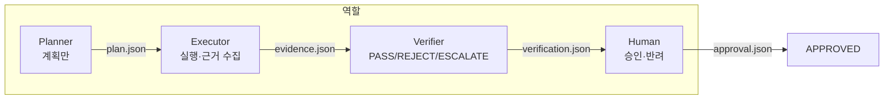
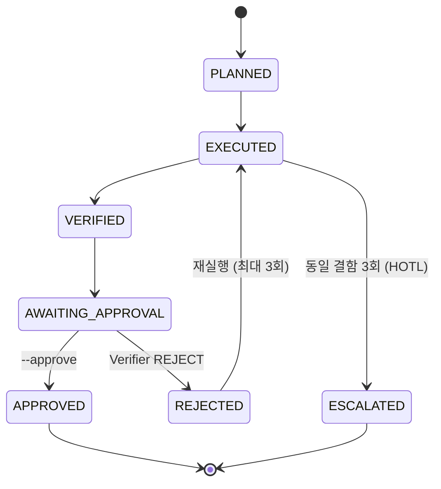

<p align="center">
  
</p>

<p align="center">
  <a href="#이론">이론</a> ·
  <a href="#사용법">사용법</a> ·
  <a href="#저장소-받기-및-실행">저장소</a> ·
  <a href="#실습-예제-안내">예제</a> ·
  <a href="#실습-예제-실행-방법">실행</a> ·
  <a href="#어려움이-생기면">문제 해결</a> ·
  <a href="#완료-기준">완료</a> ·
  <a href="#day-5-연결">Day 5</a>
</p>

계획자·실행자·검증자를 **역할 계약**으로 나누고, 검증 통과 후에도 **사람 승인 전에는 멈춥니다.** **기술 기둥: HITL + Multi-agent**

---

## 이론

### Day 4가 하는 일

Day 4는 **"누가 무엇을 하고, 언제 멈추는가"**를 코드로 구현합니다.

- **Multi-agent:** 한 AI가 모든 일을 하지 않고, Planner → Executor → Verifier → Human으로 **역할 분리**
- **HITL (Human-in-the-Loop):** 위험 행동 전 **명시적 사람 승인** 대기 (`AWAITING_APPROVAL`)
- **HOTL (Human-on-the-Loop):** 자동 실행을 **관찰**하다 이상 시 이관 (`ESCALATED`)

### 4역할 파이프라인



### 상태 머신



### PRD 연결

| Day 1 PRD 예약석 | Day 4 구현 |
|---|---|
| 9 승인 게이트 위치 | `AWAITING_APPROVAL` → `--approve` → `APPROVED` |
| 9 활동 로그 | `runs/<id>/events.jsonl` |
| 10 이관·임계치 | 동일 결함 3회 → `ESCALATED` |
| 5 역할 분리 | Planner / Executor / Verifier / Human 스킬 |

Day 2 지식 + Day 3 MCP(설비 로그) + Day 4 fixtures(품질) = **한 분석 파이프라인**

---

## 사용법

| 순서 | 할 일 | 팁 |
|:---:|---|---|
| 1 | **역할을 섞지 않기** | Planner가 실행하면 안 됨 |
| 2 | **4개 skill을 순서대로** | plan → execute → verify → approve |
| 3 | **결함 주입 테스트** | `--fault missing-evidence`로 반려 확인 |
| 4 | **승인은 명시적으로** | `--approve` 없으면 `APPROVED` 불가 |
| 5 | **runs/ 폴더 확인** | plan·evidence·verification·events 추적 |
| 6 | **팀 PRD 9·10번 채우기** | Day 1 `prd.md`와 비교 |

**비개발자 안내**

- `npm run demo`는 **시연**입니다. 화면에 상태가 바뀌는지 눈으로 확인하세요.
- `AWAITING_APPROVAL` = **"여기서 멈춤, 사람 결정 필요"**
- 검증 PASS여도 **자동 승인되지 않습니다.** `AWAITING_APPROVAL`에서 멈춥니다.

---

## 저장소 받기 및 실행

### Day 4 진입

```bash
cd 202608_sec_gumi
python3 scripts/check_day_gate.py --enter-day 4
cd mx-agentic-ai-day4-multi-agent-hitl
```

### 매 실습 시작할 때

```bash
cd 202608_sec_gumi/mx-agentic-ai-day4-multi-agent-hitl
python3 ../scripts/verify_dummy_data.py   # fixtures/ 포함 확인
npm test
claude
```

---

## 실습 예제 안내

### Dummy Data (GitHub clone 포함)

| 항목 | 경로 (이 폴더 기준) | 비고 |
|---|---|---|
| 품질 요약 | `fixtures/quality_summary.json` | `QUALITY-*` evidence |
| 오류 집계 | `fixtures/equipment_errors.json` | Day 3 `LOG-*`와 정렬된 fixture |

Day 3 CSV를 다시 읽지 않고 fixture로 고정합니다. Claude 실습은 `fixtures/` 또는 승인된 MCP만 사용합니다.

```bash
python3 ../scripts/verify_dummy_data.py
cat fixtures/quality_summary.json
```

조인 키: `PRESS-01`, `PRESS-03`, `MILL-02` (Day 2 equipment · Day 3 equipment_id와 동일).  
가이드: [`docs/dummy-data.md`](../docs/dummy-data.md)

### 시나리오: 설비·품질 연관 분석 + 승인 게이트

| 항목 | 내용 |
|---|---|
| 입력 | `fixtures/equipment_errors.json` + `fixtures/quality_summary.json` (필요 시 Day 3 MCP) |
| 목표 | 연관 분석 초안 → 검증 → **사람 승인 대기** |
| 금지 | Verifier가 결과를 직접 수정, 승인 없이 최종 확정 |

### 폴더 구조

```text
mx-agentic-ai-day4-multi-agent-hitl/
├── fixtures/
│   ├── quality_summary.json       ← 품질 (읽기 전용)
│   └── equipment_errors.json      ← 오류 집계 fixture (읽기 전용)
├── src/cli.mjs                    ← 데모·결함 주입 CLI
├── runs/<run-id>/                 ← 실행 증거 (자동 생성)
│   ├── plan.json
│   ├── evidence.json
│   ├── verification.json
│   ├── approval.json
│   └── events.jsonl
└── .agents/skills/                ← 4역할 skill
```

### 4가지 종료 경로

| 시나리오 | 명령 | 끝 상태 |
|---|---|---|
| A. 정상 | `npm run demo` | `AWAITING_APPROVAL` |
| B. 승인 | `npm run demo:approve` | `APPROVED` |
| C. 결함 1회 | `--fault missing-evidence` | 반려 후 복구 |
| D. 결함 3회 | `--persistent-fault` | `ESCALATED` |

---

## 실습 예제 실행 방법

### 1단계 — 자동 검증 (터미널)

```bash
cd mx-agentic-ai-day4-multi-agent-hitl
npm test
npm run demo
npm run demo:approve
node src/cli.mjs --fault missing-evidence
node src/cli.mjs --fault missing-evidence --persistent-fault
```

### 2단계 — 4역할 skill (Claude Code, 순서대로)

```text
/plan-maintenance-analysis로 설비 오류와 품질 결함의 연관 분석 계획을 만들어줘.
목표, 순서가 있는 단계, 필요한 LOG/QUALITY evidence, PASS 기준을 정의하되
도구 조회·계산·설비 추천·승인은 하지 마.
```

```text
/execute-evidence-plan으로 승인된 plan만 실행해 evidence.json을 만들어줘.
fixtures/ 또는 승인된 MCP 도구만 사용하고 모든 수치에 evidence ID를 연결해.
검증이나 최종 승인은 하지 마.
```

```text
/verify-maintenance-report로 evidence를 독립 검증해줘.
PASS, REJECT, ESCALATE 중 하나를 구체적 사유와 함께 반환해.
```

```text
/request-human-approval로 verifier PASS 이후의 승인 패킷을 만들어줘.
명시적인 approve/reject/revise 입력 전에는 AWAITING_APPROVAL에서 멈춰.
```

### 3단계 — 4시나리오 팀 과제 (선택)

```text
Day 4 팀 과제를 네 시나리오로 수행해줘.
A. 정상 근거: VERIFIED 후 AWAITING_APPROVAL에서 정지
B. missing-evidence: Verifier REJECT 후 Executor 재실행
C. persistent missing-evidence: 동일 결함 3회 후 ESCALATED
D. 명시적 --approve: 검증 PASS 이후에만 APPROVED
각 시나리오의 plan.json, evidence.json, verification.json, approval.json,
events.jsonl을 확인하고 상태 전이가 계약과 일치하는지 비교해줘.
```

### 4단계 — 실행 증거 확인

```bash
LATEST_RUN="$(find runs -mindepth 1 -maxdepth 1 -type d | sort | tail -n 1)"
printf '%s\n' "$LATEST_RUN"
sed -n '1,200p' "$LATEST_RUN/events.jsonl"
```

### 5단계 — 제출

```bash
npm test
git add src/ test/ README.md
git commit -m "feat(day4): complete multi-agent HITL lab"
git push -u origin HEAD
```

### 6단계 — Day 5 진입

```bash
python3 ../scripts/request_handoff.py --day 4
python3 ../scripts/approve_handoff.py --day 4 --reviewer "이름" --role instructor
python3 ../scripts/check_day_gate.py --enter-day 5
cd ../mx-agentic-ai-day5-final-project
python3 scripts/sync_from_prd.py
```

---

## 어려움이 생기면

| 즹상 | 원인 | 해결 |
|---|---|---|
| `npm test` FAIL | 역할·상태 로직 오류 | 오류 메시지를 Claude에게 전달 |
| `demo`가 APPROVED로 끝남 | 승인 게이트 누락 | `--approve` 없이 실행했는지 확인 |
| `ESCALATED` 안 됨 | persistent-fault 미사용 | `--persistent-fault` 플래그 추가 |
| evidence에 ID 없음 | Executor 규칙 위반 | `LOG-*`, `QUALITY-*` 연결 재요청 |
| Verifier가 결과 수정 | 역할 혼합 | skill 경계 재확인, 새 run 시작 |
| `runs/` 폴더 없음 | demo 미실행 | `npm run demo` 먼저 실행 |
| Day 5 gate 거부 | Day 4 미승인 | `approve_handoff --day 4` |

**추가 도움:** `npm test` 출력 + `runs/<id>/events.jsonl` 앞 20줄을 강사에게 전달하세요.

---

## 완료 기준

- [ ] 4역할 skill 경계 준수 (혼합 없음)
- [ ] 정상 경로 → `AWAITING_APPROVAL`에서 정지
- [ ] `--approve`만 `APPROVED`
- [ ] 결함 주입 → 반려·복구 확인
- [ ] 3회 동일 결함 → `ESCALATED`
- [ ] `runs/<id>/`에 plan·evidence·verification·events 존재
- [ ] `npm test` **PASS**
- [ ] 강사 **사람 승인** (`approve_handoff --day 4`)

---

## Day 5 연결

[`docs/handoffs/day4-to-day5.md`](../docs/handoffs/day4-to-day5.md) · [Day 5 핸드오프](./docs/day5-handoff.md)

```bash
cd ../mx-agentic-ai-day5-final-project
python3 scripts/sync_from_prd.py
python3 scripts/assemble_project.py
```

## 참고 자료

- [Dummy Data 가이드](../docs/dummy-data.md)
- [GitHub 배포 가이드](../docs/github-deployment-and-quickstart.md)
- [skill·기술 참고](./docs/skill-and-tech-reference.md)
- [Day 5 agents](../mx-agentic-ai-day5-final-project/project/agents/)
