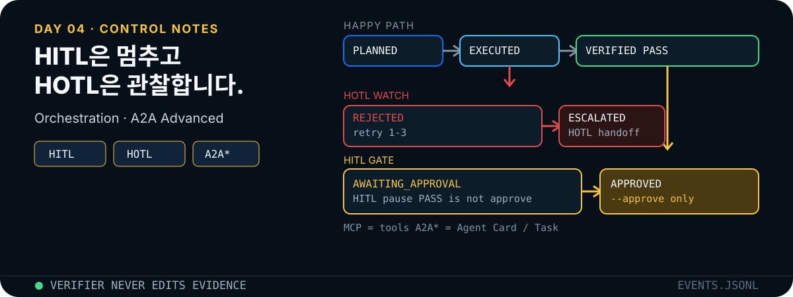

<p align="center">
  
</p>

역할을 프롬프트 페르소나가 아니라 JSON 산출물과 상태 전이로 나눕니다. 검증이 통과해도 `--approve` 전에는 정비 우선순위를 확정하지 않습니다.

## 먼저 확인하는 증거

```bash
npm test
npm run demo
npm run demo:approve
```

| 테스트 | 기대 상태 |
|---|---|
| 결함 없음 | `AWAITING_APPROVAL` |
| `--approve` | `APPROVED` |
| `--fault missing-evidence` | 반려 후 복구, 승인 대기 |
| `--fault bad-join --persistent-fault` | 3회 반려 후 `ESCALATED` |
| `--fault bad-rate` | 사유에 불량률 계산 불일치 |

매 실행은 `runs/<run-id>/`에 `plan.json`, `evidence.json`, `verification.json`, `approval.json`, `events.jsonl`을 남깁니다.

## Repo skill

네 스킬은 한 파이프라인의 네 역할입니다. 한 스킬이 다른 스킬의 산출물을 고치지 않습니다.

| skill | 산출 | 하면 안 되는 일 |
|---|---|---|
| `$plan-maintenance-analysis` | 목표, 단계, 통과 기준 | 도구 조회, 계산, 추천, 승인 |
| `$execute-evidence-plan` | `evidence.json` + 로그·품질 ID | PASS/FAIL 판정, 최종 승인 |
| `$verify-maintenance-report` | `PASS` / `REJECT` / `ESCALATE` | 실행자 출력 수정 |
| `$request-human-approval` | 승인 패킷 | 침묵·이전 승인·검증 PASS를 승인으로 취급 |

계획 계약은 `plan()`이 JSON으로 고정합니다. 실행자는 Day 3의 `evidence_id`를 이어받습니다. 검증자는 품질 원본에서 불량률을 다시 계산합니다. 승인 패킷의 불확실성 문구는 “합성 데이터 기반 교육 결과이며 실제 정비 지시가 아님”입니다.

## 상태와 결함

| 상태 | 의미 |
|---|---|
| `PLANNED` | 계약만 존재 |
| `EXECUTED` | 근거 행 생성 |
| `REJECTED` | 검증 실패, 재시도 |
| `VERIFIED` | 검증 PASS. 사람 승인 아님 |
| `AWAITING_APPROVAL` | 최종 확정 전 대기 |
| `APPROVED` | `--approve`가 있을 때만 |
| `ESCALATED` | 같은 결함 3회 후 이관 |

| `--fault` | 주입 | 검증자가 잡는 것 |
|---|---|---|
| `missing-evidence` | 로그 ID 빈 배열 | 로그 근거 없음 |
| `bad-join` | 조인 키 `PRESS-99` | 품질 조인 실패 |
| `bad-rate` | 불량률 `99` | 불량률 계산 불일치 |

한 번만 넣으면 다음 시도에서 수리됩니다. `--persistent-fault`면 이관됩니다. 검증자가 수정 권한을 가지면 이 테스트는 무의미합니다.

## 기술 개념

### A2A와 MCP의 경계

[A2A Protocol 1.0](https://a2a-protocol.org/latest/specification/)은 독립적이고 내부가 불투명할 수 있는 에이전트 시스템 사이의 발견, Message, 상태가 있는 Task, Artifact 교환을 표준화합니다. MCP는 에이전트가 도구·데이터에 연결되는 agent-to-tool 계약이고, A2A는 독립 에이전트끼리 협력하는 agent-to-agent 계약입니다.

| 적용 | 이 실습의 해석 |
|---|---|
| MCP | Executor가 Day 3의 설비 조회 도구를 호출 |
| 내부 orchestration | 한 프로세스가 네 역할과 상태 전이를 통제 |
| A2A Advanced | Planner·Executor·Verifier를 독립 서비스로 보고 Agent Card와 Task/Artifact 계약 작성 |

Advanced에서는 [A2A 공식 저장소](https://github.com/a2aproject/A2A)의 샘플을 참고하되, 기본 실습 코드를 곧바로 분산 시스템으로 바꾸지 않습니다. 먼저 `plan.json`, `evidence.json`, `verification.json`을 Task/Artifact 경계로 매핑하고 `evidence_id`를 잃지 않는 계약을 작성합니다.

### 역할을 계약으로 나누기

효과가 있으려면 역할이 **다른 입력과 다른 출력 스키마**를 가져야 합니다. 계획 LLM이 자기 계획을 채점하면 오류를 놓치기 쉽습니다. 독립 검증자는 산출물과 원본 픽스처만 봅니다.

| 역할 | 입력 | 출력 | 권한 |
|---|---|---|---|
| Planner | 목표 | 단계·완료 기준 | 데이터 수정 없음 |
| Executor | 계획 + 허용 데이터 | 근거가 붙은 결과 | 판정 없음 |
| Verifier | 결과 + 원본 | `PASS`/`REJECT`/`ESCALATE` | 결과 수정 없음 |
| Human | 승인 패킷 | `APPROVE`/`REJECT`/`REVISE` | 최종 확정 |

- [ALAS](https://arxiv.org/abs/2511.03094) — 계획과 검증 분리, 실행 로그, 국소 수리
- [SagaLLM](https://arxiv.org/abs/2503.11951) — 자기 검증의 한계
- [Building effective agents](https://www.anthropic.com/engineering/building-effective-agents) — evaluator-optimizer와 orchestrator-workers
- [Claude Code · Subagents](https://code.claude.com/docs/en/sub-agents) — 역할별 도구·스킬·권한 격리
- [Codex · Subagents](https://developers.openai.com/codex/concepts/subagents) — 명시적 위임과 병렬 수집
- [OpenAI Agents SDK · HITL](https://openai.github.io/openai-agents-python/human_in_the_loop/)

### Agent Orchestration과 Loop Engineering

Claude와 Codex에서 멀티 에이전트는 프롬프트 페르소나가 아니라 **격리된 루프의 그래프**입니다. [Building effective agents](https://www.anthropic.com/engineering/building-effective-agents)의 evaluator-optimizer가 이 실습의 Executor↔Verifier 루프이고, orchestrator-workers가 Planner가 단계를 나누는 방식입니다. [Claude subagents](https://code.claude.com/docs/en/sub-agents)는 `.claude/agents/`에 역할·도구·권한을 고정하고, [Codex subagents](https://developers.openai.com/codex/concepts/subagents)는 `.codex/agents/` TOML과 명시적 위임을 씁니다. [Iterative repair loops with Codex](https://developers.openai.com/cookbook/examples/codex/build_iterative_repair_loops_with_codex)는 Review → Repair → Validate를 구조화 산출물로 닫습니다.

[OpenAI orchestration 가이드](https://developers.openai.com/api/docs/guides/agents/orchestration)는 중앙 manager와 handoff 패턴, 코드 기반 순서 제어와 모델 기반 판단을 구분합니다. 이 실습은 안전하고 재현 가능한 코드 기반 manager 패턴입니다.

```text
Planner → Executor → Verifier
              ↑          │
              └─ REJECT ─┘  (최대 3회)
                         ├─ ESCALATED → Human
                         └─ PASS → AWAITING_APPROVAL → Human
```

- 오케스트레이터만 다음 역할과 상태를 결정합니다.
- Verifier는 Executor 결과를 수정하지 않습니다.
- 같은 결함은 최대 3회까지만 재시도합니다.
- PASS, ESCALATE, 사람 결정이 명시적 종료점입니다.

### Eval Check

[OpenAI agent workflow eval 가이드](https://developers.openai.com/api/docs/guides/agent-evals)는 최종 출력뿐 아니라 도구 선택·handoff·trace까지 평가 대상으로 봅니다. Day 4는 결함 주입과 상태 전이를 결정적인 회귀 평가로 사용합니다.

| 평가 케이스 | 합격 조건 |
|---|---|
| 정상 | `AWAITING_APPROVAL`에서 정지 |
| 승인 | 명시적 `--approve`일 때만 `APPROVED` |
| 일시 결함 | REJECT 후 복구, 승인 대기 |
| 지속 결함 | 정확히 3회 뒤 `ESCALATED` |
| 계산 오류 | Verifier가 불량률 불일치 탐지 |

### HITL 게이트

HITL은 모든 단계에 사람을 앉히지 않습니다. 되돌리기 어려운 부작용 앞에만 멈춥니다. 여기서는 “정비 우선순위 확정”입니다.

승인 패킷: 추천, 근거 ID, 검증 판정, 남은 불확실성. 자격증명·개인정보는 `events.jsonl`에 쓰지 않습니다.

| 운영 패턴 | 이 실습 |
|---|---|
| propose-then-commit | 검증 PASS 후 승인 대기 |
| evidence pack | `approval.json` |
| 명시적 재개 | `--approve` |
| 침묵 ≠ 승인 | `approve: false`면 대기에서 종료 |

Day 3의 `APPROVE_WRITE`와 Day 4의 `--approve`는 같은 원칙의 다른 층입니다. Claude는 [permission modes](https://code.claude.com/docs/en/permissions)와 `canUseTool` / `PreToolUse`로, Codex는 [`approval_policy`](https://developers.openai.com/codex/agent-approvals-security)로 같은 게이트를 겁니다. [LangGraph interrupts](https://docs.langchain.com/oss/python/langgraph/interrupts)는 그래프 노드에서 멈추고 `Command(resume=...)`로 재개하는 Graph Engineering 구현입니다. [HITL Approval Flow Pattern](https://www.agentnative.dev/patterns/human-in-the-loop-approval-flow-pattern)과 [MCP Tools 사람 거부권](https://modelcontextprotocol.io/specification/2025-06-18/server/tools)도 같은 패턴입니다.

### HITL과 HOTL

요청의 `HILT`는 표준적으로 쓰이는 `HITL`(Human-in-the-Loop)의 오기로 보고 교정했습니다. HITL과 HOTL(Human-on-the-Loop)은 사람의 개입 시점이 다릅니다.

| 구분 | 자동화 상태 | 사람 개입 | 이 실습 |
|---|---|---|---|
| HITL | 위험 행동 직전에 일시정지 | 매 승인 대상에 명시적 결정 | `AWAITING_APPROVAL`, `--approve` |
| HOTL | 자동 실행을 지속 | 임계치·이상·반복 실패 때 개입 | `events.jsonl` 관찰, 3회 실패 후 `ESCALATED` |

HOTL은 여기서 특정 SDK의 단일 API 이름이 아니라 운영 설계 용어입니다. Claude의 `acceptEdits`와 Codex의 [`approvals_reviewer = "auto_review"`](https://developers.openai.com/codex/sandboxing/auto-review)는 루프를 멈추지 않고 경계만 감시한다는 점에서 HOTL에 가깝습니다. [NIST AI RMF Playbook](https://airc.nist.gov/airmf-resources/playbook/)의 지속 측정, 인간 감독과 책임 문서화 원칙을 적용해 모니터링 지표, 개입 임계치, 담당자, 재개 조건을 명시합니다. 고위험 정비 확정은 HOTL만으로 처리하지 않고 기존 HITL 게이트를 유지합니다.

### Graph Engineering (역할 그래프)

Day 2 Advanced가 부품→ECO 지식 그래프라면, Day 4는 **역할·상태 그래프**입니다. 노드는 Planner, Executor, Verifier, Human이고, 엣지는 `plan.json` → `evidence.json` → `verification.json` → `approval.json`입니다. REJECT는 조건부 엣지, 3회 실패는 `ESCALATED` 싱크입니다.

| 그래프 요소 | 이 실습 |
|---|---|
| Node | 네 repo skill + Human |
| Edge | JSON 산출물 경로, 상태 전이 |
| Interrupt | `AWAITING_APPROVAL` |
| Eval | 결함 주입 후 기대 종단 상태 |

### Claude · Codex 기준 skill·repo

| 출처 | 요약 | 이 실습에 쓰는 점 |
|---|---|---|
| [Claude Code · Subagents](https://code.claude.com/docs/en/sub-agents) | 역할별 시스템 프롬프트, 도구, 스킬 preload | 네 스킬이 서로의 산출물을 고치지 않음 |
| [Codex · Subagents](https://developers.openai.com/codex/concepts/subagents) | 명시적 위임, 병렬 수집, TOML 에이전트 파일 | 오케스트레이터만 다음 상태를 결정 |
| [Claude permissions](https://code.claude.com/docs/en/permissions) | `default` / `acceptEdits` / `dontAsk` | HITL vs HOTL 운영 모드 |
| [Codex approvals](https://developers.openai.com/codex/agent-approvals-security) | sandbox + `approval_policy` + auto-review | `--approve`와 `ESCALATED` |
| [A2A + MCP](https://a2a-protocol.org/latest/) | MCP=도구, A2A=에이전트 간 | Advanced Agent Card / Task |
| [a2aproject/A2A](https://github.com/a2aproject/A2A) | 스펙·SDK·샘플 | evidence를 Artifact로 전달 |
| [hybroai/a2a-adapter](https://github.com/hybroai/a2a-adapter) | Claude Code·Codex CLI를 A2A 서버로 노출 | Advanced 상호운용 참고 |

기계가 읽는 전체 목록은 [research-ingest.jsonl](../../docs/research-ingest.jsonl)입니다.

## Day 2·3과의 연결

| 이전 실습 | Day 4가 이어받는 것 |
|---|---|
| Day 2 `source_id` | 모든 숫자에 evidence ID |
| Day 2 `UNKNOWN` | 조인 실패를 추정으로 메우지 않음 |
| Day 3 `evidence_id` | `log_evidence_ids`, `quality_evidence_id` |
| Day 3 승인 토큰 | `AWAITING_APPROVAL` |

## 코드 대응

| 개념 | 구현 |
|---|---|
| 계획 | `plan()` |
| 실행 | `execute({ fault })` |
| 검증 | `verify(evidence)` |
| 오케스트레이션 | `runPipeline(...)` |
| CLI | `src/cli.mjs` |
| 테스트 | `test/pipeline.test.mjs` |

## 완료 기준

- [ ] 결함 없는 실행은 `AWAITING_APPROVAL`에서 멈춘다
- [ ] `--approve`가 있을 때만 `APPROVED`
- [ ] `missing-evidence` 1회는 반려 후 복구
- [ ] 지속 결함은 3회 후 `ESCALATED`
- [ ] 검증자 PASS를 사람 승인으로 쓰지 않는다
