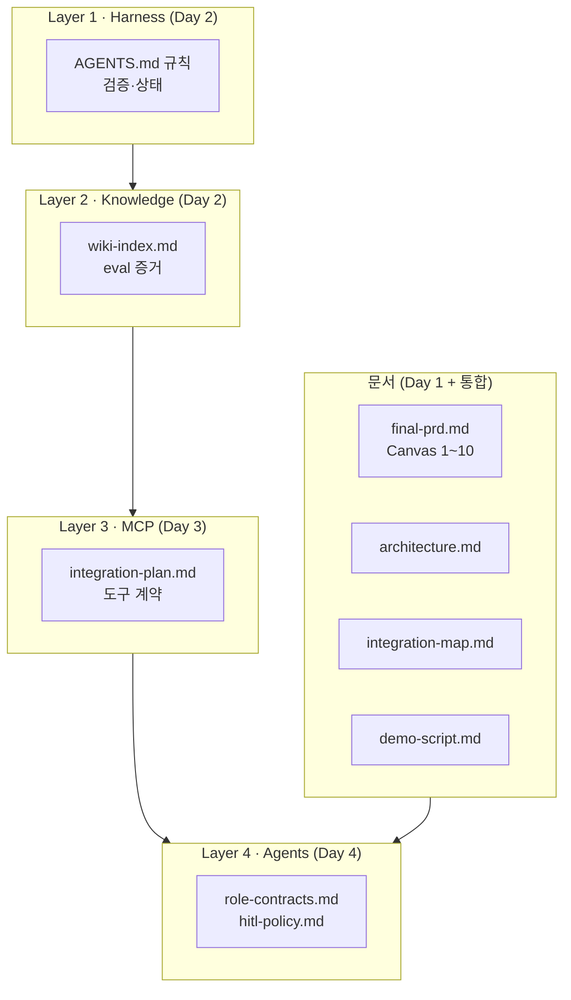
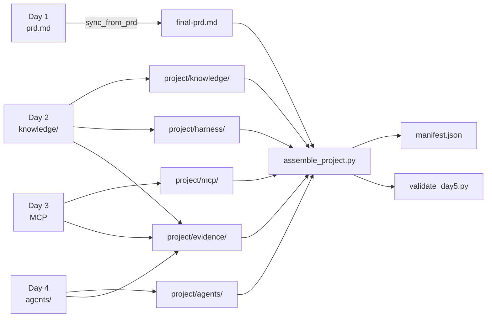
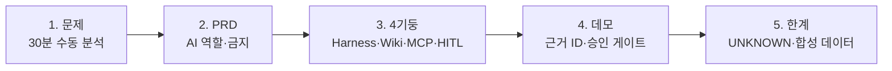

<p align="center">
  
</p>

<p align="center">
  <a href="#이론">이론</a> ·
  <a href="#사용법">사용법</a> ·
  <a href="#저장소-받기-및-실행">저장소</a> ·
  <a href="#실습-예제-안내">예제</a> ·
  <a href="#실습-예제-실행-방법">실행</a> ·
  <a href="#어려움이-생기면">문제 해결</a> ·
  <a href="#발표-준비">발표</a>
</p>

Day 1~4 실습을 **최종 결과물(`project/`)**로 통합하고 **5~7분 발표**로 마무리합니다.

---

## 이론

### Day 5가 하는 일

Day 5는 **"내 업무 에이전트"**를 한 폴더에 모읍니다. Day 1 PRD의 빈 칸(8·9·10)을 Day 2~4에서 채운 내용으로 **완성**하고, 4대 기술 기둥이 어떻게 연결되는지 **아키텍처·증거·데모**로 설명합니다.

### 4층 아키텍처



### Day 1~4 → project/



### Day별 반영

| Day | 기술 기둥 | Day 5 반영 |
|:---:|---|---|
| 1 | PRD 정의 | `project/docs/final-prd.md` |
| 2 | Harness + LLMWiki/GraphRAG | `project/harness/`, `project/knowledge/` |
| 3 | MCP 제작·외부 연동 | `project/mcp/` |
| 4 | HITL + Multi-agent | `project/agents/` |

커리큘럼: **[5일](../docs/curriculum-5day.md)** · **[기술 기둥](../docs/tech-pillars.md)**

---

## 사용법

| 순서 | 할 일 | 팁 |
|:---:|---|---|
| 1 | **Day 4 승인** 후 진입 | `check_day_gate.py --enter-day 5` |
| 2 | **sync → assemble → validate** 순서 | 스크립트가 폴더 구조를 맞춤 |
| 3 | **팀 PRD 중심**으로 final-prd 작성 | 참조 PRD가 아닌 **본인 Day 1 PRD** |
| 4 | **integration-map**에 증거 경로 | Day 2~4 PASS·파일 위치 |
| 5 | **demo-script** 5~7분 분량 | 문제→구현→검증→한계 |
| 6 | **validate_day5.py PASS** 후 발표 | 구조 누락 방지 |

**비개발자 안내**

- `assemble_project.py`는 **자동 정리**입니다. Day 1~4 산출물을 `project/`에 모읍니다.
- 발표는 **코드 설명이 아니라** "왜 이렇게 설계했는가"에 집중하세요.
- [`presentation-rubric.md`](./docs/presentation-rubric.md)로 자가 점검하세요.

---

## 저장소 받기 및 실행

### Day 5 진입

```bash
cd 202608_sec_gumi
python3 scripts/check_day_gate.py --enter-day 5
cd mx-agentic-ai-day5-final-project
```

### 매 실습 시작할 때

```bash
cd 202608_sec_gumi/mx-agentic-ai-day5-final-project
python3 scripts/sync_from_prd.py
python3 scripts/assemble_project.py
claude
# /final-project-assembler
python3 scripts/validate_day5.py
```

Claude Code skill: `/final-project-assembler`

---

## 실습 예제 안내

### 최종 산출물: `project/` 폴더

```text
project/
├── manifest.json              ← assemble_project.py가 생성
├── docs/
│   ├── final-prd.md           ← Canvas 1~10 완성
│   ├── architecture.md        ← 4층 스택 설명
│   ├── integration-map.md       ← Day 2~4 증거·PASS·경로
│   └── demo-script.md         ← 5~7분 발표 대본
├── harness/                   ← Day 2 Harness 규칙 요약
├── knowledge/                 ← Day 2 지식·eval 요약
├── mcp/                       ← Day 3 도구·연동 계획
├── agents/                    ← Day 4 역할·HITL 정책
└── evidence/                  ← Day 2~4 테스트·실행 요약
```

### 발표 스토리 권장 구조



---

## 실습 예제 실행 방법

### 1단계 — Day 1 PRD 동기화

```bash
cd mx-agentic-ai-day5-final-project
python3 scripts/sync_from_prd.py
```

`sync_from_prd.py`가 Day 1 `docs/prd.md`를 `project/docs/final-prd.md` 초안에 넣습니다.

### 2단계 — 프로젝트 조립

```bash
python3 scripts/assemble_project.py
```

Day 2~4 산출물을 수집하고 `manifest.json`을 생성합니다.

### 3단계 — Claude Code로 문서 완성

```text
/final-project-assembler를 사용해 project/ 통합을 완성해줘.
final-prd.md의 Canvas 8·9·10을 Day 2~4 증거로 채우고,
architecture.md, integration-map.md, demo-script.md를 작성해.
Day 1 팀 PRD를 중심으로 하되 참조 PRD와의 차이를 명시해줘.
완료 전 validate_day5.py를 실행해줘.
```

### 4단계 — 검증

```bash
python3 scripts/validate_day5.py
```

**PASS** 항목 예시:

- `final-prd.md` Canvas 1~10 존재
- `architecture.md` 4층 구조
- `integration-map.md` Day 2~4 경로
- `manifest.json` tech_pillars 4개
- `evidence/` 요약 파일

### 5단계 — 발표 연습

1. `demo-script.md` 읽으며 **5~7분** 맞추기
2. 승인 게이트(`AWAITING_APPROVAL`) 장면 포함
3. 근거 ID(`ECO-*`, `LOG-*`, `QUALITY-*`) 한 번 이상 언급
4. [발표 루브릭](./docs/presentation-rubric.md) 자가 점검

---

## 어려움이 생기면

| 즹상 | 원인 | 해결 |
|---|---|---|
| `check_day_gate` 거부 | Day 4 미승인 | `approve_handoff --day 4` |
| `sync_from_prd` 실패 | Day 1 `prd.md` 없음 | Day 1 폴더에서 PRD 완성 후 재실행 |
| `assemble` 일부 누락 | Day 2~4 미완료 | 해당 Day 검증 PASS 확인 |
| `validate_day5` FAIL | 문서·폴더 구조 누락 | 오류 메시지의 파일명 확인·생성 |
| `final-prd` 8·9·10 비어 있음 | Day 2~4 회고 미반영 | integration-map·evidence 참고해 채움 |
| `manifest` tech_pillars 불일치 | 기둥 증거 부족 | harness/knowledge/mcp/agents 폴더 확인 |
| 발표 시간 초과 | demo-script 과다 | 문제·데모·한계만 남기고 축약 |

**추가 도움:** `validate_day5.py` 전체 출력 + `project/` 트리(`ls -R project/`)를 강사에게 전달하세요.

---

## 발표 준비

| 체크 | 항목 |
|:---:|---|
| ☐ | `assemble_project.py` 완료 |
| ☐ | `validate_day5.py` **PASS** |
| ☐ | `final-prd.md` Canvas 1~10 완성 |
| ☐ | `demo-script.md` 5~7분 분량 |
| ☐ | 4기둥 각각 1문장 이상 설명 가능 |
| ☐ | HITL 승인 게이트 데모 포함 |
| ☐ | 합성 데이터·UNKNOWN 한계 언급 |

[발표 루브릭 →](./docs/presentation-rubric.md)

---

## 참고 자료

- [Day 2 LLMWiki + GraphRAG](../mx-agentic-ai-day2-knowledge-harness/docs/llmwiki-graphrag-bridge.md)
- [Day 3 외부 MCP 연동](../mx-agentic-ai-day3-mcp-tools/docs/external-mcp-integration.md)
- [Day 4 HITL 핸드오프](../mx-agentic-ai-day4-multi-agent-hitl/docs/day5-handoff.md)
- [skill·기술 참고](./docs/skill-and-tech-reference.md)
- [GitHub 배포 가이드](../docs/github-deployment-and-quickstart.md)
- [핸드오프 다이어그램](../assets/diagrams/curriculum-handoff.html)
